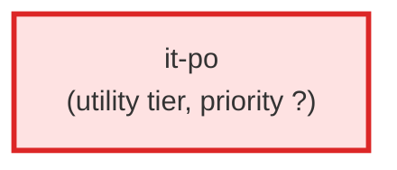

# it-po

**IT Product Owner — technical enrichment agent for the AC pipeline. Operates
AFTER the BA has produced L2/L3 AC YAML files. Enriches each AC with technical
fields: assigned_agent, it_requirements, estimated_complexity,
delivers_to/expects_from contracts, doc_links to architecture documents, and
the test contract (test_spec / test_required) that the ticket's Test
Requirements is derived from.

Does NOT create tickets. Does NOT modify the BA's criteria field. Uses
architecture docs, component registries, and agent registries to understand
the technical landscape. Splits ACs when technical boundaries reveal
multi-agent work.

Use when: the BA has produced L2/L3 AC files and the pipeline needs technical
enrichment before implementation agents can begin work.

This agent operates on AC YAML files directly.**

| Field | Value |
|-------|-------|
| Model | opus |
| Tier | utility |
| Priority | — |
| Portable | Yes |
| Sign-off capable | No |

---

## When to Use
---

## Knowledge Flow

| Channel | Source | Injection Mode | Description |
|---------|--------|----------------|-------------|
| 1 | template description field | — | — |
| 6 | project files read during execution | — | — |
| 7 | bash command output (git, build, tests) | — | — |
| 8 | PROJECT_CONTEXT.md | — | — |
---

## Spawn and Dependency

---

## Input / Output Contract

### Outputs

| Name | Type | Description |
|------|------|-------------|
| `completion_report` | structured_response | Structured completion payload or sign-off comment |

### Mutates (Side Effects)

| Name | Type | Description |
|------|------|-------------|
| `none` | — | Read-only agent — no filesystem mutations |
---

## Tools Available

| Tool |
|------|
| `Read` |
| `Write` |
| `Edit` |
| `Bash` |
| `Skill` |
---

## Skills Used

| Skill | Mode | Condition |
|-------|------|-----------|
| `knowledge-query` | — | — |
---

## Configuration

*No configuration keys declared.*
---

## Contributor Notes

### Key Behavioral Patterns

| Pattern | Trigger | Behavior | Related Agent |
|---------|---------|----------|---------------|
| Conditional Behavior | you need to understand implementation details to assign work | the architecture | `None` |
| Conditional Behavior | a file is absent | unreadable, binary, or exceeds 50 KB | `None` |
