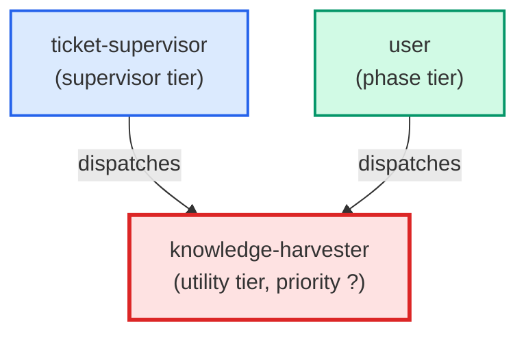

# knowledge-harvester

**Runs the knowledge-emission harvester for a worktree. Reads unprocessed
knowledge_captured events from debugging/logs/knowledge_emissions.jsonl
(per ADR-011), routes each to the correct knowledge surface via the
capture-learning write protocol, marks events as processed, and reports
a summary. Invoked by ticket-supervisor or by the user after a batch of
phase agents have signed off.**

| Field | Value |
|-------|-------|
| Model | sonnet |
| Tier | utility |
| Priority | — |
| Portable | Yes |
| Sign-off capable | No |

---

## When to Use

### Spawned By

- `ticket-supervisor`
- `user`
---

## Knowledge Flow

| Channel | Source | Injection Mode | Description |
|---------|--------|----------------|-------------|
| 1 | template description field | — | — |
| 4 | pre-flight file reads | — | — |
| 6 | project files read during execution | — | — |
| 7 | bash command output (git, build, tests) | — | — |
---

## Spawn and Dependency

---

## Input / Output Contract

### Outputs

| Name | Type | Description |
|------|------|-------------|
| `completion_report` | structured_response | Structured completion payload or sign-off comment |

### Mutates (Side Effects)

| Name | Type | Description |
|------|------|-------------|
| `none` | — | Read-only agent — no filesystem mutations |
---

## Tools Available

| Tool |
|------|
| `Bash` |
| `Read` |
---

## Skills Used

*No skills declared.*
---

## Configuration

*No configuration keys declared.*
---

## Contributor Notes

### Key Behavioral Patterns

| Pattern | Trigger | Behavior | Related Agent |
|---------|---------|----------|---------------|
| Stop-and-Ask | condition requiring user decision or out-of-scope action | Stop and ask the user when:

- The sink file exists but contains no `knowledge_captured` events (onl | `None` |
| Conditional Behavior | the file does not exist | exit with a message: | `None` |
| Conditional Behavior | a warning appears for an unrecognised `entry_kind` | note the kind name and | `None` |
