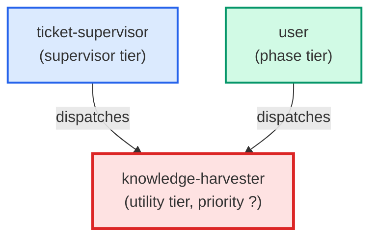

# knowledge-harvester

**Runs the knowledge-emission harvester for a worktree. Reads unprocessed
knowledge_captured events from debugging/logs/knowledge_emissions.jsonl
(per ADR-011), routes each to the correct knowledge surface via the
capture-learning write protocol, marks events as processed, and reports
a summary. Invoked by ticket-supervisor or by the user after a batch of
phase agents have signed off.**

| Field | Value |
|-------|-------|
| Model | sonnet |
| Tier | utility |
| Priority | — |
| Portable | Yes |
| Sign-off capable | No |

---

## When to Use

### Spawned By

- `ticket-supervisor`
- `user`
---

## Knowledge Flow

*No knowledge channels declared.*

---

## Spawn and Dependency

---

## Input / Output Contract

*No structured I/O contract declared.*
---

## Tools Available

| Tool |
|------|
| `Bash` |
| `Read` |
---

## Skills Used

*No skills declared.*
---

## Configuration

*No configuration keys declared.*
---

## Contributor Notes

No conditional behaviors — this agent follows a single fixed execution path
