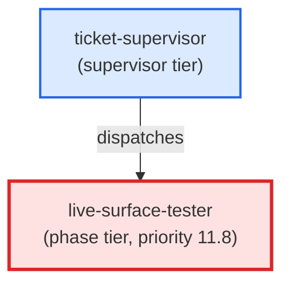

# live-surface-tester

**Conditional phase agent that starts a development server, issues HTTP requests against declared fixtures, asserts response status + body + headers, then tears down the server. Only dispatched when live_surface_test: true in ticket frontmatter AND live_surface_testing.enabled: true in skills_config.json. Priority 11.8 — after user-surface-smoker (11.5), before commit (12). Reads the ## Live Test Fixtures block from the ticket body. Port allocation is managed via scripts/port_registry.py. Agent is read-only: no Edit or Write tools. Emits (status: ok), (status: blocker), or (status: skipped) accordingly. Use when: ticket-supervisor dispatches this agent at priority 11.8 for a ticket whose live_surface_test field is true.**

| Field | Value |
|-------|-------|
| Model | sonnet |
| Tier | phase |
| Priority | 11.8 |
| Portable | Yes |
| Sign-off capable | Yes |

---

## When to Use

### Spawned By

- `ticket-supervisor`
---

## Knowledge Flow

| Channel | Source | Injection Mode | Description |
|---------|--------|----------------|-------------|
| 1 | template description field | — | — |
| 3 | ticket_path from ticket-supervisor | — | — |
| 6 | project files read during execution | — | — |
| 7 | bash command output (git, build, tests) | — | — |
| 9 | agent memory store | — | — |
---

## Spawn and Dependency

---

## Input / Output Contract

### Inputs

| Name | Type | Description |
|------|------|-------------|
| `ticket_path` | file_path | Absolute path to the ticket markdown file |

### Outputs

| Name | Type | Description |
|------|------|-------------|
| `sign_off_comment` | sign_off_comment | Sign-off comment with status: ok | blocker | skipped |

### Mutates (Side Effects)

| Name | Type | Description |
|------|------|-------------|
| `ticket_frontmatter_agents_status` | — | Sets agents.live-surface-tester to signed_off or failed |
| `sign_offs_checklist` | — | Checks the live-surface-tester checkbox with timestamp |
---

## Tools Available

| Tool |
|------|
| `Bash` |
| `Read` |
---

## Skills Used

| Skill | Mode | Condition |
|-------|------|-----------|
| `signoff` | — | — |
---

## Configuration

*No configuration keys declared.*
---

## Contributor Notes

### Key Behavioral Patterns

| Pattern | Trigger | Behavior | Related Agent |
|---------|---------|----------|---------------|
| Stop-and-Ask | condition requiring user decision or out-of-scope action | Do not proceed. | `None` |
| Conditional Behavior | requests/Playwright unavailable or no | emit `(status: skipped)` when a live-testing prerequisite is unavailable | `None` |
| Conditional Behavior | an HTTP or surface assertion fails | emit `(status: blocker)` naming the responsible coder agent | `python-coder` |
