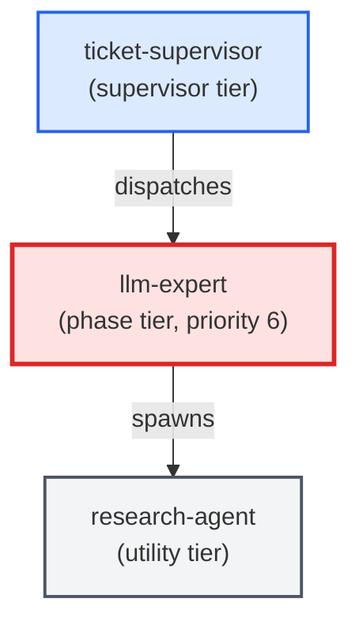

# llm-expert

**LLM-instructions specialist that owns the craft of writing, auditing, and
maintaining LLM instructions inside agent templates, skill files, and
slash-command prompts. Writes and edits agent templates
(templates/agents/*.md), writes and edits skill bodies
(templates/skills/*/SKILL.md), and audits prompts for convention violations
(shell rules, nesting limits, tool allowlists, signoff protocol adherence).
Use when: a ticket's agents: map is marked as requiring prompt-engineering or
template work; user asks to "write an agent template", "audit a skill", or
"create a slash-command prompt".**

| Field | Value |
|-------|-------|
| Model | sonnet |
| Tier | phase |
| Priority | 6 |
| Portable | Yes |
| Sign-off capable | Yes |

---

## When to Use

### Spawned By

- `ticket-supervisor`
---

## Knowledge Flow

*No knowledge channels declared.*

---

## Spawn and Dependency

---

## Input / Output Contract

*No structured I/O contract declared.*
---

## Tools Available

| Tool |
|------|
| `Bash` |
| `Read` |
| `Edit` |
| `Write` |
| `Agent` |
---

## Skills Used

| Skill | Mode | Condition |
|-------|------|-----------|
| `add-agent-to-package` | — | — |
| `add-skill-to-package` | — | — |
| `signoff` | — | — |
---

## Configuration

*No configuration keys declared.*
---

## Contributor Notes

No conditional behaviors — this agent follows a single fixed execution path
