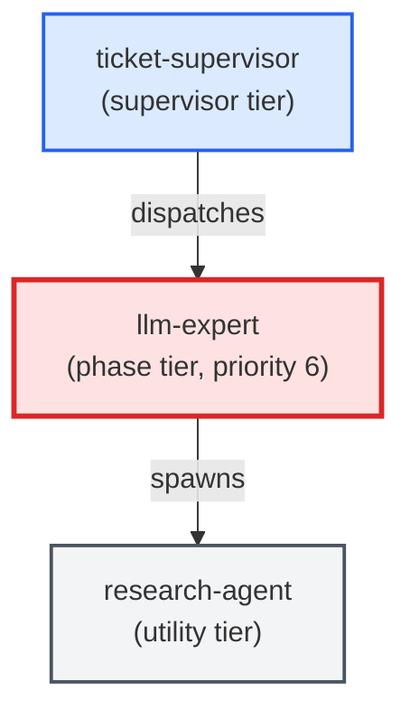

# llm-expert

**LLM-instructions specialist that owns the craft of writing, auditing, and
maintaining LLM instructions inside agent templates, skill files, and
slash-command prompts. Writes and edits agent templates
(templates/agents/*.md), writes and edits skill bodies
(templates/skills/*/SKILL.md), and audits prompts for convention violations
(shell rules, nesting limits, tool allowlists, signoff protocol adherence).
Use when: a ticket's agents: map is marked as requiring prompt-engineering or
template work; user asks to "write an agent template", "audit a skill", or
"create a slash-command prompt".**

| Field | Value |
|-------|-------|
| Model | sonnet |
| Tier | phase |
| Priority | 6 |
| Portable | Yes |
| Sign-off capable | Yes |

---

## When to Use

### Spawned By

- `ticket-supervisor`
---

## Knowledge Flow

| Channel | Source | Injection Mode | Description |
|---------|--------|----------------|-------------|
| 1 | template description field | — | — |
| 3 | ticket_path from ticket-supervisor | — | — |
| 4 | pre-flight file reads | — | — |
| 6 | project files read during execution | — | — |
| 7 | bash command output (git, build, tests) | — | — |
| 8 | PROJECT_CONTEXT.md | — | — |
---

## Spawn and Dependency

---

## Input / Output Contract

### Inputs

| Name | Type | Description |
|------|------|-------------|
| `ticket_path` | file_path | Absolute path to the ticket markdown file |

### Outputs

| Name | Type | Description |
|------|------|-------------|
| `sign_off_comment` | sign_off_comment | Sign-off comment with status: ok | blocker | handoff |

### Mutates (Side Effects)

| Name | Type | Description |
|------|------|-------------|
| `ticket_frontmatter_agents_status` | — | Sets agents.llm-expert to signed_off or failed |
| `sign_offs_checklist` | — | Checks the llm-expert checkbox with timestamp |
| `implementation_artifacts` | — | Files created or modified during phase execution |
---

## Tools Available

| Tool |
|------|
| `Bash` |
| `Read` |
| `Edit` |
| `Write` |
| `Agent` |
---

## Skills Used

| Skill | Mode | Condition |
|-------|------|-----------|
| `signoff` | conditional | — |
| `add-agent-to-package` | conditional | — |
| `add-skill-to-package` | conditional | — |
---

## Configuration

*No configuration keys declared.*
---

## Contributor Notes

### Key Behavioral Patterns

| Pattern | Trigger | Behavior | Related Agent |
|---------|---------|----------|---------------|
| Stop-and-Ask | condition requiring user decision or out-of-scope action | Stop and ask the user when:**
- The ticket's acceptance criteria are ambiguous about the prompt's in | `None` |
| Delegation to add-agent-to-package | task requiring add-agent-to-package capabilities | Delegates to add-agent-to-package via Agent tool | `add-agent-to-package` |
| Conditional Behavior | a `ticket_path` was provided | Read the ticket in full | `None` |
| Conditional Behavior | editing an existing agent | Read the current | `None` |
---

## AC Assignments

### llm-expert

- ACD-1000b-1: /po slash command invokes PO v3 with AC store context
- ACD-1000b-2: /ba slash command invokes BA v3 for L2/L3 decomposition
- ACD-1000b-3: /it-po slash command invokes IT PO v3 for technical enrichment
- ACD-1100a-1: Legacy pipeline agent templates are deleted from the package
- ACD-1100b-1: V3 agent template files are renamed to canonical names
- ACD-1100c-1: Skill directory and registry entry use the name plan-feature
- ACD-1100d-1: product-owner-agent and test-planner are fully removed
- ACD-1200b-2: User can proceed with approved-only subset or request bulk review
- ACD-1200e-1: /build-ac with a leaf AC continues the existing single-ticket behavior unchanged
- ACD-1200e-2: /build-ac with an L0 or L1 AC automatically switches to epic-generation mode
- ACD-1200e-2-i: L1 AC with no children is treated as a leaf, not a goal
- ACD-1500a-2: Each entry is classified into a work type and a size
- ACD-1500a-2-ii: Non-problem categories take no fix action; success-pattern is offered for codification
- ACD-1500a-4: Classification of the same entry is deterministic across runs
- ACD-1500b-1: Every classification carries a confidence score
- ACD-1600b-1: A phase agent resolves its authoritative spec by following source_ac to the store
- ACD-1600b-1-i: Missing or unresolvable source_ac halts the agent instead of trusting the ticket body
- ACD-1600b-2: When the ticket body and the store disagree, the store wins
- ACD-1800b-1b: The signoff skill records each deliverable's sign-off onto the requirement, not the ticket body
- ACD-1800b-5: Done-eligibility accepts AC-side sign-offs, not only ticket-body status
- ACD-1900b-5: The fulfillment gate resolves coverage by dual-read, so a thin ticket is always verified
- ACD-1900c-6: At enforce, the gate's absent-coverage skip flips from ok to blocker
- ACD-200a: BA v3 produces documentation ACs when decomposing features with flows or state
- ACD-200a-1: BA v3 template contains documentation AC generation rules
- ACD-200b: IT PO v3 validates documentation AC presence before promoting to reviewed
- ACD-200b-1: IT PO v3 template contains documentation AC validation gate
- ACD-200c: PO v3 signals documentation intent at L0/L1 level
- ACD-200c-1: PO v3 template contains documentation_triggers field instruction
- ACD-300a: A fast triage agent classifies the request and checks for duplicates before authoring begins
- ACD-300a-1: Triage routes 'new feature / strategic' requests to PO v3 first
- ACD-300a-2: Triage routes 'behavioral addition' requests directly to BA v3
- ACD-300a-3: Triage detects already-covered requests and surfaces existing ACs
- ACD-300b-3: The /plan-feature command, skill, and workflow present one consistent execution model
- ACD-300b-3-i: Invoking /plan-feature follows exactly one documented execution path
- ACD-300e-1: Each authoring agent template declares knowledge-query in its skills_used frontmatter
- ACD-300e-2: PO v3 queries the knowledge graph during S1 to discover related L0/L1 nodes before framing
- ACD-300e-2-i: Agent proceeds with baseline context when knowledge-query returns no matching nodes
- ACD-300e-2-ii: Agent degrades gracefully when knowledge-query fails with an error
- ACD-300e-3: BA v3 queries the knowledge graph during S1 to discover related L2/L3 patterns and cross-component behaviors
- ACD-300e-4: IT PO v3 queries the knowledge graph during S1 to discover agent capabilities and architecture relationships
- ACD-300e-5: Agents cite knowledge-graph findings in their output to support deduplication and cross-referencing
- ACD-300e-5-i: Agents do not block when the knowledge graph is entirely empty (fresh project)
- ACD-300f-1: SKILL.md defines three standard invocation patterns in an Agent Consumption Protocol section
- ACD-300f-2: Agent Consumption Protocol defines zero-result and empty-graph handling as non-error conditions
- ACD-300f-3: Agent Consumption Protocol defines error handling as graceful degradation without abort or retry
- ACD-300f-4: Agent Consumption Protocol defines citation format for overlapping nodes and deduplication warnings
- ACD-700a: A single /build-ac command sequences prioritization, ticket generation, build, and done-marking
- ACD-700a-1: /build-ac surfaces the top-ranked AC with its id and title
- ACD-700a-2: Answering yes triggers ticket generation, build dispatch, and done-marking in sequence
- ACD-700a-2-i: Ticket generation failure when AC already has a ticket offers recovery
- ACD-700a-2-ii: Build dispatch respects the agent depth-1 limit (ADR-006)
- ACD-700a-3: Answering skip defers the current AC and proposes the next candidate
- ACD-700a-3-i: Repeated skips exhaust all candidates and exit cleanly
- ACD-700a-4: /build-ac exits cleanly when no ready ACs exist in the store
- ACD-700a-5: /build-ac accepts an explicit --ac flag to bypass the ranking step
- ACD-700a-5-i: Explicit --ac flag with non-existent or non-ready AC is rejected
- ACD-900b: SKILL.md documents the AC-aware prioritization workflow and pick-next script
- ACD-900b-1: SKILL.md contains sections for --include-acs, pick_next.py, and the complexity mapping table
- ACS-100c: The right person owns each level of detail
- ACS-100h: Grow your requirements without outgrowing your folders
- ACS-100h-1: Overcrowded parent triggers the split procedure with the correct pattern
- ACS-100h-2: Split rewires depends_on and covered_by without breaking any reference
- ACS-100h-3: Split requires user confirmation at each gate before modifying files
- ACS-100h-4: Split leaves an audit trail in amended_by and the git commit message
- ACS-100h-5: Post-split validation confirms no cycles, no dangling refs, and limits respected
- ACS-100h-6: Pattern C documentation is consistent with the ID-derivation child-counting rule
- ACS-100h-6-i: Pattern C warns that the L2 rename is an ID-change cascade requiring a store-wide grep
- ACS-100h-7-i: When the AC tree is already at the limit and cannot be auto-split, the scaffold error tells the author to split first
- ACS-100h-7b: /create-epic runs the AC-tree-limit check before stub generation and blocks on violation
- ACS-300g-4b: Skill wrapper for the add-component script
- ACS-300k-2: Agent templates referencing index.yaml for component metadata are migrated to components.json
- ACS-500c-1: BA agent checks for existing pattern before writing new behavioral AC
- ACS-500c-2: IT PO agent preserves implements_pattern when enriching an AC
- ACS-500g-1: A pattern-steward scans the whole store and surfaces recurring behavior as pattern candidates
- ACS-500g-1-i: A pattern candidate is a proposal — existing ACs are never rewritten by the scan
- ACS-500g-2: An authoring-patterns skill states the pattern-worthiness rules as decidable tests
- ACS-500g-2-i: A newly promoted pattern is recognised as a pattern by both the authoring scan and the commit-time check
- ACS-500g-3: Producer and consumer decide 'is this a pattern?' from one shared source that cannot drift
- ACS-500g-4: Recurrence noticed while authoring is promoted in that same authoring run
- ACS-500g-4-i: A below-threshold repetition is recorded so the next occurrence can trip the threshold
- ACS-500g-5: A retrospective sweep over the existing store seeds the first patterns and ends the cold start
- ACS-500g-5-i: Re-running the sweep reports already-covered behavior instead of proposing a duplicate pattern
- ACS-800f: The authoring guidance reflects the new model
- ACS-800f-1: The tree-split guidance describes re-home as a single metadata change
- ACS-800f-1-i: Guidance documents the child-limit override as removable once tooling reads metadata
- ACS-800f-2: The authoring agent instructions describe the UID-and-metadata model
- ACS-800f-3: The schema reference prose describes stable UIDs and metadata hierarchy
- BO-1000c-1b: The /finalize-feature launcher polls the run-progress journal and relays it into the main conversation
- BO-1000c-2: Surfaced progress reflects the in-flight step, arriving over time rather than only at the end
- BO-1000c-2-i: On a mid-flight halt the last conversation line reflects the halting step, live
- BO-100d-1b: build-feature.md prose hard-blocks the drive before dispatch when the telemetry sink is unreachable
- BO-100d-2b: build-feature.md prose lets the drive proceed when the telemetry sink is reachable
- BO-1100a-2: Matched routing group produces its pattern-specific commit subject line
- BO-1100a-2-i: Empty staging area produces no commit message
- BO-1100a-3: Router delegates to the pattern-learning specialist when no group matches
- BO-1100a-4: Router skips pattern application when a user-approved subject line already exists
- BO-1100a-5: Commit body enumerates all staged files for a single-group commit
- BO-1100b-1: Staged files spanning two or more routing groups trigger a warning before message composition
- BO-1100b-1-i: Mixed commit with 3+ groups lists all groups in the warning
- BO-1100b-2: Mixed-change warning names the conflicting groups and lists files per group
- BO-1100b-3: User can confirm a mixed commit or abort to split
- BO-1100b-3-i: Confirmed mixed commit message indicates the mixed nature
- BO-1100c-3: Commit agent reloads the routing config on every invocation
- BO-1100c-3-i: Missing routing config file causes graceful fallback to current commit behavior
- BO-1100d-2: After 10 occurrences of the same unmatched shape, a new routing rule is proposed
- BO-1100d-2-i: Shape with 10 occurrences but inconsistent historical messages is flagged for manual rule authoring
- BO-1100d-3: Proposed routing rule requires user confirmation before being written to config
- BO-1100d-3-i: Proposed rule conflicting with an existing config entry is rejected with explanation
- BO-1100d-4: Specialist examines recent commit history for structurally similar commits
- BO-1300a-1: On-demand spot-check command targets a named finished feature
- BO-1300a-1-i: Spot-check command with no resolvable target is rejected before dispatch
- BO-1300a-2: On-demand command dispatches exactly three spot-check reviewers in parallel
- BO-1300b-1: Each of the three reviewers is seeded with a distinct review angle
- BO-1300b-1-i: Two reviewers may not collapse onto the same angle
- BO-1300b-2: Findings from all three reviewers are aggregated into one consolidated result
- BO-1300c-1: Reviewers exercise the feature for uncovered gaps and never run the unit test suite
- BO-1300c-1-i: Reviewer tempted to fall back to running tests must refuse and exercise the feature instead
- BO-1400a-1: Pre-PR review re-verifies bulk/quantitative data-claim ACs against the real data store
- BO-1400a-1-i: Real-data verification reports INCONCLUSIVE (not PASS) when the validation tool is unavailable
- BO-1400a-2: Pre-PR review confirms a delivered artifact lands in the deployable package source, not only a build-output tree
- BO-1400a-2-i: A build-output-only artifact that is not consumer-shipped by design is not falsely flagged
- BO-1500b-3: Partial-run recovery pre-flight still detects stranded AC files on the isolated branch
- BO-1700b-3: A commit made with --no-verify is still refused where the main repo has gates
- BO-1700d-2: Pre-drive gate: no ticket starts until the probe passes against the worktree
- BO-1700d-3: Commit-phase gate: the commit driver runs the probe and refuses on failure
- BO-1700d-3-i: A shared-hook mutation between the pre-drive gate and commit is caught at commit
- BO-1800c-1: The number of agents collaborating on a single feature is capped
- BO-1800c-1-i: An inherently sequential task is not force-parallelized
- BO-2000a-1: Sign-off block resolves its skill in both consumer and source layouts
- BO-2000a-1-i: Source-layout fallback is used when the consumer skills location is absent
- BO-2000a-2: Sign-off updates frontmatter, checklist, and comment as one atomic edit
- BO-2000a-2-i: Sign-off comment heading uses an em-dash so the parser can find it
- BO-2000a-3: Sign-off degrades safely when the feedback sink is unreachable
- BO-2000a-4: Sign-off self-verifies its write and reports a lost write
- BO-2000a-4-i: A dropped sign-off write returns signoff-write-lost, never success
- BO-2000a-5: Sign-off block includes the mandatory knowledge-capture step
- BO-2000b-1: python-coder-authored hooks fail open on unexpected errors
- BO-2000b-1-i: A hook that raises an unexpected OSError exits 0
- BO-2000b-2: python-coder treats templates as source and generated dirs as build outputs
- BO-2000b-3: python-coder registers new hooks, agents, and skills through their skills
- BO-2000b-4: python-coder reads a file before editing it
- BO-2000b-5: python-coder spot-checks against the real artifact and bans phantom tests
- BO-2000b-6: python-coder restates the single-simple-command shell discipline
- BO-2000d-3: The IT-PO template states the package-surface spec obligation
- BO-200c-1: Commit message follows the project's conventional-commit format
- BO-200c-2: Commit message body explains the intent, not just the file changes
- BO-200c-3: Commit message is written by a dedicated agent, not inline by the supervisor
- BO-200c-4: An approved commit message subject line is never rewritten by hooks or subsequent staging
- BO-2100a-1: Ticket authoring adds live-surface-tester to the agents map when both toggles are on
- BO-2100a-1-i: live-surface-tester is absent from the agents map unless both toggles are on, and a requested-but-disabled check is recorded as skipped
- BO-2100a-2: ticket-supervisor Spawn Allowlist permits live-surface-tester
- BO-2100a-4: building-epics canonical dispatch order documents live-surface-tester at 11.8
- BO-2100b-1: Project toggle off means the check never runs, even when the ticket opts in
- BO-2100b-2: Ticket not opted in means the check is skipped, even when the project enables it
- BO-2100b-3: Both toggles on means the check runs
- BO-210b-1: Coder emits a context_capsule with the five required design fields only when a warn-tier signal trips
- BO-210b-1-i: An oversized context_capsule is truncated to the length cap rather than written unbounded
- BO-210b-2: Consumers tolerate an absent context_capsule exactly like an absent completion_manifest
- BO-210c-1: Judgment-tier hook failure re-dispatches the originating agent type with its capsule
- BO-210c-1-i: The re-dispatched coder runs at depth 2 and spawns no sub-agents
- BO-210c-1-ii: Judgment-tier failure with no capsule degrades gracefully to a warn-and-proceed fixer
- BO-210c-1-iii: Every bash command in new or edited safety-net templates is a single simple command
- BO-210c-2: Mechanical-tier hooks keep the generic light-model route and the commit retries exactly once
- BO-210c-2-i: Re-dispatched coder returns a blocker when the fix genuinely needs fresh cross-file lookup
- BO-2200b-2: The verifier fails the ticket when a required documentation file was not changed
- BO-2200b-2-i: Partial documentation coverage still fails, naming the specific missing doc
- BO-2200b-3: The verifier fails placeholder documentation and passes real content
- BO-2200b-3-i: A short but genuine doc passes while a heading-only or token-filled stub fails
- BO-2200b-6: The verifier is registered in every canonical phase-order source so it never sorts to the end
- BO-2300a-1: A gate pauses and persists resumable state instead of cancelling
- BO-2300a-1-i: A run that hits no decision point completes normally without pausing
- BO-2300a-2: Paused-awaiting-input is a distinct state, separable from cancelled
- BO-2300b-1: Each pending question declares its type and its valid answer shape
- BO-2300b-2: An answer of the wrong shape is rejected and the question is re-asked
- BO-2300b-2-i: An unparseable answer re-prompts and never crashes the run
- BO-2300c-1: The pause surfaces the decision context captured at pause time
- BO-2300d-1: A valid answer is applied by type and the run resumes from the pause point
- BO-2300d-1-i: Pausing mid multi-stage run preserves the earlier committed stages
- BO-2300d-1-ii: A cancel answer stops gracefully, keeps committed stages, opens no PR
- BO-2300e-1: A paused run's state survives process exit and is resumable later
- BO-2300e-1-i: Applying the same answer twice is idempotent and never double-applies
- BO-2300e-1-ii: Resuming a run with no pending pause is a no-op
- BO-2300e-1-iii: A stale or expired pause is handled gracefully
- BO-2400a-1: Exactly one test-writer and one coder agent per batch
- BO-2400a-3: Red-baseline verification is a deterministic script gate before the coder runs
- BO-2400a-3-i: Red-baseline gate halts when the batch will not go red
- BO-2400a-4-i: Green gate refuses commit staging when the coder cannot make all tests pass
- BO-2400a-5: No heavy-path coordination constructs are used in the fast lane
- BO-2400b-1: Scoped interactive work routes to the fast lane
- BO-2400b-2: Large, unattended, or high-defect-cost work routes to the heavy pipeline
- BO-2400b-3: A single documented rule deterministically decides the lane
- BO-2400b-3-i: Ambiguous scope defaults to the heavy pipeline
- BO-2400b-3-ii: An explicit lane override wins over the decision rule
- BO-2400g-2: The fast lane's change is read before it is committed, and the reading has something real to read against
- BO-2400g-2-i: A reading that examined nothing is recorded as a reading that did not happen
- BO-2400g-3: The fast lane's change is read for design problems, not only for local mistakes
- BO-2400g-4: What the reading finds decides the run: serious findings stop it before anything is committed, minor ones ride along
- BO-2400g-4-i: Findings that did not stop the run arrive with the pull request, not only in the session that produced them
- BO-2500b-1-i: Work whose local pre-commit check was skipped is still caught by the CI gate
- BO-2500b-2: The final proof-of-done check runs on a fresh clean checkout in CI
- BO-2500b-3: The CI proof-of-done check is required and blocks merge
- BO-2500c-1: Fixtures for serialized data are produced by the real serializer, not hand-typed
- BO-2500c-2: Parser and validator tests round-trip through the real on-disk artifact
- BO-2500c-3: An independent real-artifact behavioral check runs for parsers, validators, and hooks
- BO-2500d-1: The fast lane carries at most one LLM verdict, and that verdict can only withhold delivery — never confer done
- BO-2500d-1-i: Removing a mechanical proof-of-done gate, or letting an LLM verdict stand in for one, is rejected
- BO-2500d-2: The opinion-only gate agents remain present in the heavy pipeline
- BO-2500d-3: The mechanical proof-of-done gates are the fast lane's completion arbiters
- BO-2500e-6: The required CI done-proof gate covers JS-covered ACs
- BO-2600a-3: build-ac leaf path is unchanged when the connected build set is just the target AC
- BO-2600a-4: build-ac emits a dependency-ordered epic when the connected build set has more than one AC
- BO-400a-1: ticket-supervisor sets status to in_progress at drive start
- BO-400a-1-i: Ticket already in_progress from a previous failed run
- BO-400a-2: ticket-supervisor sets status to done when all agents complete
- BO-400a-2-i: Parity violation: status done but agents map has needed entries
- BO-400a-3: finalize-feature reads status from frontmatter, not folder position
- BO-400c-1: ticket-supervisor does not move files to done/
- BO-400c-2: finalize-feature-archive-check scans by frontmatter, not folder position
- BO-400c-2-i: Mixed state: some tickets in done/ folder, some with status: done at root
- BO-400c-4: status-checker close-out calls set_ticket_status.py instead of git mv
- BO-510-2: Agent template frontmatter carries the produces trait matching the registry
- BO-510-4: llm-expert populates the produces trait on every existing agent template
- BO-510-4-i: llm-expert flags ambiguous agent trait for human review
- BO-510-5: Ticket-supervisor reads the produces trait to determine which guardrails apply
- BO-530-1: test-writer is injected before any coder-class agent in the computed chain
- BO-530-1-i: Ticket with change_type doc_change skips TDD injection entirely
- BO-530-2: test-runner is injected after every coder-class agent in the computed chain
- BO-530-3: Test failure hands context back to the implementation agent for rework
- BO-540-1: flow_change injects architect-review before any coder in the computed chain
- BO-540-1-i: Coder dispatch is blocked if architect-review has not signed off
- BO-540-2: flow_change injects documentation-expert before any coder in the computed chain
- BO-550-1-i: IT PO modifying agents map for testing is rejected in favor of test_constraints
- BO-550-2: test-writer reads test_constraints and adjusts its testing strategy
- BO-560-1: Full agent chain is derived from change_type and the work agent's produces trait
- BO-560-1-i: Work agent with missing produces trait causes chain computation to fail gracefully
- BO-560-2: Computed chain places mandatory agents in correct priority order
- BO-560-3: Manually-authored agents map is overwritten by the computed chain
- BO-560-3-i: Pre-existing agents map is fully replaced, not merged, with audit trail
- BO-570-2: Frontend sign-off gate blocks on render failure using the render-smoke verdict
- BO-570-2-i: No frontend files changed -- dev-render smoke check is skipped, not failed
- BO-570-2-ii: Render tooling unavailable in the worktree surfaces clearly and never silently passes
- BO-570-2-iii: A locally-passing render or ruff check records auditable evidence in the sign-off
- BO-570-4: Python sign-off gate blocks on lint failure using the repo-ruff verdict
- BO-570-4-i: No Python files changed -- repo-ruff check is skipped, not failed
- BO-570-4-ii: Ruff tooling unavailable in the worktree surfaces clearly and never silently passes
- BO-650-2: Architect produces ADRs when a design decision is required
- BO-650-3: Architect produces C4 diagrams for structural changes
- BO-650-4: Architect asks PO/BA clarifying questions when intent is ambiguous
- BO-800a-1: PR title is set to the L1 AC title referenced by the ticket's source_ac field
- BO-800a-1-i: Ticket with no source_ac field falls back to the ticket title
- BO-800a-1-ii: L1 title exceeding 70 characters is truncated with an ellipsis
- BO-800b-1: PR summary section contains the L0 criteria text (goal) and the L1 criteria text (feature)
- BO-800b-1-i: Source AC chain with no L0 ancestor produces a summary from L1 criteria only
- BO-800c-1: PR test plan section lists all L2/L3 Gherkin scenarios from the ticket's AC lineage
- BO-800c-1-i: A ticket with zero L2/L3 ACs produces an empty test plan section with a note
- BO-800d-1: PR description is assembled from AC YAML files on disk at PR-creation time, not from cached data
- BO-800d-1-i: An AC that was superseded mid-drive is excluded from the PR description
- BO-800d-2: An amended AC (amended_by non-empty) is read in its current state, not its original state
- BO-800e-1: PR body includes a Goal line with the L0 AC ID and title, linking to the AC file path
- BO-800e-1-i: A ticket whose source_ac chain has multiple L0 ancestors lists all of them
- BP-1100f-1: A durable-change dispatch that carries no instruction is flagged before it is accepted
- BP-1100f-1-i: A whitespace-only or empty instruction string is treated as no instruction
- BP-1100f-2: A durable-side-effect work item requires a test that exercises the real effect, not only that a step ran
- BP-1100f-2-i: Asserting the artifact path was passed as an argument is topology, not effect coverage
- BP-1100f-3: A work item whose stated intent contradicts its declared surface is caught before implementation
- BP-1100f-3-i: A mixed-surface work item flags only the portion its stated intent cannot handle
- BP-1100g-1: Every kind of proof the plan can ask for is a kind the test writer has been taught
- BP-1100g-2: When the plan cannot name the way in, the writer is told how to resolve one and records the one it resolved
- BP-1100g-5: The cross-layer seam rule leaves exactly one answer per piece of work, and an honest no is one of them
- BP-200a-1: Agent template frontmatter declares all required fields for a phase agent
- BP-200a-2: Agent template body contains the six-item Prompt-Quality Checklist with detection heuristics
- BP-200a-3: Agent template defines stop-and-ask boundaries deferring infrastructure edits
- BP-200a-3-i: Agent constraints section prohibits editing Python, SQL, and frontend files
- BP-200a-4: Agent template pre-flight reads load PROJECT_CONTEXT and signoff skill before any write
- BP-200a-4-i: Agent gracefully degrades when PROJECT_CONTEXT.md is absent
- BP-200a-5: Agent template declares exactly three skills with invocation conditions
- BP-200b-1: PROJECT_CONTEXT.md contains all six required knowledge sections in order
- BP-200b-2: Shell convention section documents violation patterns with wrong and right examples
- BP-200b-3: Agent and skill frontmatter schemas distinguish required from build-injected fields
- BP-200b-4: Signoff protocol section documents the three-place parity guard and timestamp format
- BP-200b-5: Nesting rules section documents the depth-3 cap and spawn_allowlist contract
- BP-200c-1: Registry entry declares llm-expert as a phase agent with correct tier and role
- BP-200c-1-i: Registry default_status prevents automatic dispatch on existing tickets
- BP-200c-2: Registry entry has DSL trigger conditions matching agent/skill template file patterns
- BP-200c-3: Ticket-supervisor spawn_allowlist includes llm-expert for automatic dispatch
- BP-200d-1: Prompt-audit skill frontmatter declares read-only tool contract
- BP-200d-2: Prompt-audit skill implements six distinct detection checks
- BP-200d-2-i: Audit check 4 is skipped when agent template has signoff: false
- BP-200d-2-ii: Audit check 2 reports overly permissive allowlist as warning, not error
- BP-200d-3: Prompt-audit skill returns a structured report with violations sorted by line number
- BP-200d-4: Prompt-audit skill never modifies the files it audits
- BP-200d-5: Prompt-audit skill supports both single-file and batch audit invocation
- BP-200e-1: Agent runs the Prompt-Quality Checklist before declaring any written prompt complete
- BP-200e-2: Agent emits a structured completion report showing checklist pass/fail per item
- BP-200e-3: Prompt-audit skill compound-bash check distinguishes side-effect pipes from read-only pipes
- BP-300e-6: Agents dispatched for a machine-parsed result return only the structured payload, with any anomaly carried inside it
- BP-400a-3: Supervisor templates contain imperative feedback emission instructions
- BP-400c-5: feedback-analyst agent is read-only and never modifies feedback files
- BP-700a-1: Unified agent template embeds design principles directly
- BP-700a-1-i: Legacy frontend-design skill file is ignored when unified agent is deployed
- BP-700a-2: Agent applies design principles without explicit skill activation
- BP-700a-3: Project design system overrides embedded principles
- BP-700c-1: All frontend-design skill principles are present in unified template
- BP-700c-2: All frontend-coder agent capabilities are preserved in unified template
- BP-700c-2-i: Framework-agnostic constraints preserved across React, Vue, Svelte, and plain HTML
- BP-700c-3: Webapp-testing skill integration preserved as optional
- BP-700d-2: Onboard wizard no longer offers frontend-design as a separate optional skill
- GE-104a-2: Planning-time trigger flips documentation-expert to needed when a ticket adds a new page without its reference doc
- GE-104a-2-i: DSL trigger expresses a new-page-without-matching-doc condition (negation feasibility open question)
- INF-100a-1: Pull-request template contains Pre-Flight section that loads PROJECT_CONTEXT.md
- INF-100a-1-i: Agent continues with template-only behavior when PROJECT_CONTEXT.md is absent
- INF-100a-2: PROJECT_CONTEXT.md contains EMU identity guard that switches GitHub account before PR creation
- INF-100a-3: PROJECT_CONTEXT.md contains PR writing standards for title and description
- INF-1100a-1: Test work-location resolves from configured test_root, not a hardcoded default
- INF-1100a-1-i: Absent test_root configuration falls back to the documented default
- INF-1100a-2: Test location mirrors the source subtree under the configured test root
- INF-1100a-2-i: A configured test_root other than the default is honored verbatim
- INF-1100b-1: A hand-off test path that disagrees with config is overridden by the config-resolved path
- INF-1100b-1-i: A hand-off path that already agrees with config is used unchanged and raises no contradiction
- INF-1100b-2: The config-vs-hand-off contradiction is surfaced, not silently corrected
- INF-200a-3: No-print convention lives in the logging rule, not CLAUDE.md
- INF-200a-6: Rules for same file type are merged — one rule + one hook per glob
- INF-300a-2: PO and BA agents consult the surface map before placing knowledge
- INF-400a-1: V3 agent templates contain a pre-flight step that loads domain-scoped accumulated context
- INF-400a-2: V3 agents read memory files that contain learnings from their own prior runs
- INF-400a-3: V3 agents read component-scoped PROJECT_CONTEXT.md files when working in a domain
- INF-400a-4: First run on a component with no prior context produces normal-quality output
- INF-400a-4-i: Corrupted or malformed PROJECT_CONTEXT.md does not crash the agent
- INF-400b-1: V3 agent templates contain a mandatory knowledge-capture step that fires before exit
- INF-400b-1-i: Knowledge capture does not block agent exit if route-learning or capture-learning is unavailable
- INF-400b-1-ii: Duplicate learnings are not persisted twice across consecutive runs
- INF-400b-2: Knowledge emissions from v3 agents use the same JSONL event schema as signoff section 7
- INF-400b-3: V3 agent knowledge-capture prompt is domain-appropriate for specification work
- INF-400e-1: Second-run BA produces L2 ACs that reference standing rules without being told
- INF-400e-2: Second-run PO uses previously-learned user framing preferences in L0/L1 language
- INF-400e-3: Second-run IT PO assigns agents correctly based on previously-learned component-agent mappings
- INF-400f-1: PO v3 learnings are available to the BA v3 when both run in the same pipeline invocation
- INF-400f-1-i: If the PO captures no learnings, the BA still runs correctly with baseline context
- INF-400f-2: BA v3 component discoveries are available to the IT PO v3 in the same pipeline run
- INF-400f-3: Cross-agent knowledge flows through shared persistence, not agent-to-agent message passing
- INF-600l-3: The pr-reviewer prose backstop for card/registry consistency delegates the search to research-agent
- KM-KGS-100e-8: The authoring-agent templates instruct emitting a component on every criterion
- KM-KQS-032: Agent Protocol specifies standard invocation syntax with keyword and surface parameters
- KM-KQS-033: Agent Protocol specifies zero-result and empty-graph handling as non-error conditions
- KM-KQS-034: Agent Protocol specifies graceful degradation when the knowledge-query script fails
- KM-KQS-035: Agent Protocol specifies citation and deduplication formats for knowledge-graph findings
- KM-KQS-036: Agent Protocol specifies mandatory-invocation rule preventing agents from skipping the query
- KM-KQS-037: Agent Protocol deduplication warning distinguishes AC overlap from doc/skill overlap
- KM-KQS-038: Agent Protocol distinguishes script-not-found from non-zero-exit in the warning message
- KM-KQS-039: Agent Protocol section is structured so agent templates can delegate to it with a single reference
- PER-100d-2a: Persona-detail skill SKILL.md provides full persona content on demand
- PER-100e-1-i: Persona expert refuses to create a persona with an ambiguous name
- PER-100e-1a: Persona expert agent template orchestrates persona creation from user input
- PER-100e-2-i: Persona refinement does not remove existing entries without explicit user confirmation
- TKT-100a-1: BA v3 reads AC store for the target component before decomposition
- TKT-100a-2: BA v3 reads agent templates referenced in L1 ACs
- TKT-100a-3: BA v3 reads component documentation via INDEX.md before drafting L2s
- TKT-100a-4: BA v3 degrades gracefully when AC store directory is absent
- TKT-100a-5: BA v3 identifies inter-agent data contracts from the AC store
- TKT-100a-6: BA v3 degrades gracefully when INDEX.md is absent
- TKT-100e: Your product vision shapes every requirement from the top down
- TKT-100e-1: PO agent produces exactly one L0 AC per feature request
- TKT-100e-2: PO agent decomposes L0 into 3-7 L1 ACs with single agent ownership
- TKT-100e-3: PO agent L1 criteria use natural-language behavioral statements, not Gherkin
- TKT-100e-4: PO agent enforces level boundary -- never produces L2 or L3 ACs
- TKT-100e-5: PO agent L1 output includes depends_on ordering between sibling L1s
- TKT-100f-1: BA v3 produces 3-5 L2 ACs per L1 with concrete Gherkin scenarios
- TKT-100f-2: Each L2 AC has exactly one assigned_agent and a depends_on referencing its parent L1
- TKT-100f-3: BA v3 applies weasel-word self-check to all L2 and L3 criteria
- TKT-100f-4: BA v3 produces L3 sub-ACs for non-trivial edge cases of L2 scenarios
- TKT-100f-5: BA v3 classifies overlapping L2 as covered-by-existing
- TKT-100f-6: BA v3 classifies extending L2 as amends-existing
- TKT-100f-7: BA v3 classifies non-overlapping L2 as genuinely-new
- TKT-100g: The system picks the right workflow for your request automatically
- TKT-100g-1: Router classifies L0 when criteria describe business outcome without implementation detail
- TKT-100g-2: Router classifies L1 when criteria describe feature behavior with a single assigned_agent
- TKT-100g-3: Router classifies L2 when criteria contain Given/When/Then with concrete inputs
- TKT-100g-4: Router classifies L3 when criteria are a sub-scenario of an existing L2 covering an edge case
- TKT-100g-5: Router rejects ACs that span multiple flight levels with a structured error
- TKT-100h: The analyst reads everything relevant before asking you a question
- TKT-100i: The analyst works with incomplete project setup without crashing or guessing
- TKT-100j: Requirements are precise, structured, and free of vague language
- TKT-100k: New requirements never duplicate or conflict with what already exists
- TKT-100l: Specifications describe what happens, not how to code it
- TKT-200a: Architecture is visible before anyone asks for it
- TKT-200a-1: Diagram generation reads component relationships from AC files
- TKT-200a-2: Diagram generation captures data flow from delivers_to and expects_from contracts
- TKT-200a-3: Diagram generation runs without manual invocation after spec completion
- TKT-200b: Component responsibilities are documented before review begins
- TKT-200b-1: Boundary doc states what a component owns and what it does not own
- TKT-200b-2: Boundary doc is derived from specs, not manually written
- TKT-200b-3: Boundary doc for a new component is created; existing component doc is updated
- TKT-200c: Everything a reviewer needs is in one place
- TKT-200c-1: Review package assembles specs, diagrams, and docs into a single location
- TKT-200c-2: Review package cross-references specs to their diagrams and docs
- TKT-200c-3: Review package includes relevant existing documentation alongside new artifacts
- TKT-200d: Documentation stays current with the specs it describes
- TKT-200d-1: Changed spec triggers regeneration of its dependent diagram
- TKT-200d-2: Only affected documentation is regenerated, not the entire package
- TKT-200d-3: Stale documentation is detected before the review checkpoint
- TKT-300a: Technical constraints are added without overwriting business intent
- TKT-300a-1: IT PO assigns exactly one agent to every L2 and L3 AC
- TKT-300a-2: IT PO adds policy-level requirements without implementation prescriptions
- TKT-300a-3: IT PO wires delivers_to and expects_from contracts at cross-agent boundaries
- TKT-300a-4: IT PO never modifies the BA's criteria field
- TKT-300c-1: User reviews business requirements before technical enrichment begins
- TKT-300c-2: User reviews enriched plan before implementation dispatch
- TKT-300c-3: No AC files are written to disk without prior user approval
- TKT-300d: Large initiatives group related work for tracking, not for execution
- TKT-300d-1: An L0 AC serves as the epic-level goal for its feature group
- TKT-300d-2: Work dispatch is based on dependency order, not epic grouping
- TKT-300d-3: The supervisor reads the AC hierarchy for sequencing, not a separate epic plan
- TKT-300e: Complex requirements are split into buildable pieces automatically
- TKT-300e-1: Split is triggered when criteria cross agent boundaries
- TKT-300e-2: Split preserves original criteria distributed across children
- TKT-300e-3: Split children receive matching cross-agent contracts
- TKT-300e-4: Split is presented at the user confirmation gate before writing
- TKT-500a-2: Agent reads criteria from the AC YAML at dispatch time
- TKT-500a-3: Amended AC is seen by the next agent without manual sync
- TKT-500e-1: Coder agent persists across sequential ACs within the same goal
- TKT-500e-1-i: Agent crash mid-goal results in respawn with prior AC summaries injected
- TKT-500e-2: Agent receives the next AC as an injection, not a new spawn
- TKT-500e-3: Cross-goal boundary forces a fresh agent spawn
- TKT-500e-3-i: Agent spawned for goal-B has no memory leakage from goal-A
- TKT-500e-4: Agent retains memory of files it modified in prior ACs within the goal
- TKT-500f-6-iii-b: ticket-supervisor halts (not silently skips) when Test Requirements is absent but an implementation .py is in scope
- UXP-100a-1: Prototype composition reads the component library catalog before assembly
- UXP-100a-1-i: Empty or missing component library catalog halts prototype assembly with a diagnostic
- UXP-100a-2: Prototype output preserves visual and structural consistency with existing pages
- UXP-100b-1: Gap detection produces a named list of missing components with usage context
- UXP-100b-1-i: All components in the feature request already exist — no gap report produced
- UXP-100b-2: Research is initiated for each missing component rather than improvising
- UXP-100b-3: Gap report distinguishes near-matches from entirely new components
- UXP-100c-1: Prototype is presented to the user with three explicit decision options
- UXP-100c-3: Request-changes feedback produces a revised prototype incorporating the feedback
- UXP-100d-1: Approved prototype produces a structured handoff artifact with layout and flow
- UXP-100d-1-i: Handoff artifact is not produced for a rejected or pending-changes prototype
- UXP-100d-3: Handoff artifact includes component version references for drift detection
- UXP-100e-2: BA can reference the in-progress prototype when decomposing L2 behaviors
