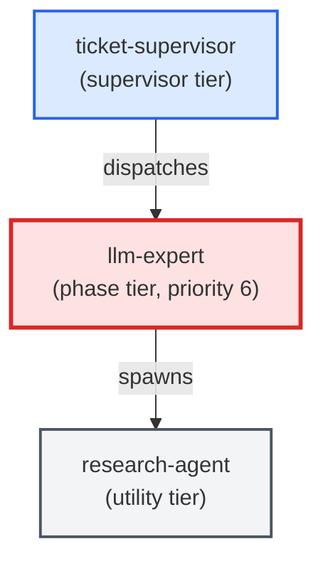

# llm-expert

**LLM-instructions specialist that owns the craft of writing, auditing, and
maintaining LLM instructions inside agent templates, skill files, and
slash-command prompts. Writes and edits agent templates
(templates/agents/*.md), writes and edits skill bodies
(templates/skills/*/SKILL.md), and audits prompts for convention violations
(shell rules, nesting limits, tool allowlists, signoff protocol adherence).
Use when: a ticket's agents: map is marked as requiring prompt-engineering or
template work; user asks to "write an agent template", "audit a skill", or
"create a slash-command prompt".**

| Field | Value |
|-------|-------|
| Model | sonnet |
| Tier | phase |
| Priority | 6 |
| Portable | Yes |
| Sign-off capable | Yes |

---

## When to Use

### Spawned By

- `ticket-supervisor`
---

## Knowledge Flow

| Channel | Source | Injection Mode | Description |
|---------|--------|----------------|-------------|
| 1 | template description field | — | — |
| 3 | ticket_path from ticket-supervisor | — | — |
| 4 | pre-flight file reads | — | — |
| 6 | project files read during execution | — | — |
| 7 | bash command output (git, build, tests) | — | — |
| 8 | PROJECT_CONTEXT.md | — | — |
---

## Spawn and Dependency

---

## Input / Output Contract

### Inputs

| Name | Type | Description |
|------|------|-------------|
| `ticket_path` | file_path | Absolute path to the ticket markdown file |

### Outputs

| Name | Type | Description |
|------|------|-------------|
| `sign_off_comment` | sign_off_comment | Sign-off comment with status: ok | blocker | handoff |

### Mutates (Side Effects)

| Name | Type | Description |
|------|------|-------------|
| `ticket_frontmatter_agents_status` | — | Sets agents.llm-expert to signed_off or failed |
| `sign_offs_checklist` | — | Checks the llm-expert checkbox with timestamp |
| `implementation_artifacts` | — | Files created or modified during phase execution |
---

## Tools Available

| Tool |
|------|
| `Bash` |
| `Read` |
| `Edit` |
| `Write` |
| `Agent` |
---

## Skills Used

| Skill | Mode | Condition |
|-------|------|-----------|
| `signoff` | conditional | — |
| `add-agent-to-package` | conditional | — |
| `add-skill-to-package` | conditional | — |
---

## Configuration

*No configuration keys declared.*
---

## Contributor Notes

### Key Behavioral Patterns

| Pattern | Trigger | Behavior | Related Agent |
|---------|---------|----------|---------------|
| Stop-and-Ask | condition requiring user decision or out-of-scope action | Stop and ask the user when:**
- The ticket's acceptance criteria are ambiguous about the prompt's in | `None` |
| Delegation to add-agent-to-package | task requiring add-agent-to-package capabilities | Delegates to add-agent-to-package via Agent tool | `add-agent-to-package` |
| Conditional Behavior | a `ticket_path` was provided | Read the ticket in full | `None` |
| Conditional Behavior | editing an existing agent | Read the current | `None` |
