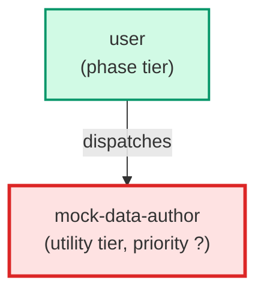

# mock-data-author

**Mock-data authoring agent for the product-truth store. Given a classified request
naming a component and its entities, it drafts or EXTENDS the one canonical dataset
for those entities — realistic sample records the mockups and flow are built on.
It enforces the store's add-vs-create rule: one canonical dataset per entity per
component; it grows in place and is never duplicated. Output is a *.mock.json
conforming to mock-data.schema.json.

Use when: the product-truth classifier (pt-classifier) returns needs_mock_data
(outcomes full-set / mockup+data / mock-data-only) and the pipeline needs the
canonical dataset drafted or extended before mockups, flow, or tests are built.**

| Field | Value |
|-------|-------|
| Model | opus |
| Tier | utility |
| Priority | — |
| Portable | Yes |
| Sign-off capable | No |

---

## When to Use

### Spawned By

- `user`
---

## Knowledge Flow

| Channel | Source | Injection Mode | Description |
|---------|--------|----------------|-------------|
| 1 | template description field | — | — |
| 6 | product-truth store files read during execution (README, schema, gold seed, index.json) | — | — |
| 7 | bash command output (generate_product_truth.py, validate_product_truth.py) | — | — |
---

## Spawn and Dependency

---

## Input / Output Contract

### Outputs

| Name | Type | Description |
|------|------|-------------|
| `mock_data_artifact` | structured_response | A drafted or extended *.mock.json artifact plus a completion report |

### Mutates (Side Effects)

| Name | Type | Description |
|------|------|-------------|
| `mock_data` | — | Product-truth mock-data artifacts plus the index.json artifacts[] entry and, when a genuinely-new entity is introduced, its entity_registry admission |
---

## Tools Available

| Tool |
|------|
| `Read` |
| `Write` |
| `Edit` |
| `Bash` |
---

## Skills Used

*No skills declared.*
---

## Configuration

*No configuration keys declared.*
---

## Contributor Notes

### Key Behavioral Patterns

| Pattern | Trigger | Behavior | Related Agent |
|---------|---------|----------|---------------|
| Conditional Behavior | a store file is missing | absent, unreadable, or oversized | `None` |
| Conditional Behavior | a canonical dataset already exists for the entities | extend in place rather than create a duplicate | `None` |
---

## AC Assignments

### mock-data-author

- UXP-540: A mock-data agent drafts or extends the one canonical dataset for the classified entities
