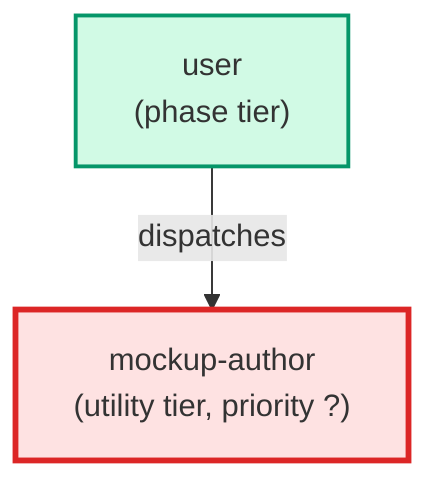

# mockup-author

**Mockup authoring agent for the product-truth store. Given drafted mock data and a
request that involves one or more screens, it drafts (or extends in place) a mockup
for each screen — a *.mockup.json plus a self-contained HTML rendering — populated
from the mock data records, not placeholder text. Each mockup registers a screen id
that a flow's steps can resolve. Output conforms to mockup.schema.json.

Use when: the product-truth classifier (pt-classifier) returns needs_mockup
(outcomes full-set / mockup+data / mockup-only) and the pipeline needs the screens
drafted from the canonical mock data before the flow is assembled or the UI is built.**

| Field | Value |
|-------|-------|
| Model | sonnet |
| Tier | utility |
| Priority | — |
| Portable | Yes |
| Sign-off capable | No |

---

## When to Use

### Spawned By

- `user`
---

## Knowledge Flow

| Channel | Source | Injection Mode | Description |
|---------|--------|----------------|-------------|
| 1 | template description field | — | — |
| 6 | product-truth store files read during execution (README, schema, gold seed, mock data, index.json) | — | — |
| 7 | bash command output (generate_product_truth.py, validate_product_truth.py) | — | — |
---

## Spawn and Dependency

---

## Input / Output Contract

### Outputs

| Name | Type | Description |
|------|------|-------------|
| `mockup_artifacts` | structured_response | One or more drafted/extended *.mockup.json (+ HTML) plus a completion report |

### Mutates (Side Effects)

| Name | Type | Description |
|------|------|-------------|
| `mockup` | — | Product-truth mockup artifacts and the index.json artifacts[] entry |
---

## Tools Available

| Tool |
|------|
| `Read` |
| `Write` |
| `Edit` |
| `Bash` |
---

## Skills Used

*No skills declared.*
---

## Configuration

*No configuration keys declared.*
---

## Contributor Notes

### Key Behavioral Patterns

| Pattern | Trigger | Behavior | Related Agent |
|---------|---------|----------|---------------|
| Conditional Behavior | a screen id already exists for the request | extend the existing screen in place rather than create a duplicate | `None` |
| Conditional Behavior | a store file is missing | absent, unreadable, or oversized | `None` |
---

## AC Assignments

### mockup-author

- UXP-541: A mockup agent drafts each screen populated from the mock data
