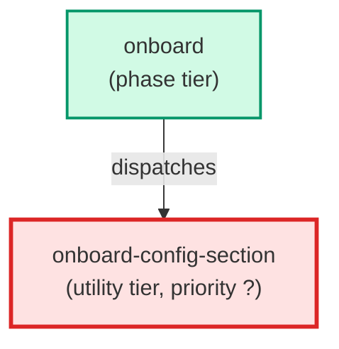

# onboard-config-section

**Haiku sub-agent spawned in parallel by the onboard wizard. Receives a discovery payload (folder structure, file excerpts, owned keys, confirmed values) and returns a JSON config fragment covering only the keys it owns. One instance is spawned per skills_config.json section (testing, packages, tickets, commands, project).**

| Field | Value |
|-------|-------|
| Model | haiku |
| Tier | utility |
| Priority | — |
| Portable | Yes |
| Sign-off capable | No |

---

## When to Use

### Spawned By

- `onboard`
---

## Knowledge Flow

| Channel | Source | Injection Mode | Description |
|---------|--------|----------------|-------------|
| 1 | template description field | — | — |
| 6 | project files read during execution | — | — |
---

## Spawn and Dependency

---

## Input / Output Contract

### Outputs

| Name | Type | Description |
|------|------|-------------|
| `key1` | structured_response | Output field: key1 |
| `key2` | structured_response | Output field: key2 |
| `test_command_live_trader` | structured_response | Output field: test_command_live_trader |

### Mutates (Side Effects)

| Name | Type | Description |
|------|------|-------------|
| `none` | — | Read-only agent — no filesystem mutations |
---

## Tools Available

| Tool |
|------|
| `Read` |
---

## Skills Used

*No skills declared.*
---

## Configuration

*No configuration keys declared.*
---

## Contributor Notes

### Key Behavioral Patterns

| Pattern | Trigger | Behavior | Related Agent |
|---------|---------|----------|---------------|
| Conditional Behavior | `tickets/` folder found with `00_inbox/` | `01_todo/`, `99_done/` subdirs: | `None` |
