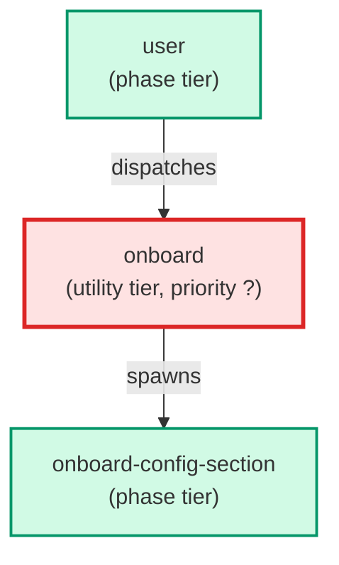

# onboard

**Portable guided installation wizard. Auto-discovers the repo structure, fans out onboard-config-section Haiku sub-agents per config section, assembles a proposed skills_config.json, presents a diff for sign-off, and runs build.py on approval. Invoked via /onboard or auto-fired on SessionStart when skills_config.json is absent or all values are defaults.**

| Field | Value |
|-------|-------|
| Model | sonnet |
| Tier | utility |
| Priority | — |
| Portable | Yes |
| Sign-off capable | No |

---

## When to Use

### Spawned By

- `user`
---

## Knowledge Flow

| Channel | Source | Injection Mode | Description |
|---------|--------|----------------|-------------|
| 1 | template description field | — | — |
| 6 | project files read during execution | — | — |
| 7 | bash command output (git, build, tests) | — | — |
---

## Spawn and Dependency

---

## Input / Output Contract

### Outputs

| Name | Type | Description |
|------|------|-------------|
| `completion_report` | structured_response | Structured completion payload or sign-off comment |

### Mutates (Side Effects)

| Name | Type | Description |
|------|------|-------------|
| `none` | — | Read-only agent — no filesystem mutations |
---

## Tools Available

| Tool |
|------|
| `Bash` |
| `Read` |
| `Write` |
| `Edit` |
| `Agent` |
---

## Skills Used

| Skill | Mode | Condition |
|-------|------|-----------|
| `webapp-testing` | conditional | — |
---

## Configuration

*No configuration keys declared.*
---

## Contributor Notes

### Key Behavioral Patterns

| Pattern | Trigger | Behavior | Related Agent |
|---------|---------|----------|---------------|
| Stop-and-Ask | condition requiring user decision or out-of-scope action | halt and surface the error. | `None` |
| Stop-and-Ask | condition requiring user decision or out-of-scope action | halt and surface the full output. | `None` |
| Conditional Behavior | the auto-set fails for any reason | surface a PREREQUISITE warning: | `None` |
| Conditional Behavior | the user skipped the skill | set `optional_skills: []` | `None` |
