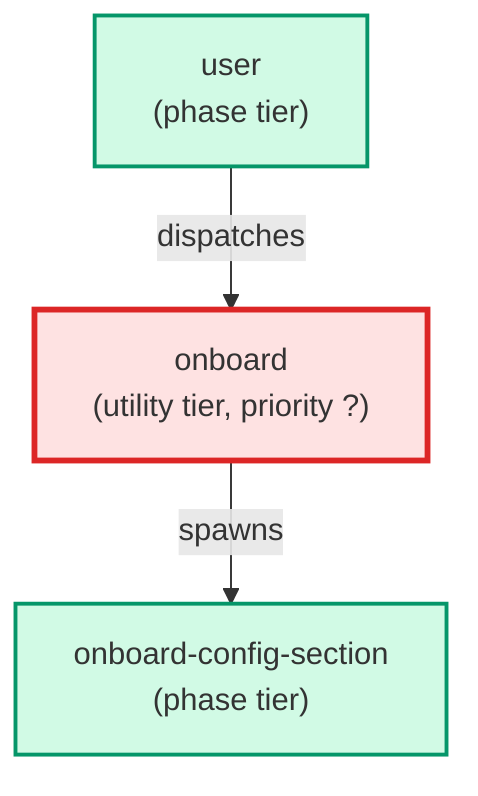

# onboard

**Portable guided installation wizard. Auto-discovers the repo structure, fans out onboard-config-section Haiku sub-agents per config section, assembles a proposed skills_config.json, presents a diff for sign-off, and runs build.py on approval. Invoked via /onboard or auto-fired on SessionStart when skills_config.json is absent or all values are defaults.**

| Field | Value |
|-------|-------|
| Model | sonnet |
| Tier | utility |
| Priority | — |
| Portable | Yes |
| Sign-off capable | No |

---

## When to Use

### Spawned By

- `user`
---

## Knowledge Flow

*No knowledge channels declared.*

---

## Spawn and Dependency

---

## Input / Output Contract

*No structured I/O contract declared.*
---

## Tools Available

| Tool |
|------|
| `Bash` |
| `Read` |
| `Write` |
| `Edit` |
| `Agent` |
---

## Skills Used

*No skills declared.*
---

## Configuration

*No configuration keys declared.*
---

## Contributor Notes

No conditional behaviors — this agent follows a single fixed execution path
