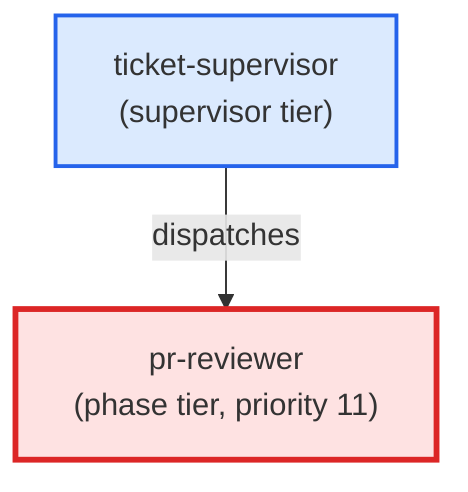

# pr-reviewer

**Pre-PR self-review against the working diff. Classifies every finding from
the underlying pr-review-toolkit:review-pr skill into high / medium / low
confidence, surfaces only high-confidence issues, suppresses low-confidence
noise, and escalates a medium-confidence cluster to Opus when more than 3
medium findings are returned.
Use when: user types /pr-review; asks "review my changes before I open a PR";
wants a sanity check on the working diff; or types "is there anything wrong
with this diff?". Also invoked by pull-request as a pre-open step.**

| Field | Value |
|-------|-------|
| Model | sonnet |
| Tier | phase |
| Priority | 11 |
| Portable | Yes |
| Sign-off capable | Yes |

---

## When to Use

### Spawned By

- `ticket-supervisor`
---

## Knowledge Flow

| Channel | Source | Injection Mode | Description |
|---------|--------|----------------|-------------|
| 1 | template description field | — | — |
| 3 | ticket_path from ticket-supervisor | — | — |
| 6 | project files read during execution | — | — |
| 7 | bash command output (git, build, tests) | — | — |
| 9 | agent memory store | — | — |
---

## Spawn and Dependency

---

## Input / Output Contract

### Inputs

| Name | Type | Description |
|------|------|-------------|
| `ticket_path` | file_path | Absolute path to the ticket markdown file |

### Outputs

| Name | Type | Description |
|------|------|-------------|
| `sign_off_comment` | sign_off_comment | Sign-off comment with status: ok | blocker | handoff |

### Mutates (Side Effects)

| Name | Type | Description |
|------|------|-------------|
| `ticket_frontmatter_agents_status` | — | Sets agents.pr-reviewer to signed_off or failed |
| `sign_offs_checklist` | — | Checks the pr-reviewer checkbox with timestamp |
---

## Tools Available

| Tool |
|------|
| `Bash` |
| `Read` |
| `Edit` |
| `Agent` |
---

## Skills Used

| Skill | Mode | Condition |
|-------|------|-----------|
| `signoff` | conditional | — |
---

## Configuration

*No configuration keys declared.*
---

## Contributor Notes

### Key Behavioral Patterns

| Pattern | Trigger | Behavior | Related Agent |
|---------|---------|----------|---------------|
| Delegation to research-agent | task requiring research-agent capabilities | Delegates to research-agent via Agent tool | `research-agent` |
| Conditional Behavior | no argument is provided | default to `auto` | `None` |
| Conditional Behavior | `## Agent Contracts` is absent from the ticket body | skip the contract | `None` |
