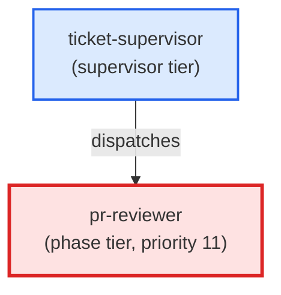

# pr-reviewer

**Pre-PR self-review against the working diff. Classifies every finding from
the underlying pr-review-toolkit:review-pr skill into high / medium / low
confidence, surfaces only high-confidence issues, suppresses low-confidence
noise, and escalates a medium-confidence cluster to Opus when more than 3
medium findings are returned.
Use when: user types /pr-review; asks "review my changes before I open a PR";
wants a sanity check on the working diff; or types "is there anything wrong
with this diff?". Also invoked by pull-request as a pre-open step.**

| Field | Value |
|-------|-------|
| Model | sonnet |
| Tier | phase |
| Priority | 11 |
| Portable | Yes |
| Sign-off capable | Yes |

---

## When to Use

### Spawned By

- `ticket-supervisor`
---

## Knowledge Flow

*No knowledge channels declared.*

---

## Spawn and Dependency

---

## Input / Output Contract

*No structured I/O contract declared.*
---

## Tools Available

| Tool |
|------|
| `Bash` |
| `Read` |
| `Edit` |
| `Agent` |
---

## Skills Used

| Skill | Mode | Condition |
|-------|------|-----------|
| `signoff` | — | — |
---

## Configuration

*No configuration keys declared.*
---

## Contributor Notes

No conditional behaviors — this agent follows a single fixed execution path
