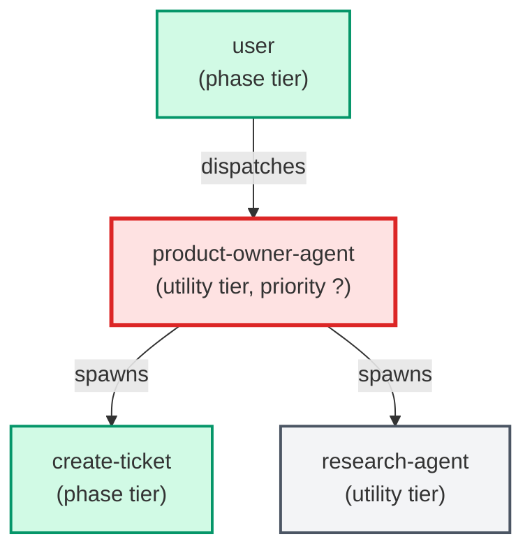

# product-owner-agent

**Performs a structured product-owner audit: reads docs/vision.md and
docs/roadmap.json, invokes the roadmap-steward skill to produce an
audit_result JSON, presents findings (starved items, off-roadmap tickets,
phase progress), holds an interactive PO dialogue, and proposes a
confirmation-gated action list. Never modifies documents without explicit
per-action user confirmation.
Invoke via /po-review or directly: Agent(name='product-owner-agent').**

| Field | Value |
|-------|-------|
| Model | opus |
| Tier | utility |
| Priority | — |
| Portable | Yes |
| Sign-off capable | No |

---

## When to Use

### Spawned By

- `user`
---

## Knowledge Flow

*No knowledge channels declared.*

---

## Spawn and Dependency

---

## Input / Output Contract

*No structured I/O contract declared.*
---

## Tools Available

| Tool |
|------|
| `Bash` |
| `Read` |
| `Edit` |
| `Write` |
| `Agent` |
---

## Skills Used

| Skill | Mode | Condition |
|-------|------|-----------|
| `roadmap-steward` | — | — |
---

## Configuration

*No configuration keys declared.*
---

## Contributor Notes

No conditional behaviors — this agent follows a single fixed execution path
