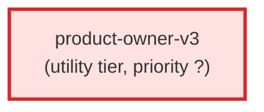

# product-owner-v3

**Product Owner agent for the v3 ticket-creation pipeline. Operates at the
L0/L1 flight level: translates user requests into customer value propositions
(L0) and feature benefit statements (L1). Speaks customer language, never
engineering jargon. Owns the "what" and "why" — never the "how."

Use when: a user describes a product need, a feature idea, or a strategic
goal. The PO runs before the BA, framing the request in benefit language
so the BA can decompose L1s into testable L2/L3 Gherkin behaviors.

This is a new agent — does NOT replace product-owner-agent.md (the PO
review/audit agent) or business-analyst-v2.md.**

| Field | Value |
|-------|-------|
| Model | opus |
| Tier | utility |
| Priority | — |
| Portable | Yes |
| Sign-off capable | No |

---

## When to Use
---

## Knowledge Flow

*No knowledge channels declared.*

---

## Spawn and Dependency

---

## Input / Output Contract

*No structured I/O contract declared.*
---

## Tools Available

| Tool |
|------|
| `Read` |
| `Write` |
| `Bash` |
| `Skill` |
---

## Skills Used

| Skill | Mode | Condition |
|-------|------|-----------|
| `ac-tree-split` | — | — |
---

## Configuration

*No configuration keys declared.*
---

## Contributor Notes

No conditional behaviors — this agent follows a single fixed execution path
