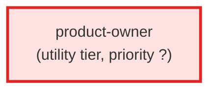

# product-owner

**Product Owner agent for the AC pipeline. Operates at the L0/L1 flight level:
translates user requests into customer value propositions (L0) and feature
benefit statements (L1). Speaks customer language, never engineering jargon.
Owns the "what" and "why" — never the "how."

Use when: a user describes a product need, a feature idea, or a strategic
goal. The PO runs before the BA, framing the request in benefit language
so the BA can decompose L1s into testable L2/L3 Gherkin behaviors.**

| Field | Value |
|-------|-------|
| Model | opus |
| Tier | utility |
| Priority | — |
| Portable | Yes |
| Sign-off capable | No |

---

## When to Use
---

## Knowledge Flow

| Channel | Source | Injection Mode | Description |
|---------|--------|----------------|-------------|
| 1 | template description field | — | — |
| 4 | pre-flight file reads | — | — |
| 6 | project files read during execution | — | — |
| 7 | bash command output (git, build, tests) | — | — |
| 8 | PROJECT_CONTEXT.md | — | — |
---

## Spawn and Dependency

---

## Input / Output Contract

### Outputs

| Name | Type | Description |
|------|------|-------------|
| `completion_report` | structured_response | Structured completion payload or sign-off comment |

### Mutates (Side Effects)

| Name | Type | Description |
|------|------|-------------|
| `none` | — | Read-only agent — no filesystem mutations |
---

## Tools Available

| Tool |
|------|
| `Read` |
| `Write` |
| `Edit` |
| `Bash` |
| `Skill` |
---

## Skills Used

| Skill | Mode | Condition |
|-------|------|-----------|
| `signoff` | always | — |
---

## Configuration

*No configuration keys declared.*
---

## Contributor Notes

### Key Behavioral Patterns

| Pattern | Trigger | Behavior | Related Agent |
|---------|---------|----------|---------------|
| Conditional Behavior | a user request implies a strategic shift (new direction | reprioritization, | `None` |
| Conditional Behavior | a file is absent | unreadable, binary, or exceeds 50 KB | `None` |
