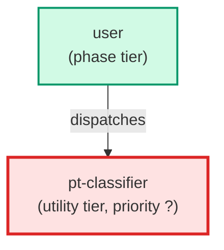

# pt-classifier

**Product-truth request classifier. Given a plain-language feature request, decides
which product-truth artifacts it needs — needs_flow, needs_mock_data, needs_mockup
(a boolean each) — maps that combination to a routing outcome (full-set /
mockup+data / mockup-only / mock-data-only / none), and names the target component,
the entities, and the add-vs-create decision. Read-only: it writes NO files and
returns a structured JSON decision the authoring pipeline routes on, so only the
agents a request actually needs are dispatched.

Use when: the product-truth authoring pipeline (define-a-feature's draft step)
needs to decide which of the mock-data-author / mockup-author / flow-author agents
to run for a request. Runs first, before any authoring agent.**

| Field | Value |
|-------|-------|
| Model | haiku |
| Tier | utility |
| Priority | — |
| Portable | Yes |
| Sign-off capable | No |

---

## When to Use

### Spawned By

- `user`
---

## Knowledge Flow

| Channel | Source | Injection Mode | Description |
|---------|--------|----------------|-------------|
| 1 | template description field | — | — |
| 6 | product-truth store files read during execution (README, eval.jsonl, schemas, index.json) | — | — |
| 7 | bash command output (reads of docs/product-truth/) | — | — |
---

## Spawn and Dependency

---

## Input / Output Contract

### Outputs

| Name | Type | Description |
|------|------|-------------|
| `classification` | structured_response | Structured classification + routing decision (JSON) |

### Mutates (Side Effects)

| Name | Type | Description |
|------|------|-------------|
| `none` | — | Read-only agent — no filesystem mutations |
---

## Tools Available

| Tool |
|------|
| `Read` |
| `Bash` |
---

## Skills Used

*No skills declared.*
---

## Configuration

*No configuration keys declared.*
---

## Contributor Notes

### Key Behavioral Patterns

| Pattern | Trigger | Behavior | Related Agent |
|---------|---------|----------|---------------|
| Conditional Behavior | a store file is missing | absent, unreadable, or oversized | `None` |
---

## AC Assignments

### pt-classifier

- UXP-543: Only the artifact-agents the classifier calls for are run
