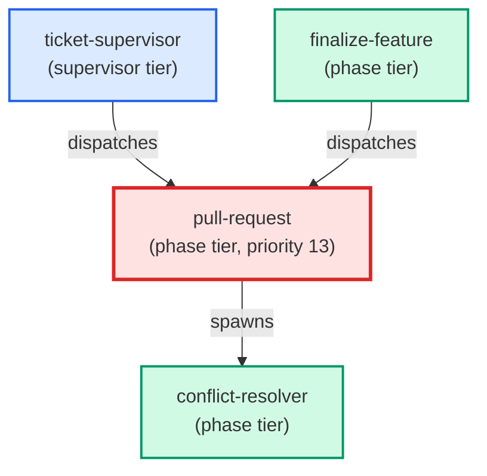

# pull-request

**Confirmation-gated PR creation agent. Reads recent commits on the current
branch, drafts a title (<=70 chars) and body (Summary + Test plan), shows
the draft to the user, and waits for an explicit "yes" before pushing the
branch and running gh pr create. Spawns conflict-resolver on any merge
conflict detected before the push, then retries once after resolution.
Use when: user types /pull-request; is in the commit->push->PR flow via
/commit-push-pr; or asks to "open a PR", "create a pull request", or
"push and open a PR for this branch".**

| Field | Value |
|-------|-------|
| Model | sonnet |
| Tier | phase |
| Priority | 13 |
| Portable | Yes |
| Sign-off capable | Yes |

---

## When to Use

### Spawned By

- `ticket-supervisor`
- `finalize-feature`
---

## Knowledge Flow

*No knowledge channels declared.*

---

## Spawn and Dependency

---

## Input / Output Contract

*No structured I/O contract declared.*
---

## Tools Available

| Tool |
|------|
| `Bash` |
| `Read` |
| `Edit` |
| `Write` |
| `Agent` |
---

## Skills Used

| Skill | Mode | Condition |
|-------|------|-----------|
| `signoff` | — | — |
---

## Configuration

*No configuration keys declared.*
---

## Contributor Notes

No conditional behaviors — this agent follows a single fixed execution path
