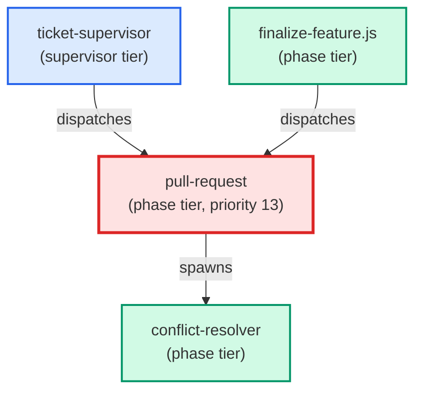

# pull-request

**Confirmation-gated PR creation agent. Reads recent commits on the current
branch, drafts a title (<=70 chars) and body (Summary + Test plan), shows
the draft to the user, and waits for an explicit "yes" before pushing the
branch and running gh pr create. Spawns conflict-resolver on any merge
conflict detected before the push, then retries once after resolution.
Use when: user types /pull-request; is in the commit->push->PR flow via
/commit-push-pr; or asks to "open a PR", "create a pull request", or
"push and open a PR for this branch".**

| Field | Value |
|-------|-------|
| Model | sonnet |
| Tier | phase |
| Priority | 13 |
| Portable | Yes |
| Sign-off capable | Yes |

---

## When to Use

### Spawned By

- `ticket-supervisor`
- `finalize-feature.js`
---

## Knowledge Flow

| Channel | Source | Injection Mode | Description |
|---------|--------|----------------|-------------|
| 1 | template description field | — | — |
| 3 | ticket_path from ticket-supervisor | — | — |
| 4 | pre-flight file reads | — | — |
| 6 | project files read during execution | — | — |
| 7 | bash command output (git, build, tests) | — | — |
| 8 | PROJECT_CONTEXT.md | — | — |
---

## Spawn and Dependency

---

## Input / Output Contract

### Inputs

| Name | Type | Description |
|------|------|-------------|
| `ticket_path` | file_path | Absolute path to the ticket markdown file |

### Outputs

| Name | Type | Description |
|------|------|-------------|
| `sign_off_comment` | sign_off_comment | Sign-off comment with status: ok | blocker | handoff |

### Mutates (Side Effects)

| Name | Type | Description |
|------|------|-------------|
| `ticket_frontmatter_agents_status` | — | Sets agents.pull-request to signed_off or failed |
| `sign_offs_checklist` | — | Checks the pull-request checkbox with timestamp |
| `implementation_artifacts` | — | Files created or modified during phase execution |
---

## Tools Available

| Tool |
|------|
| `Bash` |
| `Read` |
| `Edit` |
| `Write` |
| `Agent` |
---

## Skills Used

| Skill | Mode | Condition |
|-------|------|-----------|
| `signoff` | conditional | — |
---

## Configuration

*No configuration keys declared.*
---

## Contributor Notes

### Key Behavioral Patterns

| Pattern | Trigger | Behavior | Related Agent |
|---------|---------|----------|---------------|
| Stop-and-Ask | condition requiring user decision or out-of-scope action | Do not
proceed to drafting, pushing, or PR creation. | `None` |
| Conditional Behavior | the output is empty (no remotes configured) | stop immediately | `None` |
| Conditional Behavior | invoked with a `ticket_path` | write a `(status: blocker)` comment to the | `None` |
