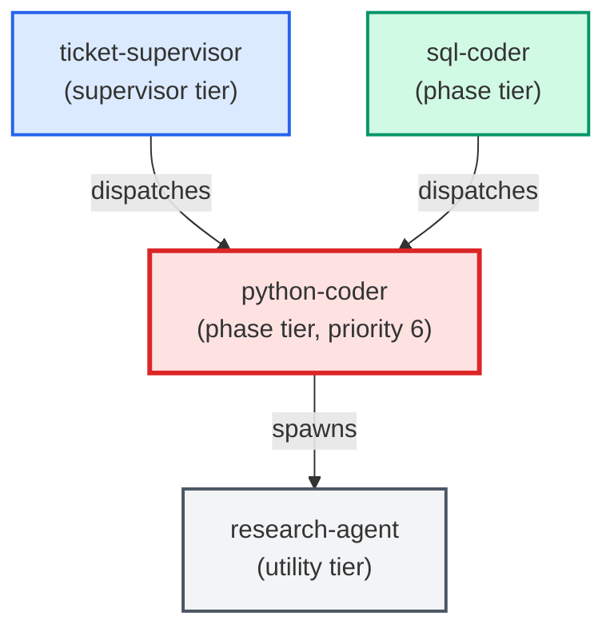

# python-coder

**Standards-enforcing Python implementation agent. Writes, edits, and refactors
Python code while automatically pulling in project conventions and running
doc-enforcer + complexity-reduction before declaring the task done.
Use when: user asks to implement a ticket in Python; says "write the code for X";
asks to refactor or extend a Python module; or any task that produces edited or
new Python files (excluding .sql files — defer those to sql-coder).**

| Field | Value |
|-------|-------|
| Model | sonnet |
| Tier | phase |
| Priority | 6 |
| Portable | Yes |
| Sign-off capable | Yes |

---

## When to Use

### Spawned By

- `ticket-supervisor`
- `sql-coder`
---

## Knowledge Flow

| Channel | Source | Injection Mode | Description |
|---------|--------|----------------|-------------|
| 1 | Root CLAUDE.md | always | Project instructions, error handling policy, shell conventions |
| 2 | Per-folder README.md | on-demand | Module-level context when cwd overlaps edited module folder |
| 5 | [signoff SKILL.md](../../../templates/skills/signoff/SKILL.md); [doc-enforcer SKILL.md](../../../templates/skills/doc-enforcer/SKILL.md); complexity-reduction; collector-enforcer | on-demand | Sign-off protocol, docstring enforcement, complexity scoring, collector pattern enforcement |
| 6 | Agent frontmatter | spawn-scoped | Model: sonnet, tools: Bash/Read/Edit/Write/Agent, signoff: true, config_keys, portable: true |
| 7 | skills_config.json + settings.json | spawn-scoped | test_command, collector_enforcer_paths, file_size_limit_py |
| 8 | Ticket frontmatter | ticket-scoped | Agents map, files_touched, depends_on, ACs, Agent Contracts section |
| 9 | Auto-memory (memory/*.md) | always | Persistent cross-session learnings |
| 10 | MCP server prompts + tool descriptions | always | Available tool surface and usage guidance |
| 11 | Glossary (docs/glossary.md) | always | Project jargon definitions via CLAUDE.md ref |
---

## Spawn and Dependency

---

## Input / Output Contract

### Inputs

| Name | Type | Description |
|------|------|-------------|
| `ticket_path` | file_path | Path to the ticket markdown file (.md) |
| `ticket_body` | structured_payload | Ticket body sections: ACs, Implementation Tasks, Agent Contracts |
| `red_baseline` | config_value | Red test list from test-writer sign-off comment, if present |
| `cited_adrs` | file | Referenced ADR files under docs/architecture/adrs/ |
| `python_conventions` | file | Relevant files under docs/conventions/ |

### Outputs

| Name | Type | Description |
|------|------|-------------|
| `edited_py_files` | file | Edited or newly created .py files |
| `completion_report` | structured_response | Structured completion report payload (Files changed, Skills run, Tests, Notes) |
| `sign_off_comment` | sign_off_comment | Sign-off comment with status: ok | handoff | blocker |
| `red_baseline_results` | structured_response | Per-test results showing which red_baseline tests moved to green |
| `completion_manifest` | structured_response | Artifact checklist in sign-off comment per signoff §2b |

### Mutates (Side Effects)

| Name | Type | Description |
|------|------|-------------|
| `ticket_frontmatter_agents_status` | — | Sets agents.python-coder to signed_off or failed |
| `sign_offs_checklist` | — | Checks the python-coder checkbox with timestamp |
| `implementation_task_checkboxes` | — | Flips all - [ ] tasks in ### python-coder section to - [x] |
| `agent_contracts_ac_checkboxes` | — | Flips AC checkboxes and appends inline sig; v2 tickets only |
| `ac_coverage_table` | — | Fills Implementation column in ## AC Coverage table; v2 tickets only |
---

## Tools Available

| Tool |
|------|
| `Bash` |
| `Read` |
| `Edit` |
| `Write` |
| `Agent` |
---

## Skills Used

| Skill | Mode | Condition |
|-------|------|-----------|
| `signoff` | always | — |
| `doc-enforcer` | always | — |
| `run-tests` | conditional | — |
---

## Configuration

| Key | Required | Description |
|-----|----------|-------------|
| `test_command_live_trader` | No | Command to run the fast unit test suite |
| `test_output_dir` | No | Temp directory for test output (outside project root) |
| `collector_enforcer_paths` | No | Paths that trigger the collector-enforcer skill |
| `file_size_limit_py` | No | Maximum lines for new .py files; referenced as {{config.file_size_limit_py}} |
| `testing_context.max_test_duration_seconds` | No | 5-second ceiling for auto-run tests |
---

## Contributor Notes

### Key Behavioral Patterns

| Pattern | Trigger | Behavior | Related Agent |
|---------|---------|----------|---------------|
| Contract-Aware Mode | Ticket body contains ## Agent Contracts with ### python-coder sub-heading | Contract block becomes primary spec, superseding ## Implementation Tasks for scope and interface decisions | `None` |
| TDD Red-Baseline Gate | test-writer signed off before python-coder; red_baseline present in sign-off comment | Must turn all red_baseline tests green; cannot skip or xfail any listed test | `test-writer` |
| Stop-and-Ask | Implementation task requires editing a .sql file | Halts immediately and instructs caller to use sql-coder for the SQL portion | `sql-coder` |
| Contract-Shrinkage Guard | About to narrow a return shape, function signature, or dictionary structure | Must enumerate consumers via research-agent first; blocked if any consumer depends on removed field | `research-agent` |
| Test Delegation | Implementation requires new or updated unit tests | Adds tasks to ### test-writer section and uses (status: handoff) instead of (status: ok) | `test-writer` |
| File-Size Limit | New .py file would exceed {{config.file_size_limit_py}} lines | Plans module splits upfront using build_phases.py / build_helpers.py precedent | `None` |
| Research Delegation | Any cross-file or symbol-level question arises during implementation | Delegates to research-agent via Agent tool; never guesses or searches directly | `research-agent` |
---

## References

- [Agent Knowledge Plane](../../architecture/agent_knowledge_plane.md)
- [Agent Conventions](../conventions.md)
---

## AC Assignments

### python-coder

- ACD-1100a-2: Legacy pipeline agent registry entries are removed
- ACD-1100a-3: No workflow or skill dispatches a removed legacy agent
- ACD-1100b-2: Agent registry entries use canonical names without version suffixes
- ACD-1100b-3: All cross-references to v3 agent names are updated to canonical names
- ACD-1100b-3-i: Edge case: no agent in the entire registry carries any version suffix
- ACD-1100c-2: Old /create-ac command surface is fully absent
- ACD-1100e-1: Version file exists with semver 2.0.0
- ACD-1100e-2: Build output references the package version
- ACD-1100f-1: Historical origin_agent values pass AC schema validation
- ACD-1100f-1-i: Edge case: origin_agent accepts any historical agent name without allowlist
- ACD-1200a-10: Leaf collection excludes done and superseded ACs while still recursing into a superseded AC's replacement children
- ACD-1200a-10-i: A goal whose every leaf is done or superseded yields an empty leaf set and triggers the zero-leaf error path, not an empty epic
- ACD-1200a-11: Regenerating a ticket dedupes the AC's implemented_by back-reference to a single entry
- ACD-1200a-11-i: Regeneration preserves an AC's unrelated implemented_by entries and only collapses the same-ticket duplicate
- ACD-1200a-12: implemented_by back-reference records a repo-relative ticket path, never absolute or worktree-specific
- ACD-1200a-13: A legacy absolute or cross-worktree entry for the same ticket is collapsed to one repo-relative entry via a shared canonicaliser
- ACD-1200a-14: A ticket path outside the passed worktree is still recorded repo-relative via a git-derived repo root
- ACD-1200a-14-i: When the repo root cannot be derived from git, the back-reference write degrades to a documented fallback
- ACD-1200a-2: One ticket file is generated per leaf AC in the collected set
- ACD-1200a-3: Generated tickets are assembled into a named EPIC folder ready for the supervisor
- ACD-1200a-3-i: Goal with zero leaf ACs beneath it produces an error, not an empty epic
- ACD-1200a-3-ii: Apostrophes and quote characters in the goal title are stripped before PascalCasing the epic folder name
- ACD-1200a-3-iii: Epic slug is ASCII-safe for non-ASCII punctuation, is not truncated mid-word, and is identical in dry-run and real run
- ACD-1200a-8: Epic folder includes a Master_Plan.md so /build-feature can drive it
- ACD-1200a-9: Each epic ticket is written only inside the epic folder, with its back-reference pointing at the epic-folder path
- ACD-1200a-9-i: A ticket whose basename already exists at the epic-folder path is resolved deterministically, never duplicated to a second location
- ACD-1200b-1: Readiness report surfaces count and IDs of unapproved ACs before generation
- ACD-1200b-1-i: When all leaf ACs are already approved the readiness gate is skipped entirely
- ACD-1200b-4: Non-interactive run with an approval flag clears the readiness gate; without a flag and without a TTY it fails clearly
- ACD-1200b-5: A supported approval mechanism promotes reviewed leaf ACs to approved without hand-editing YAML
- ACD-1200b-5-i: Approval mechanism leaves already-approved and non-reviewed leaves unchanged
- ACD-1200c-1: AC depends_on relationships are propagated to ticket depends_on fields
- ACD-1200c-1-i: Circular dependency among leaf ACs is detected and reported before ticket generation
- ACD-1200c-2: Multi-hop dependency chains produce transitive ticket ordering
- ACD-1200c-3: A dependency cycle in one subtree degrades the store-wide scan to a warning, while a real intra-scope cycle still hard-fails a scoped epic build
- ACD-1200c-3-i: The store-wide cycle warning lists the full cycle path and the scan still exits 0 when the cycle is outside the requested scope
- ACD-1200d-1: All in-scope leaf ACs receive target_epic matching the generated epic folder name
- ACD-1200d-1-i: AC already tagged with a different target_epic triggers a conflict warning
- ACD-1200d-2: ACs excluded by the approval gate do NOT receive target_epic
- ACD-1200f-1: Tree traversal collects only leaf-level ACs beneath the target goal
- ACD-1200f-1-i: Traversal from an L1 collects only the leaves beneath that L1, not the whole L0 tree
- ACD-1200f-2: Level-based leaf detection: _dfs_collect_leaves uses level field, not covered_by emptiness
- ACD-1200f-2-i: traverse_ac_tree emits each leaf once even when reachable by multiple covered_by paths
- ACD-1500a-1: Router reads only the unresolved feedback set as its work queue
- ACD-1500a-2-i: Entry resolved between scan and route is dropped without action
- ACD-1500a-3: Routing matrix sends each classified entry to its destination
- ACD-1500b-2: Classifications below the confidence floor are parked, not auto-acted
- ACD-1500b-2-i: Confidence exactly at the floor is allowed to proceed
- ACD-1500b-3: Blocker-category entries are always parked regardless of confidence
- ACD-1500b-3-i: High-confidence blocker is still parked — blocker rule wins
- ACD-1500b-4: Parked entries remain unresolved so feedback-review still surfaces them
- ACD-1500c-1: After producing an artifact, the entry is resolved with a back-reference
- ACD-1500c-1-i: Half-succeeded artifact creation must not mark the entry resolved (atomicity)
- ACD-1500c-2: Resolved entries are excluded from the next scan
- ACD-1500c-2-i: Re-running the router is idempotent for already-resolved entries
- ACD-1500c-3: The back-reference is recoverable from feedback id to the artifact
- ACD-1500d-1: Feature-type items are checked for roadmap alignment before auto-authoring
- ACD-1500d-1-i: Missing roadmap fails safe — entry is parked, not assumed aligned
- ACD-1500d-2: A configurable per-run cap limits how many artifacts the router auto-creates
- ACD-1500d-2-i: Cap reached mid-run parks the remainder and ends the run cleanly
- ACD-1500d-3: The router never auto-commits on a protected branch
- ACD-1500e-1: Thin feedback that blocks confident routing triggers the router's own process-feedback
- ACD-1500e-1-i: Process-feedback is deduplicated to prevent feedback storms
- ACD-1500e-2: Emitted process-feedback names the specific deficiency so it is actionable
- ACD-1500e-3: Emitted process-feedback is itself routable by a future run so the loop compounds
- ACD-1500e-3-i: Router-emitted process-feedback cannot drive an infinite self-referential loop
- ACD-1500e-4: Process-feedback recommends faster, more verbose, more structured emission
- ACD-1600a-1: Generated ticket references its AC by id instead of copying the criteria
- ACD-1600a-1-i: Unresolvable source AC aborts generation rather than embedding a partial copy
- ACD-1600a-2: Generated ticket omits requirement and contract copies, keeping only the checklist
- ACD-1600c-1: An AC missing file targets or a test contract is flagged not implementation-ready
- ACD-1600c-1-i: Real ACs lacking file targets (ACD-300c-3, TQ-200a-1) are held back, not dispatched
- ACD-1600c-2: An AC carrying both file targets and a test contract is released to its builder
- ACD-1600d-1: A file target pointing at a deployed copy of a template is flagged for the canonical source
- ACD-1600d-1-i: A genuinely source-only path under scripts/ is not falsely flagged
- ACD-1600d-2: The canonical-source check applies to implemented_by and doc_links, not just file targets
- ACD-1600e-1: Criteria embedding an authoring-pipeline precondition is flagged
- ACD-1600e-1-i: A legitimate runtime or domain precondition is not mistaken for authoring framing
- ACD-1600e-2: Criteria describing only the behaviour to build passes the check
- ACD-1600f-1: A referenced supporting artifact is checked for schema consistency with the AC
- ACD-1600f-1-i: A fixture using `request` where the AC specifies `input` is flagged
- ACD-1600f-2: An artifact consistent with its AC passes the consistency check
- ACD-1600g-1: A requirement declares the boundary it must not cross, alongside the surface it changes
- ACD-1600g-2: A bundle's boundary is the members' exclusions minus every member's change surface, never their union
- ACD-1600g-2-i: A directory-grain exclusion is cancelled by a member that changes an exact file inside it
- ACD-1600g-3: A change outside the declared boundary is surfaced for a decision, naming the file and the requirement that excluded it
- ACD-1600g-3-i: A boundary breach caused by one member of a bundle names that member, not the bundle
- ACD-1600g-4: A scope review with no boundary to read says so loudly instead of falling back to guesswork
- ACD-1700a-1: A coder's spawn context excludes cross-role authoring content
- ACD-1700a-2: Each role still receives its own role-appropriate context
- ACD-1700b-1: An assigned_agent that mismatches the deliverable surface is flagged
- ACD-1700b-1-i: A deliverable spanning two surfaces is flagged for a split, not a single agent
- ACD-1700b-2: An assigned_agent that matches the deliverable surface passes the check
- ACD-1700c-1: The tool assembles an agent's effective prompt from template, channels, and AC-graph context
- ACD-1700c-1-i: An AC with no relationships renders empty sections rather than omitting or erroring
- ACD-1700c-2: Dependencies are shown together with what they already shipped
- ACD-1700c-3: Non-reproducible channels are explicitly marked in the rendered brief
- ACD-1700c-4: Cross-agent AC content is shown as a pointer, not inlined as a full spec
- ACD-1800a-1: A requirement carries an explicit deliverable checklist naming each artifact's kind and responsible craft
- ACD-1800a-2: The deliverable checklist is validated against the requirement's change surface
- ACD-1800a-2-i: A requirement that needs docs or a diagram but omits them from its checklist is flagged incomplete, naming each missing kind
- ACD-1800a-4: A requirement can list a reviewed product-truth artifact as a deliverable, proven by a journey step naming it
- ACD-1800b-1a: A per-deliverable sign-off record is stored on the requirement itself, in independent slots
- ACD-1800b-2: A requirement is done only when every deliverable is signed off
- ACD-1800b-2-i: A deliverable that does not apply is recorded as not-applicable, never silently skipped
- ACD-1800c-1: A ticket enumerates its grouped requirements and carries no sign-offs of its own
- ACD-1800c-2: A ticket is done exactly when all its grouped requirements are done
- ACD-1800c-2-i: A requirement joins a ticket's group without the ticket duplicating the requirement's content
- ACD-1800c-5: The sign-off parity gate accepts AC-side sign-offs and requires no body Sign-offs section on a thin ticket
- ACD-1800d-1: A requirement records, per deliverable, the concrete artifact that delivered it, navigable both ways
- ACD-1800d-1-i: A per-deliverable back-reference resolves to the hand-edited canonical file, never a generated or deployed copy
- ACD-1800e-1: Re-deriving work from a requirement produces no duplicate deliverables, tickets, or sign-off slots
- ACD-1800e-1-i: Re-deriving after a partial derivation fills only the missing items and leaves existing ones untouched
- ACD-1800f-1: A requirement can declare that it has an observable effect, through one slot that every observation craft reads
- ACD-1800f-1-i: A requirement asking for a live-surface exercise is routed to that craft through the same declaration, with no second slot
- ACD-1800f-2: The requirement itself states what to invoke and what should then be observed
- ACD-1800f-3: An observable promise with no proof is reported as unproven, never as passed
- ACD-1800f-4: Bundled proofs all run, each in isolation, and a failure names whose proof failed
- ACD-1800f-4-i: One requirement's proof cleanup cannot destroy another requirement's uncommitted effect
- ACD-1900a-1: A legacy requirement with none of the new fields still validates
- ACD-1900a-2: A new-shape requirement validates, and both shapes pass in one run
- ACD-1900a-3: The rules stay permissive while any old-shape requirement remains
- ACD-1900a-3-i: Edge: strict enforcement is prevented while any v1 record remains
- ACD-1900b-1: A thinned ticket resolves its spec from the store
- ACD-1900b-1-i: Edge: neither store nor ticket body resolvable halts, never silent-green
- ACD-1900b-2: A legacy fat ticket resolves its spec from the ticket body (fallback)
- ACD-1900b-3: A gate's verdict is driven by the resolved spec, never a fixed pass
- ACD-1900c-1: The emit flag chooses fat vs thin ticket generation
- ACD-1900c-2: The enforce flag chooses advisory dual-read vs required new-shape
- ACD-1900c-2-i: Edge: flipping enforce back to false restores green in one step
- ACD-1900c-3: enforce can only be turned on once no old-shape requirements remain
- ACD-1900d-1: A new gate starts advisory and never blocks the build
- ACD-1900d-2: A gate becomes required only after a sustained green window
- ACD-1900d-3: A gate not in the deploy-manifest cannot be promoted to required
- ACD-1900d-3-i: Edge: a required gate missing from the manifest is blocked before it blocks every merge
- ACD-1900d-4: A new done-accounting gate judges only what a change touches
- ACD-1900d-6: emit=true is refused unless the dual-read resolver and migrated read-side templates are deployed
- ACD-1900e-1: Backfill adds missing fields to a chosen store and is safe to re-run
- ACD-1900e-1-i: Edge: backfill on a partially-migrated store fills only the gaps
- ACD-1900e-2: --dry-run previews the changes and writes nothing
- ACD-1900e-3: Backfill preserves authored notes and never reverts finished work
- ACD-1900e-4: Backfill never runs automatically inside a build
- ACD-1900f-1: A consumer that upgrades the package and rebuilds keeps working
- ACD-1900f-1-i: Edge: a consumer that upgraded but never backfilled still builds, with a warning
- ACD-1900f-2: The build warns or safely refuses on schema_version skew
- ACD-1900f-3: Dual-readers are retained through the window; legacy removal gated on its end
- ACD-1900g-1: No consumer cutover until the model is proven on the self-host project
- ACD-1900g-2: The final cutover is refused unless every go/no-go criterion holds
- ACD-1900g-2-i: Edge: any single no-go signal blocks the cutover
- ACD-1900g-3: Green sign-offs alone don't satisfy dogfood; a real-ticket spot-check is required
- ACD-2000a-1: Every attempt at a requirement is appended to that requirement's trail, and nothing may rewrite an earlier entry
- ACD-2000a-1-i: A requirement being taken and handed back leaves its existing trail intact and complete
- ACD-2000a-2: A fresh effort reads the trail and stops to ask a person once the budget is spent
- ACD-2000a-2-i: The escalation a person receives states the actual reason, taken from the trail
- ACD-2000a-3: A requirement can raise or lower its own rework budget, and the effort honours that number
- ACD-2000b-1: A requirement being built is visibly taken, by a named owner, since a recorded moment
- ACD-2000b-1-i: Routine lifecycle edits cannot silently steal or drop a live claim
- ACD-2000b-2: When two efforts reach for the same requirement at once, exactly one gets it
- ACD-2000b-2-i: A set of requirements that cannot be taken whole leaves none of them taken
- ACD-2000b-3: A requirement abandoned by a vanished effort becomes available again without that effort's help
- ACD-2000b-4: Requirements whose change footprints overlap never build at the same time, and an unknown footprint conflicts with everything
- ACD-300b: A workflow script orchestrates the authoring agents in sequence based on the triage decision
- ACD-300b-1: The strategic route dispatches PO v3, then BA v3, then IT PO v3 in strict sequence
- ACD-300b-2: The behavioral and technical routes skip upstream agents and start at the correct stage
- ACD-300c: The user confirms each authoring stage before the next agent begins
- ACD-300c-1: Gate after PO v3 shows L0/L1 ACs and offers approve, edit, or cancel
- ACD-300c-2: Gate after BA v3 shows L2/L3 ACs and offers approve, edit, or cancel
- ACD-300c-3: Final gate after IT PO v3 allows the user to set priority and promote to approved
- ACD-300d: All authoring output is written to the AC store, never to ticket files
- ACD-300d-1: Each authoring agent writes ACs to the correct component subdirectory with valid schema
- ACD-300g: Each stage's AC output is committed to git before the workflow advances to the next stage
- ACD-300g-1: Approved stage output is committed before the next agent is dispatched
- ACD-300g-1-i: Commit failure aborts the pipeline with an actionable error
- ACD-300g-2: The commit includes only AC files from the current stage
- ACD-300g-2-i: Partial-run recovery: uncommitted AC files from a prior crashed session are detected
- ACD-300g-3: The commit message identifies the workflow run, stage, and AC IDs produced
- ACD-300g-4: Cancel or abort does not commit -- draft files remain on disk uncommitted
- ACD-400a: Scanner identifies todo, unblocked leaf ACs and presents them as a prioritized ready list
- ACD-400a-1: Leaf scanner filters to todo, active, unblocked L2/L3 ACs and sorts by complexity then id
- ACD-400a-1-i: Scanner returns empty ready list when AC store contains no eligible files
- ACD-400a-1-ii: Scanner reports unparseable YAML files as diagnostics without crashing
- ACD-400a-1-iii: Scanner detects and reports circular dependencies without entering an infinite loop
- ACD-400a-2: Scanner JSON output conforms to a defined schema with ready and blocked lists
- ACD-400a-3: Scanner does not treat an AC's own ancestor as a build-order blocker
- ACD-400a-3-i: No transitive ancestor at any depth gates a leaf AC's readiness
- ACD-400a-3-ii: A genuine non-ancestor dependency still gates readiness on work_status done
- ACD-400a-4: A freshly-authored tree of approved todo leaves yields a non-empty ready list end to end
- ACD-400b-1-i: Generator rejects an AC that has no criteria field with a descriptive error
- ACD-400b-2: Generator writes implemented_by back-reference into source AC without modifying other fields
- ACD-400b-2-i: Back-reference write preserves YAML formatting by using targeted append rather than full rewrite
- ACD-400b-3: Generator is idempotent -- re-run with existing ticket exits non-zero without duplicating
- ACD-400b-4: Generated ticket passes ticket_frontmatter_guard with correct structure and sign-offs
- ACD-400b-5-i: Agent Contracts rendering handles multi-entry lists, stray non-mapping elements, and empty/absent fields
- ACD-400b-6: Generated files_touched includes every implementation source the AC points at, never dropping the behavior's home file
- ACD-400b-6-i: Multi-source AC keeps the fix file when a delegating helper is also linked
- ACD-400b-7: Generated standalone ticket's depends_on never leaks AC-level dependencies and passes the frontmatter guard
- ACD-400b-7-i: A ticket generated from an AC that depends on its parent AC commits without a frontmatter-guard block
- ACD-400b-8: Dotfile-prefixed paths referenced by an AC survive ticket generation with their leading dot intact
- ACD-500a: The ticket prioritizer merges AC readiness into its output with a single opt-in flag
- ACD-500a-1: Merged output contains both ticket and AC entries sorted by unified priority
- ACD-500a-1-i: Merged output is empty when both ticket backlog and AC store return zero ready items
- ACD-500a-1-ii: Merged output handles AC scanner returning malformed JSON gracefully
- ACD-500a-2: Deduplication suppresses an AC entry when a ticket with source_ac exists
- ACD-500a-2-i: Deduplication handles multiple tickets referencing the same AC without duplicating the ticket
- ACD-500a-3: The --include-acs flag defaults to off preserving backward compatibility
- ACD-500a-4: Complexity-to-priority mapping converts AC sizes to the ticket priority scale
- ACD-500a-4-i: Complexity mapping rejects unknown estimated_complexity values with a warning
- ACD-500a-5: AC prioritizer reports a clear error when the AC store scanner is unavailable
- ACD-600a: mark_ac_done script sets work_status to done for a given AC or ticket
- ACD-600a-1: mark_ac_done marks the source AC done given a ticket path with source_ac
- ACD-600a-1-i: mark_ac_done rejects marking an AC that has status: deprecated
- ACD-600a-1-ii: mark_ac_done with --ac directly sets work_status done without needing a ticket
- ACD-600a-2: mark_ac_done is idempotent when AC is already work_status: done
- ACD-600a-3: mark_ac_done rejects a non-existent AC ID with exit code 1
- ACD-600a-4: mark_ac_done rejects a ticket that has no source_ac field
- ACD-600b: Post-merge hook automatically marks ACs done for completed tickets in the merge
- ACD-600b-1: Post-merge hook marks ACs done for all source_ac tickets in the merge
- ACD-600b-1-i: Post-merge hook exits 0 even when mark_ac_done fails for one ticket
- ACD-600b-1-ii: Post-merge hook ignores non-ticket files touched by the merge
- ACD-600b-2: Post-merge hook skips tickets without source_ac and exits 0
- ACD-800a: Exact-criteria text matching discovers high-confidence implementations
- ACD-800a-1: Audit finds exact-criteria matches at high confidence
- ACD-800b: Keyword-and-component matching discovers medium-confidence implementations
- ACD-800b-1: Audit finds keyword-and-component matches at medium confidence
- ACD-800c: The --apply flag atomically backfills high-confidence matches into AC metadata
- ACD-800c-1: --apply writes implemented_by for high-confidence matches only
- ACD-800c-2: --apply is idempotent for already-linked ACs
- ACD-800d: Every audit run produces a persistent JSON report for human review
- ACD-800d-1: JSON report is written to debugging/logs/ with defined schema
- ACD-900a: pick_next.py presents the highest-priority work item from the merged ticket-and-AC list
- ACD-900a-1: Default invocation outputs the single highest-priority item with all required fields
- ACD-900a-1-i: Upstream prioritizer failure produces a diagnostic error and exit code 1
- ACD-900a-2: The --top N flag lists exactly N items in priority order
- ACD-900a-2-i: The --top N flag with N larger than the ready list returns all available items without error
- ACD-900a-3: The --json flag outputs machine-readable JSON matching the defined schema
- ACD-900a-4: Empty ready list produces an informational message and exits successfully
- ACD-900a-4-i: Empty ready list with --json flag returns a valid JSON object with an empty top array
- ACS-100a: Every required field is validated individually at commit time
- ACS-100a-1: Required fields reject missing values at commit time
- ACS-100a-2: ID field enforces PREFIX-NNN regex pattern
- ACS-100a-3: Status field accepts only the three allowed enum values
- ACS-100a-4: Additional properties are rejected to prevent schema drift
- ACS-100a-5: superseded_by field enforces conditional constraint with status
- ACS-100a-6: Dangling depends_on and expects_from references blocked at commit time
- ACS-100b: Find any requirement instantly by its ID
- ACS-100b-1: Feature folder naming follows PREFIX-NNN-kebab-slug convention
- ACS-100b-2: L0 file uses the folder's base ID as its own ID
- ACS-100b-3: L1 IDs extend the L0 ID with a lowercase letter suffix
- ACS-100b-4: L2 IDs extend the L1 ID with a hyphen-number suffix
- ACS-100b-5: Tooling can reconstruct the parent-child tree from hierarchical IDs
- ACS-100c-1: AC tree branching factor is capped to keep folders readable
- ACS-100c-2: Sparse AC parents receive a non-blocking advisory
- ACS-100c-3: L0 and L1 ACs are authored by product-owner-class agents only
- ACS-100c-4: Child ACs can be amended without modifying the parent AC
- ACS-100c-5: Parent AC amendment does not invalidate existing child ACs
- ACS-100c-6: Superseded children do not count toward the child-count cap
- ACS-100c-6-i: A parent whose children are all superseded has an effective count of zero
- ACS-100c-6-ii: Status exclusion composes with an existing child_limit_override
- ACS-100d: Named authorship on every requirement
- ACS-100d-1: origin_agent field records the creating agent's identity
- ACS-100d-2: created_by field links to the originating ticket path
- ACS-100d-3: amended_by array accumulates ticket paths for each modification
- ACS-100d-4: origin_agent accepts any string value without closed enum restriction
- ACS-100e: Your team's names appear on requirements automatically
- ACS-100e-1: Agent template can declare a default origin_agent value
- ACS-100e-2: Explicit origin_agent in AC creation overrides the template default
- ACS-100e-3: Skill metadata can declare a default origin_agent for skill-created ACs
- ACS-100e-4: Missing default_origin_agent falls back to the agent's own name
- ACS-100f: Agents find the requirements they need without manual lookups
- ACS-100f-1: Query by flight level returns ACs at the requested level(s)
- ACS-100f-2: Parent chain traversal returns ancestors up to L0
- ACS-100f-3: Related ticket lookup finds tickets that created or amended matched ACs
- ACS-100f-4: Compound filter combines multiple criteria with AND semantics
- ACS-100f-5: Children lookup returns all ACs that depend on a given AC
- ACS-100g: Bulk AC approval workflow for cold-start bootstrap
- ACS-100h-7a: A shared AC-tree-limit check is callable at scaffold time and returns the violation set
- ACS-100i: Cross-field constraints and relational references are enforced together
- ACS-100i-1: Parent ID is derived from child ID by stripping the last segment
- ACS-100i-2: Pre-commit hook blocks a child AC whose parent covered_by omits it
- ACS-100i-2-i: Hook fails open when a staged YAML file contains non-UTF-8 binary content
- ACS-1200a-1: A parked tree is marked by a field its author sets on purpose, never by an empty child list
- ACS-1200a-2: The commit-time back-link check passes a parked tree with nothing skipped
- ACS-1200a-2-i: A parked marker exempts only the record it is set on, never the records beneath it
- ACS-1200a-4: The tree that forced the bypass commits cleanly with no bypass
- ACS-1200b-1: Every health surface that judges a tree by its back-links is enumerated and each one is proven parked-aware
- ACS-1200b-2: The orphan scan reports a parked tree as parked instead of as an orphan, and does not hide it
- ACS-1200b-2-i: A record whose parent does not exist is still reported, even if the record marks itself parked
- ACS-1200b-3: The pre-existing orphan backlog is not swept up by the exemption
- ACS-1200c-1: A decomposed tree with a genuinely missing back-link is still blocked after the change
- ACS-1200c-2: The block message tells the developer which of the two remedies applies
- ACS-1200c-3: A childless tree with no marker is still caught, because absence is not a decision
- ACS-1200c-4: The marker cannot be applied to work that has already been broken down
- ACS-1200c-4-i: An approved requirement with nothing under it is reported as a contradiction, not quietly parked
- ACS-1200d-1: Un-parking is one change that removes the marker and restores the child list together
- ACS-1200d-1-i: A tree that was un-parked but never broken down is shown as exactly that
- ACS-1200d-2: Half an un-park is refused, and the message says which half is missing
- ACS-1200d-3: Parking a tree never adds work to the buildable queue, and un-parking alone does not either
- ACS-200d: New tickets must reference their source AC
- ACS-200e: The standalone AC validator enforces the same schema as the commit-time gate
- ACS-200f: An AC whose covering tests genuinely pass can be marked done through the normal path, without the operator knowing an environment variable
- ACS-200f-1: An AC whose covering tests genuinely fail, or that has no covering test at all, is still refused — the gate is unblocked, not weakened
- ACS-200g: Every pull request that changes the requirements store has those changes checked against the store's own rules before merge
- ACS-200g-1: A pull request introducing a malformed acceptance criterion is blocked from merging
- ACS-200g-2: A pull request is not failed for pre-existing problems it did not introduce
- ACS-200h: The whole requirements store is re-checked when changes land on the protected branch
- ACS-200i: The rules applied before merge and the rules applied locally are one and the same set
- ACS-300g: Complete component coverage in the registry
- ACS-300g-1: Each backfilled component entry satisfies the minimum schema
- ACS-300g-1-i: Entry with null detail_ref is accepted without error
- ACS-300g-1-ii: Entry with detail_ref pointing to a non-existent file is rejected
- ACS-300g-2: Existing component entries are preserved unmodified during backfill
- ACS-300g-3: Every agent-backed subsystem has a corresponding component entry
- ACS-300g-4-i: Write tooling rejects duplicate component ID
- ACS-300g-4a: Write tooling Python script for adding component entries to the registry
- ACS-300g-5: Component integrity hook skips the new-component check during a merge
- ACS-300g-6: Component integrity hook resolves REPO_ROOT to the actual repository top-level
- ACS-300h: Agent affinity field maps components to default agents
- ACS-300h-1: Agent affinity field is present on every component entry
- ACS-300h-2: Every agent ID in agent_affinity exists in the agent registry
- ACS-300h-2-i: Stale agent ID detection after registry removal
- ACS-300h-3: Ordering in agent_affinity conveys implementor priority
- ACS-300i: Exposed interfaces field documents component boundaries
- ACS-300i-1: Interface descriptor schema is enforced on exposed_interfaces elements
- ACS-300i-1-i: Interface path referencing a non-existent file emits a warning but is accepted
- ACS-300i-2: Components with no external interfaces have an empty array
- ACS-300i-3: Interface type values are restricted to the enumerated set
- ACS-300j: Component dependency graph in the registry
- ACS-300j-1: depends_on field references only valid component IDs
- ACS-300j-1-i: Self-referencing dependency is rejected
- ACS-300j-2: Dependency graph is verified as acyclic
- ACS-300j-2-i: Circular dependency is detected and rejected with cycle identification
- ACS-300j-3: Known minimum dependency set is captured in the registry
- ACS-300k: Agents use components.json as the single source of component knowledge
- ACS-300k-1: build.py injects components data into agent templates via a placeholder
- ACS-300k-1-i: build.py fails gracefully when components.json is missing
- ACS-300k-1-ii: build.py fails gracefully when components.json is malformed JSON
- ACS-300k-3: index.yaml is scoped solely to AC-prefix assignment
- ACS-300k-4: Compiled agents reflect current component data after rebuild
- ACS-400a-1: Authorized requirement agents can create the criteria field
- ACS-400a-2: Authorized agents can modify the criteria field on an existing AC
- ACS-400a-3: Unauthorized agents are rejected when writing the criteria field
- ACS-400a-3-i: Human user is always authorized regardless of agent registry membership
- ACS-400b-1: Implementation agents can update work_status field
- ACS-400b-2: Implementation agents can update implemented_by and covered_by fields
- ACS-400b-3: Implementation agents are rejected when touching protected requirement fields
- ACS-400b-3-i: Mixed commit with both allowed and disallowed field changes is fully rejected
- ACS-400c-1: New AC creation records origin_agent identifying the author
- ACS-400c-2: Criteria amendment appends the author to amended_by
- ACS-400c-2-i: Criteria change with stale amended_by entry is rejected
- ACS-400d-1: Governance rules appear in deployed agent instructions after build
- ACS-400d-2: Governance rules are included by default with no opt-in required
- ACS-400d-2-i: Projects without an AC store are not affected by governance rules
- ACS-400e-1: Blocked commit produces a clear, actionable error message
- ACS-400e-1-i: Hook failure does not block legitimate commits (fail-open)
- ACS-400e-2: Only staged AC YAML files are inspected — unmodified files are ignored
- ACS-400e-3: Non-AC files in the same commit are not affected by governance rejection
- ACS-500a-1: A pattern AC defines shared behavior with parameterized slots
- ACS-500a-2: Pattern definitions live in the existing component registry hierarchy
- ACS-500a-3: Schema validates implements_pattern references point to existing ACs
- ACS-500a-3-i: pattern_bindings with missing keys are rejected at commit time
- ACS-500a-3-ii: implements_pattern referencing a deprecated pattern is rejected
- ACS-500b-1: A consuming AC declares pattern reference and page-specific bindings
- ACS-500b-1-i: AC with implements_pattern but empty criteria is valid
- ACS-500b-2: Pattern deviations are separate page-specific ACs, not inline overrides
- ACS-500c-3: Duplicate detection rejects AC whose criteria duplicates an existing pattern
- ACS-500d-1: Updating a pattern AC's criteria changes effective behavior for all consumers
- ACS-500d-1-i: Deleting a pattern AC is blocked when consumers still reference it
- ACS-500d-2: Existing page deviations survive pattern updates unchanged
- ACS-500e-1: Atomic pattern ACs compose into named composite pattern ACs
- ACS-500e-1-i: Circular composition dependency is detected and rejected
- ACS-500e-2: Composition depth is visible through the AC parent-child hierarchy
- ACS-500f-1: Binding-completeness and field-preservation checks fire at commit time
- ACS-500f-1-i: Schema hook fails open and never blocks an unrelated commit on its own error
- ACS-500f-1-ii: Phase 2 field-preservation binds its git diff to the project root, not process cwd
- ACS-500f-3: AC store schema accepts the real hierarchical id format and the pattern_slots field
- ACS-500f-3-i: Widened schema still rejects malformed ids and unknown fields
- ACS-500g-3-i: A second copy of a pattern-worthiness rule is rejected before it can drift
- ACS-500g-6-iii: The eval harness scores a seeded-gap evaluation all-or-nothing, per round
- ACS-600e: Stale diagrams and ADRs get flagged automatically
- ACS-800a: Every requirement gets a permanent name of its own
- ACS-800a-1: A new requirement is assigned the next sequential opaque UID at creation
- ACS-800a-1-i: Two requirements created concurrently never receive the same UID
- ACS-800a-2: A requirement's UID is immutable for the life of the requirement
- ACS-800a-2-i: A requirement's UID survives a re-home unchanged
- ACS-800a-3: Every requirement in the store has exactly one unique UID
- ACS-800b: A requirement's place in the tree is information, not its name
- ACS-800b-1: A requirement names its parent by the parent's stable UID
- ACS-800b-1-i: A parent pointer to a non-existent UID is detected
- ACS-800b-2: A requirement's level is recorded as an explicit field
- ACS-800b-3: A requirement's order among its siblings is recorded as an explicit field
- ACS-800b-4: Root requirements have no parent and child level is exactly one below the parent
- ACS-800b-4-i: A child whose level does not sit one below its parent is rejected
- ACS-800c: Re-home a requirement with a single change
- ACS-800c-1: Re-parenting a requirement is a single parent-pointer change with no rename
- ACS-800c-2: Re-homing a requirement rewrites no cross-references anywhere in the store
- ACS-800c-3: A re-home keeps both ends of the parent-child link consistent and is auditable
- ACS-800c-3-i: A re-home that would make a requirement its own ancestor is rejected
- ACS-800d: Everything you already wrote keeps working
- ACS-800d-1: Migration assigns a UID and populates hierarchy metadata for every existing requirement
- ACS-800d-1-i: Migration surfaces a requirement whose legacy name cannot be parsed
- ACS-800d-2: Existing cross-references keep resolving after migration
- ACS-800d-2-i: Migration surfaces a reference that points at a non-existent requirement
- ACS-800d-3: Migration leaves zero dangling references it did not already find
- ACS-800d-4: Re-running the migration changes nothing
- ACS-800e: The tooling reads the tree from the facts, not the name
- ACS-800e-1: Child-count limit checks count children from parent-pointer metadata
- ACS-800e-2: The parent-child coverage check verifies the link by parent-pointer metadata
- ACS-800e-3: Tree traversal for epic generation follows parent-pointer metadata
- ACS-800e-4: The id-string parent-derivation module is replaced by a metadata lookup
- ACS-800e-4-i: During the migration window tooling accepts both metadata and name-derived hierarchy
- ACS-800e-5: The schema accepts an opaque id and validates the new hierarchy metadata fields
- ACS-900a-1: Check fires only when an AC's status transitions to a retired state in the staged diff
- ACS-900a-1-i: A brand-new AC file authored directly in a retired state does not arm the check
- ACS-900a-2: Orphaned-code check inspects the retired AC's implemented_by file list
- ACS-900b-1: Leftover live code behind a retired AC blocks the commit
- ACS-900b-1-i: An internal hook error fails open and never hard-blocks the commit
- ACS-900b-2: The deprecation-hygiene hook is wired into the commit_guardian framework
- ACS-900c-1: Block message names the retired AC, the surviving files, and the two remedies
- ACS-900c-1-i: For a superseded_by retirement, the message names the successor AC to re-point to
- ACS-900d-1: Retirement with the implementing code removed passes cleanly
- ACS-900d-1-i: Retiring an AC that never claimed any code passes cleanly
- ACS-900d-2: Superseded AC re-pointed to its successor passes cleanly even with the code intact
- ACS-900e-1: Detection reuses the audit tool's traceability logic rather than re-implementing it
- BO-1000a-1: Every non-error finalize step emits a start-of-step progress line on the success path
- BO-1000a-1-i: The in-flight step is identifiable from the start line even when its sub-agent errors
- BO-1000a-2: The step count N in the announcements is stable and correct across the run
- BO-1000a-2-i: The intermediate closure step and early pre-flight aborts do not break the X-of-N counting
- BO-1000a-3: A step skipped because its state is already satisfied still reports the skip and why
- BO-1000b-1: Each finalize step emits a one-line outcome result after its work, on the success path
- BO-1000b-1-i: A skipped step records a skipped outcome so the per-step record has no gaps
- BO-1000b-2: The end-of-run summary is composed from the recorded per-step outcomes
- BO-1000b-2-i: On HALT the recap reports which steps completed, which step halted, and why
- BO-1000b-3: Step outcomes and the recap carry concrete result data, never a content-free 'done'
- BO-1000c-1a: Background finalize appends each progress line to a durable, pollable run-progress journal as it happens
- BO-100a: Dependencies are resolved automatically so nothing runs out of order
- BO-100a-1: Empty epic folder produces an empty graph and immediate completion
- BO-100a-2: Linear dependency chain produces one-at-a-time sequential dispatch
- BO-100a-3: Diamond dependency resolves without duplicate dispatch
- BO-100a-4: Cycle detection halts the epic with a diagnostic naming all cycle members
- BO-100a-5: Unknown dependency references are treated as satisfied (not blocking)
- BO-100b: Work runs in parallel up to a safe limit you control
- BO-100b-1: Default batch cap of 3 limits dispatch when ready set exceeds cap
- BO-100b-2: Custom cap overrides default when configured in epic metadata
- BO-100b-3: Ready set smaller than cap dispatches all available tickets
- BO-100b-4: NN execution-order prefix breaks ties deterministically within cap
- BO-100c: Parallel work never creates merge conflicts
- BO-100c-1: Disjoint files_touched sets allow parallel dispatch in same batch
- BO-100c-2: Overlapping files_touched removes conflicting ticket from batch
- BO-100d-1-i: Missing log directory is created and re-probed rather than hard-failing on first miss
- BO-100d-1-ii: Only a genuine write failure after remediation hard-blocks the drive
- BO-100d-1a: build-epic.js hard-blocks the drive before dispatch when the telemetry sink is unreachable
- BO-100d-2-i: Remediation that makes a failing probe pass lets the drive proceed
- BO-100d-2a: build-epic.js lets the drive proceed when the telemetry sink is reachable
- BO-1100a-1: Staged files are classified into exactly one routing group per file
- BO-1100a-1-i: Files matching multiple groups are escalated to mixed-change handling
- BO-1100a-6: Path rules match only their intended directory subtree, not unrelated paths sharing a substring
- BO-1100a-6-i: Paths containing target directory name as an infix in a longer segment are not matched
- BO-1100c-1: Routing configuration is a single JSON file with an array of pattern entries
- BO-1100c-1-i: Malformed routing config is rejected with a specific parse error
- BO-1100c-2: Adding a new routing pattern requires only a single entry addition
- BO-1100c-4: Pattern config reflects the current file contents on every classification invocation
- BO-1100d-1: Unmatched file groupings are logged with their structural shape
- BO-1100d-1-i: Shapes differing only in file count are treated as the same shape
- BO-1100d-5: Observation store write failure does not crash the commit workflow
- BO-1100d-6: Already-classified shapes are not recorded as unknown observations
- BO-1100e-1: Filtering skill narrows git log to commits touching the same directory set
- BO-1100e-1-i: Fewer than 10 commits in filtered path set returns all available without error
- BO-1100e-2: Filtering skill returns at most a bounded number of candidate commits
- BO-1100e-2-i: Path pattern matching zero commits returns an empty result set without error
- BO-1100e-3: Each candidate commit includes subject line and list of files changed
- BO-1100e-4: History filter is invoked by the learning pipeline and enforces a positive commit bound
- BO-1100e-4-i: Negative max_commits value is rejected before querying git history
- BO-1300d-1: The same three-reviewer spot-check runs automatically as the closing step of a build
- BO-1300d-1-i: Blocking spot-check findings are surfaced in the build's completion output
- BO-1300e-1: Each spot-check finding is written as a ticket into the inbox for the fix flow
- BO-1300e-1-i: A clean spot-check creates no tickets and signs off the feature
- BO-1300e-1-ii: Duplicate findings across reviewers are deduplicated to one ticket per distinct issue
- BO-1500a-1: Authoring runs in a dedicated worktree on a new branch cut from origin/main
- BO-1500a-1-i: An existing authoring worktree/branch from a prior run is reused, not blindly recreated
- BO-1500a-2: The original checkout and any concurrent worktree are left untouched
- BO-1500a-5: Authoring begins only on a positive confirmation of isolation; every other outcome halts the run
- BO-1500a-5-i: A refusal, an out-of-scope reply, or an uninterpretable reply is treated as a failed setup
- BO-1500a-5-ii: A confirmation naming the invoking checkout, or a directory that is not a separate working copy, is rejected
- BO-1500b-1: Each authoring stage commits its AC files before the next stage starts
- BO-1500b-1-i: The fresh authoring worktree is bootstrapped so pre-commit hooks do not silently skip
- BO-1500b-2: A crash mid-pipeline leaves completed stages committed and resumable
- BO-1500c-1: Final approval pushes the authoring branch and opens a PR to main automatically
- BO-1500c-1-i: Cancelling before final approval leaves draft ACs on the branch and opens no PR
- BO-1500c-2: The authoring PR passes the same CI gates as any other change
- BO-1500c-3: AC files are never committed directly onto main during authoring
- BO-1500d-1: The PR number and URL are reported back to the user the moment the PR is opened
- BO-1500e-1: Authoring works when invoked while checked out on protected main (the common case)
- BO-1500e-2: Authoring works when run from a deployed/installed copy, not just the dev layout
- BO-1500e-3: PR creation tolerates the active gh account silently reverting to an EMU account
- BO-1500f-1: The isolated-workspace setup step is dispatched only to an agent permitted to run repository commands
- BO-1500f-2: Every authoring run gets a workspace no other run can resolve to while it is running
- BO-1500f-2-i: Two runs that ask for a workspace at the same moment are never granted the same one
- BO-1500f-3: A workspace that already exists is continued only when it belongs to this same run
- BO-1500f-3-i: Ownership evidence outlives the run that recorded it, so a crashed run's workspace is still identifiable
- BO-1500g-1: Every authored file and repository action targets the confirmed workspace by its absolute location
- BO-1500g-1-i: A run halted at setup leaves the invoking checkout exactly as it was
- BO-1500g-2: The lean single-AC entry point and the full planning pipeline run one shared isolation, store-writing, and delivery implementation
- BO-1500g-2-i: Two authoring runs started at the same time get separate workspaces and never commit each other's drafts
- BO-1500g-3: What is delivered for review is exactly the criteria this run authored and the user approved
- BO-1500g-3-i: Content already sitting in the workspace before authoring began is never delivered
- BO-1500g-3-ii: Another run's work never rides along with this run's delivery
- BO-1600a-1: Commit phases of concurrent supervisors are serialized at the git layer
- BO-1600a-2: A second supervisor waits for the git write portion, then commits cleanly
- BO-1600a-3: Concurrent commits no longer produce a zero-byte object or a broken index
- BO-1600b-1: An interrupted commit leaves no half-written object behind
- BO-1600b-2: An interrupted commit leaves no poisoned index or stranded lock
- BO-1600b-3: The next delivery commits cleanly into a worktree left by a failed one
- BO-1600c-1: Detected repository corruption halts the drive before the next commit
- BO-1600c-2: The halt message names what is wrong and what the operator should do
- BO-1600c-3: The drive never presses on against a repository known to be corrupted
- BO-1600d-1: Recovery is human-invoked and confirmation-gated — it never runs inside the automatic drive loop
- BO-1600d-2: Recovery is non-destructive by default: it prints exactly what it will do and only acts on explicit confirmation
- BO-1600d-3: Recovery performs the real repair steps observed in the incident, in dependency order
- BO-1600d-3-i: On git older than 2.36 (no fetch --refetch), recovery falls back or refuses rather than running an unsupported command
- BO-1600d-3-ii: When origin genuinely lacks the missing objects, recovery reports it as unrecoverable and does not loop
- BO-1600d-3-iii: Recovery refuses to run on a shallow or bare clone
- BO-1600d-3-iv: Branch-ref reset targets the detected default/current branch, never a hardcoded main
- BO-1600d-3-ix: A failing read-only status probe is non-fatal — recovery keeps planning when HEAD is corrupt
- BO-1600d-3-v: When a worktree's cache-tree is poisoned, recovery rebuilds via a fresh worktree
- BO-1600d-3-vi: In a large object store, recovery removes only the detected corrupt objects, never every empty file
- BO-1600d-3-vii: The fresh-worktree fallback is idempotent — a re-run creates a distinct recovered worktree, never a collision
- BO-1600d-3-viii: Branch-ref reset recovers the reflog tip even when the branch tip object is corrupt
- BO-1600d-3-x: With no origin remote, recovery blocks removal instead of crashing; refetch is planned only when it can restore
- BO-1600d-3-xi: Every step failure surfaces as an operator-facing stop-and-report, never a raw traceback
- BO-1600d-4: Any project that installs leafcutter and runs build.py gets the recovery helper the same way
- BO-1700a-1: Probe orchestrator runs four checks and returns a structured pass/fail result
- BO-1700a-2: Canary hook prints a fixed token and only ever runs when explicitly invoked
- BO-1700a-3: A present-but-inert chain fails Check D even when A, B and C pass
- BO-1700a-3-i: Dangling config symlink fails Check B naming the unresolved path
- BO-1700a-3-ii: Uninstalled shared git hook fails Check C naming the missing hook
- BO-1700b-1: Any non-positive probe outcome halts every gate; only an all-pass result proceeds
- BO-1700b-2: Setting PRE_COMMIT_ALLOW_NO_CONFIG cannot produce a passing verdict
- BO-1700b-4: Deleting the canary from the manifest cannot turn Check D into a silent pass
- BO-1700c-1: First-registered self-healing hook re-materializes a missing config on any commit
- BO-1700c-1-i: When a symlink cannot be created the hook copies the config and the probe passes
- BO-1700c-1-ii: When the config still cannot be restored the hook exits non-zero with a loud error
- BO-1700c-1-iii: If another hook is ordered before the self-healing hook the guard fails closed
- BO-1700c-1-iv: Self-heal is atomic and idempotent under concurrent commits
- BO-1700d-1: Create-time gate: workspace creation halts when the probe fails
- BO-1700d-1-i: Binary absent while main has config halts creation with an install hint
- BO-1700e-1: The build deploys all three guard scripts to their target paths for a fresh install
- BO-1700e-1-i: The probe is found when the package is installed in a consumer subdirectory
- BO-1700e-2: The guard resolves the shared git dir to the main checkout's config when self-hosting
- BO-1700e-3: A partial deploy missing a guard script is detected and fails closed
- BO-1700e-4: In a plain clone (not a worktree) the guard enforces without a false chain-broken verdict
- BO-1700e-5: The gate applies to the main tree too; main-tree commits are not exempt
- BO-1700f-1: A project with no pre-commit config at all: the guard prints INFO and exits 0
- BO-1700f-1-i: Main has config but the worktree cannot fire it: hard fail naming the worktree
- BO-1700f-1-ii: The no-config verdict is judged against the main tree, and ambiguity fails closed
- BO-1700g-1: Check B requires the manifest's required hook IDs, not merely one hook
- BO-1700g-2: The canary token is only trusted when the canary hook actually executed
- BO-1700g-3: The probe covers every stage that carries required hooks, or states its scope
- BO-1700h-1: A stale worktree config that diverges from the main tree fails the probe
- BO-1700h-2: A canary run that exceeds its timeout yields a fail-closed verdict
- BO-1700h-3: The probe honors a core.hooksPath override when locating the shared hook
- BO-1800a-1: Each drive runs in an independent copy with its own object store, isolated from every other drive
- BO-1800a-1-i: A drive killed mid-commit cannot corrupt any other drive's object store
- BO-1800a-1-ii: A drive requested on a non-native filesystem is refused before it can start
- BO-1800a-2: Drive copies are created by the fastest safe strategy available, in a fixed preference order
- BO-1800a-2-i: Reflink unsupported falls back cleanly to the next creation strategy
- BO-1800a-3: Removing a drive deletes both its working copy and its feature branch
- BO-1800c-2: The number of independent features in flight is not capped by a fixed limit
- BO-1800c-3: Scheduling is host-resource-aware and sheds idle drives under memory pressure
- BO-1800d-1: Automatic garbage collection and maintenance are disabled inside a drive clone during a drive
- BO-1800d-1-i: No background auto-gc fires mid-drive even after the loose-object threshold is passed
- BO-1800d-2: Garbage collection runs only single-writer, between drives
- BO-1800e-1: No drive step commits to a local main; a clone's main is a read-only tracking branch
- BO-1800e-1-i: An attempt to commit onto local main during a drive is prevented or flagged
- BO-1800e-2: Scaffold and finalize bookkeeping lands via a branch and pull request, never a direct local-main commit
- BO-1800e-3: A developer's local main sync is fetch plus fast-forward-only (read-only)
- BO-1900b-1: A premise that no longer reproduces at dispatch halts the run
- BO-1900b-1-i: A premise with no attached reproduction command is treated as unfit
- BO-1900b-1-ii: A reproduction command that errors or times out fails closed
- BO-1900b-2: A premise that still reproduces at dispatch passes the freshness re-check
- BO-1900c-1: A run-and-report task assigned to test-writer is caught as a mis-assignment
- BO-1900c-1-i: A task verb with no confidently-matching charter is held back, not passed
- BO-1900c-1-ii: A registry entry with no charter description fails the check closed
- BO-1900c-2: A correctly-assigned agent passes the charter check
- BO-2000c-1: Ticket generation emits an Implementation Notes section when the AC has it_requirements
- BO-2000c-1-i: No Implementation Notes section is emitted when the AC has no it_requirements
- BO-2000c-2: Implementation Notes carries the full task spec verbatim from the AC
- BO-2000c-3: The reference file is emitted as a resolved path, not a raw pattern
- BO-2000c-3-i: An unresolvable reference pattern is surfaced as an authoring error
- BO-2000c-4: The deterministic dispatch stays thin but tells the agent to read the ticket
- BO-2000d-1: A package-surface AC missing required spec fields fails validation
- BO-2000d-1-i: A non-package-surface AC is exempt from the mandatory spec fields
- BO-2000d-2: A fictional registration reference is rejected by the schema
- BO-2000e-1: A code ticket with an empty Test Requirements section is blocked at authoring
- BO-2000e-1-i: A docs-only ticket with no Test Requirements is allowed
- BO-2000e-2: The supervisor refuses to dispatch the coder before tests exist for a code ticket
- BO-2000f-1: The /build-feature epic-batch path runs each ticket's phases through the flattened driver, not an inline supervisor
- BO-2000f-2: The /build-feature single-ticket path runs the ticket's phases through the flattened driver, not an inline supervisor
- BO-2000f-3: A code ticket driven via /build-feature runs test-writer and coder as separate phase agents
- BO-2000f-4: A structural check keeps the flattened driver wired into /build-feature and blocks whole-ticket inline execution
- BO-2000f-4-i: The structural check fails if /build-feature reintroduces whole-ticket inline phase execution
- BO-2000f-5: Rewiring /build-feature to the flattened driver preserves worktree guard, batching, ordering, and failure adjudication
- BO-2000f-5-i: A ticket is still held until its dependency predecessors complete under the rewired driver
- BO-200a: Every commit knows exactly what it contains and why
- BO-200a-1: Work envelope contains ticket reference and changed file list
- BO-200a-2: Work envelope includes sign-off records from completed phase agents
- BO-200a-3: Incomplete work envelope is rejected before commit attempt
- BO-200b: Failed commits roll back cleanly instead of leaving a mess
- BO-200b-1: All envelope files are staged and committed as a single atomic unit
- BO-200b-2: Failed commit rolls back staging area to pre-commit state
- BO-200b-3: Automatic retry attempts commit again after recoverable hook failure
- BO-2100b-1-i: Absent live_surface_testing block is treated as disabled (default false)
- BO-2100c-1: The started server's PID is recorded in the port registry
- BO-2100c-2: Finalize releases the port and kills the recorded server PID
- BO-2100c-3: Teardown kills the whole server process group, not just the shell wrapper
- BO-2100c-3-i: Orphan scan never kills unrelated processes and guards against PID reuse
- BO-2100d-1: Missing requests package fails the check loudly instead of silently timing out
- BO-2100d-2: Enabled with empty or missing startup_command is rejected as a config error
- BO-2100d-3: Startup and finalize resolve the deployed scripts from the real deployed dir in a worktree
- BO-210a: The auto-fix routing config is populated to the documented schema with a single gating list
- BO-210a-1: Routing config is rewritten from the dead stub to the documented defaults/commit_review/rules shape
- BO-210a-1-i: The packaged template source of the routing config matches the deployed config byte-for-content
- BO-210a-2: A blocking_hook_ids array is the single authority on which hooks gate a commit
- BO-210b: Coders emit a design-context capsule in their sign-off when they trip a warn-tier signal
- BO-210c: Auto-fix re-dispatches the originating coder with its capsule instead of a context-free fixer
- BO-2200a-1: A declarative documentation-gates policy demands docs for user-facing, data, flow, and docs changes
- BO-2200a-2: A boundary, safety, auth, or privacy risk surface also demands documentation
- BO-2200a-3: A purely internal refactor does not demand documentation
- BO-2200a-3-i: A cost risk surface and an unclassified AC do not demand documentation
- BO-2200a-4: A list-valued change target triggers documentation if any element triggers (union semantics)
- BO-2200a-5: The schema validator rejects documentation_triggers on any AC that is not level L1
- BO-2200a-5-i: A valid documentation_triggers enum value on a non-L1 AC is still rejected for being off-level
- BO-2200b-1: A documentation-verifier phase runs after writing and before commit
- BO-2200b-4: Generating a ticket from a doc-triggering AC injects both the writer and the verifier
- BO-2200b-5: Once triggered, the writer and verifier cannot be suppressed by a not_needed override
- BO-2200b-5-i: A hand-edited not_needed on the verifier is restored to needed at generation time
- BO-2200c-1: The generated ticket carries an Agent Contracts documentation-expert section in a fixed position
- BO-2200c-2: Each contract line names a genre, a target doc path, and a content constraint
- BO-2200c-3: The genre is sourced from the parent L1's documentation_triggers
- BO-2200c-3-i: An unresolved or absent parent L1 yields a genre-less contract line, not a crash
- BO-2200c-4: doc_links richness is surfaced as existing docs to update or cross-link
- BO-2200c-4-i: A doc_link that is a bare path or is missing optional fields is surfaced gracefully
- BO-2200c-5: The Agent Contracts block is the single source both the writer reads and the verifier asserts
- BO-2200d-1: documentation-expert is added via the post-coder surface path, not the pre-coder flow-change slot
- BO-2200d-1-i: Removing documentation-expert from the flow-change gates leaves the other pre-coder gates intact
- BO-2200d-2: On a doc-required ticket, the writer runs after code and tests and the verifier runs last before commit
- BO-2200d-2-i: With multiple coders, documentation-expert is ordered after the last coder
- BO-2400a-2: Batch AC selection is done by a deterministic script, not an agent
- BO-2400a-2-i: Selection truncates a batch that exceeds the cohesion cap
- BO-2400a-4: Green verification and coverage check are deterministic script gates before commit
- BO-2400c-1: Agent prompts are assembled as stable-prefix, cache breakpoint, then variable suffix
- BO-2400c-1-i: Stable-prefix churn that would bust the cache is detected
- BO-2400c-2: Extended one-hour cache TTL is configured for drives
- BO-2400c-2-i: Cache TTL expiry mid-drive re-primes the prefix instead of dropping it
- BO-2400c-3: Prior-phase distilled outputs are threaded forward rather than re-derived
- BO-2400d-1: Each agent invocation records duration and token counts to the telemetry sink
- BO-2400d-1-i: An unreachable telemetry sink is surfaced loudly, never silently
- BO-2400d-2: Each telemetry record is tagged with its lane and agent identity
- BO-2400d-3: A report compares fast-lane vs heavy-pipeline cost and time per unit of work
- BO-2500a-1: An AC with no linked covers test cannot be marked done
- BO-2500a-1-i: A covers tag pointing at a non-active AC id does not satisfy any AC's done proof
- BO-2500a-2: An AC whose linked covers test fails cannot be marked done
- BO-2500a-2-i: An xfailed or skipped linked test does not count as passing
- BO-2500a-3: An AC with a present, passing linked test is eligible to be marked done
- BO-2500a-6: A done composite AC derives its proof from its children, not from a direct linked test
- BO-2500a-6-i: Editing only a non-coverage field of a done composite does not trip the proof-of-done check
- BO-2500b-1: A pre-commit check gives fast local proof-of-done feedback and is skippable
- BO-2500c-1-i: A hand-typed fixture that could reproduce the bug's own blind spot is flagged
- BO-2500e-1: The oracle discovers // covers:<id> tags in front-end tests through the shared seam
- BO-2500e-1-i: A // covers tag pointing at a non-active AC id does not satisfy any done proof
- BO-2500e-2: A passing front-end test run makes a JS-covered AC eligible to be marked done
- BO-2500e-2-i: An AC covered in both Python and JS is eligible only when every linked test passes
- BO-2500e-3: A JS-covered AC whose front-end test fails cannot be marked done
- BO-2500e-3-i: When the JS runner is unavailable, JS-covered ACs fail closed
- BO-2500e-4: A JS-covered AC stuck in progress can be mechanically marked done
- BO-2500e-4-i: Python-covered ACs yield an unchanged verdict after JS support is added
- BO-2500e-5: The pre-commit proof-of-done check covers JS-covered ACs
- BO-2600a-1: resolve_connected_build_set can exclude a node's structural parent from the depends_on walk
- BO-2600a-2: The select_connected CLI exposes --exclude-structural-parent
- BO-2600a-5: goal_to_epic can build an epic from an explicit connected-set id list, not just a single AC's subtree
- BO-2700a-1: selectDispatchPhases removes the pull-request phase when isEpicMember is true
- BO-2700a-1-i: selectDispatchPhases is a safe no-op for epic members when no pull-request phase is present
- BO-2700a-2: selectDispatchPhases retains the commit phase and every non-PR phase when isEpicMember is true
- BO-2700a-3: selectDispatchPhases preserves all phases including pull-request when isEpicMember is false (single-ticket backward compatible)
- BO-2700a-4: The epic batch call site opts into PR deferral; the single-ticket call site does not
- BO-2900a-1: A proof that reached the code by direct import does not make a criterion done when the code has a real way in
- BO-2900a-1-i: Entering the way in without reaching the code under proof does not make a criterion done
- BO-2900a-2: Whether the proof went in the real way is decided by watching the run, never by reading the test's text
- BO-2900a-3: Code that no way of running the product can reach cannot be marked done, however many tests pass
- BO-2900b-1: A registered capability that no automation runs is reported and refuses the change
- BO-2900b-1-i: A capability introduced together with its caller passes; one introduced alone is refused with both ways forward named
- BO-2900b-2: Replay of the stranded build-lifecycle capabilities: the three states and which guard catches each
- BO-2900b-3: Only an actual invocation counts as a caller — a capability's name in text does not
- BO-2900c-1: An automation invocation naming a capability that does not exist is refused before the run, not during it
- BO-2900c-2: Renaming a capability reports every stale caller and the newly uncalled capability as separate findings
- BO-2900c-4: Every automation script is checked because the set is derived, and an unreadable surface fails closed
- BO-2900d-1: Code with no way in passes only on a recorded exemption carrying a reason, never by convention
- BO-2900d-1-i: An exemption with no reason does not exempt, and says so rather than failing as if absent
- BO-2900d-2: Every exemption in force is listed with its reason on every run, so the set can be reviewed and counted
- BO-2900d-3: An exemption covers only the item it names, and one whose item is gone is reported as stale
- BO-2900e-1: Every refusal names the stranded thing, which side of the connection is missing, and the one action that clears it
- BO-2900e-2: One run reports every unreachable thing it found, so the fix list is complete the first time
- BO-2900e-3: A refusal cause with no exercised message cannot be added — message quality is proven by running the guard
- BO-2900f-1: A requested gate that did not run still records a skipped outcome naming the reason
- BO-2900f-2: Exactly one recorded outcome per requested gate — on the executed path and the skipped path alike
- BO-2900f-2-i: A run that halts leaves later gates with no entry, and the halt itself is recorded so the shortfall is explained
- BO-2900f-3: A skipped gate is reported apart from a passing gate and never satisfies a requirement that it pass
- BO-2900f-4: The skipped record is derived from the requested-gate set, so a newly added gate is covered without bespoke wiring
- BO-2900g-1: The demand for proof-of-wiring reaches every piece of work, including work that arrived with a plan of its own
- BO-2900g-1-i: A plan that already asks for proof-of-wiring is not asked twice, and an author who named the way in keeps it
- BO-2900g-2: Work that changes something real declares it, because the work already says so in its own words
- BO-2900g-2-i: Work authored after the sweep carries the declaration too, so the hole does not reopen tomorrow
- BO-2900g-3: One set of words for a required proof, with the reached-the-real-way kind named once
- BO-2900g-4: What is actually asked for is expressed in the one set of words, and anything that reads it reads that one
- BO-300a: Epic completion shows summary, worktree, test hints, and finalize command
- BO-300a-1: Step 6 return object includes worktree_path and manual_tests fields
- BO-300a-2: Step 6 message string contains all four sections in order
- BO-300a-2-1: Zero files_touched across all tickets still renders the manual_tests section
- BO-300a-3: build-feature.md On-ok block renders all four sections from the return value
- BO-300a-4: build-feature.md inline fallback template includes all four sections with placeholders
- BO-300b: Single-ticket completion shows summary, worktree, test hints, and finalize command
- BO-300b-1: build-single-ticket Step 4c template includes all four completion sections
- BO-300c: Finalize command always uses the epic or branch name, never a raw path
- BO-300c-1: Finalize command uses epic or branch name, not a raw path, in all three locations
- BO-300c-1-1: Nested epic path is reduced to just the epic name in the finalize command
- BO-400a-4: Dependency graph uses frontmatter status to determine completed tickets
- BO-400a-5: ticket-prioritizer excludes in_progress tickets from the ready set
- BO-400b-1: set_ticket_status.py accepts a ticket path and target status
- BO-400b-1-i: Script refuses done when agents map has needed entries
- BO-400b-2: Script validates status transitions against an allow-list
- BO-400b-2-i: Script handles missing status field gracefully
- BO-400b-3: Script stages the modified ticket file after a successful update
- BO-400c-1-i: Backward compatibility: old epics with done/ subfolder still work
- BO-400c-3: Parity guard rejects commits that move ticket files into epic subfolders
- BO-400c-3-i: Editing a ticket already residing under done/ (no move) is not blocked
- BO-400c-3-ii: Branch commit moving a ticket into tickets/99_done/ is blocked (finalize carve-out)
- BO-510-1: Agent registry entries carry a produces trait field from a defined enum
- BO-550-1: Ticket frontmatter supports a structured test_constraints field
- BO-570-1: Deterministic render-smoke runner helper for the frontend sign-off gate
- BO-570-3: Deterministic repo-ruff runner helper for the python sign-off gate
- BO-610-1: change_target enum definition with 10 canonical values
- BO-610-2: risk_surface enum definition with 6 canonical values
- BO-610-3: Multi-value classification: a work unit carries one or more change_targets
- BO-610-4: Every ticket frontmatter includes change_target and risk_surface fields
- BO-610-5: Unrecognized change_target or risk_surface value is rejected at validation
- BO-620-1: Schema-contract pair maps to migration plan + backward-compat check + consumer notification
- BO-620-2: Code-internal pair maps to standard TDD guardrail only
- BO-620-3: Infra-contract pair maps to plan review + blast-radius label
- BO-620-4: Prompt-safety pair maps to red-team eval + human sign-off
- BO-620-5: UI-internal pair maps to visual regression + a11y audit + TDD
- BO-630-1: Low and medium complexity tasks route to the faster model tier
- BO-630-2: High complexity tasks route to the deeper-reasoning model tier
- BO-640-1: High-complexity assessment triggers a decomposition challenge before escalation
- BO-640-2: Successful decomposition reduces complexity to medium and routes to faster model
- BO-640-3: Challenge failure (irreducible complexity) accepts high and routes to deeper model
- BO-650-1: Architect discovers and reads existing architecture docs before producing artifacts
- BO-650-5: Architect runs at L0/L1 level, before implementation tickets are created
- BO-660-1: New agent type inherits guardrails from its declared produces trait
- BO-660-2: New change_target value inherits guardrails from its declared risk_surface
- BO-700a-1: Changelog entry content is assembled from AC fields of completed tickets
- BO-700a-1-i: Ticket completed without a source_ac produces a placeholder entry
- BO-700a-2: Changelog entries are emitted at ticket completion (done-link closure)
- BO-700a-2-i: Duplicate completion events do not produce duplicate changelog entries
- BO-700a-3: Changelog entries group into releases by version tag boundary
- BO-700b-1: Version computation reads the highest AC level among completed tickets since last tag
- BO-700b-1-i: No tickets completed since last tag produces no version bump
- BO-700b-2: L1 completion bumps the minor segment; L2/L3 completions bump the patch segment
- BO-700b-2-i: Mixed L1 and L3 completions in one release yield a single minor bump (highest wins)
- BO-700b-3: Major version is never bumped without explicit human override
- BO-700c-1: Each changelog entry includes the parent L0 title and the L1 feature title
- BO-700c-1-i: An L3 fix with no L0 ancestor renders under an Ungrouped fixes heading
- BO-700c-2: Entries sharing the same L0 parent are grouped under a goal heading
- BO-700d-1: A Markdown CHANGELOG file is rendered from the release data
- BO-700d-1-i: An empty release (no tickets between tags) produces a No changes entry
- BO-700d-2: A structured YAML release manifest is produced alongside the Markdown
- BO-700e-1: The done-link closure invokes changelog emission as a mandatory step
- BO-700e-1-i: A ticket moved to done/ manually (bypassing done-link) is detected by the validation scan
- BO-700e-2: A pre-release validation scan reports tickets missing changelog entries
- BO-900a-1: Commit-count divergence detection after each batch
- BO-900a-1-i: Unreachable remote is treated as zero divergence (safe default)
- BO-900a-2: User prompt with merge-or-continue choice when threshold exceeded
- BO-900a-3: Automatic merge execution when user accepts sync
- BO-900a-3-i: Merge conflict halts the epic with actionable diagnostics
- BO-900a-4: Configurable divergence threshold with sensible default
- BP-006a-1: Each skill directory has a registry entry with all required fields
- BP-006b-1: sys.path includes scripts/ directory before build_helpers module load
- BP-006b-2: Edge case: duplicate sys.path insertion is prevented by guard
- BP-006c-1: build_workflow_scripts() output directory is target_root/.claude/workflows/
- BP-006c-3: Deployed plan-feature.js matches the canonical templates/workflows-js source (no stale committed copy)
- BP-006d-1: test_setup_ticket_worktree.py bootstrap mocks return valid JSON so json.loads() succeeds
- BP-017: Symlink shims are created with targets relative to the link's own location
- BP-018: Rebuilding agent cards preserves their provenance dates and rewrites nothing unchanged
- BP-1000a-1: Any diff between a source script and its shipped template copy blocks the merge
- BP-1000a-1-i: The merge-gate parity check catches cumulative cross-ticket drift that per-ticket sync verification let through
- BP-1000a-2: A source script edited during the drive whose template copy was not updated is reported as drift and blocks
- BP-1000a-3: When every mirrored script is byte-identical the parity check passes and the merge proceeds
- BP-1000b-1: The parity check runs as a pre-merge gate, positioned before the PR-merge step in finalize
- BP-1000b-2: When the parity gate finds drift, finalize HALTs and the PR-merge step is never reached
- BP-1000b-2-i: Drift caught at this gate is caught before merge, never discovered in a post-merge spot-check
- BP-1000b-3: When the parity gate passes, finalize proceeds to the PR-merge step normally
- BP-1000c-1: A parity failure names each drifted script and shows how the shipped copy differs from its source
- BP-1000d-1: A source script with no shipped template counterpart is never flagged as a parity failure
- BP-1000e-1: Any diff between a workflow source script and its shipped mirror blocks the merge
- BP-1000e-2: A workflow template edited without its mirror is caught and blocked
- BP-1000e-3: When every workflow mirror matches its source, the merge proceeds
- BP-1000e-4: Only workflow scripts that have a shipped mirror are compared
- BP-1000e-5: A workflow-mirror drift failure names every drifted file and shows the diff
- BP-100a-1: Build emits a warning for each registered hook whose script file is absent
- BP-100a-2: Build emits no integrity warnings when all hook scripts are present
- BP-100b-1: Build creates a symlink so agents reach compiled workflows at .claude/workflows/
- BP-100b-11: Registry referential integrity: every commit-guardian hook entry points at a script that exists, and the deployed registry is derivable from the canonical template
- BP-100b-11-i: A dangling registry entry is caught at build/commit time, never silently shipped to consumers
- BP-100b-2: Output mappings track workflow source-to-destination pairs for compare-before-write
- BP-100b-3: Stale workflow artifacts are removed during build cleanup
- BP-100b-4: Source manifests include workflows for content fingerprinting
- BP-100b-5: Drift detection scans .claude/workflows/ for compiled workflow changes
- BP-100b-5-i: Drift detection does not false-positive on the legacy .agents/workflows/ path
- BP-100b-7: Pre-commit drift hook triggers on compiled workflow files
- BP-100c-1: Ticket lifecycle scaffold uses config-driven inbox path instead of hardcoded default
- BP-100c-1-i: Folder remap applies config overrides to all lifecycle subdirectories
- BP-100c-2: Ticket lifecycle skips scaffold when manifest already exists
- BP-100c-2-i: Force flag bypasses the skip guard and overwrites existing manifest
- BP-100c-3: Project paths table overlays config values onto paths.json defaults
- BP-100c-3-i: Partial config overlay leaves unspecified paths at their defaults
- BP-100c-4: Template compiler threads config to project paths table generation
- BP-100c-5: Consumer project with no config override gets standard default paths
- BP-100d-1: Contract-shrinking hook excludes commit_guardian paths from production classification
- BP-100e-1: Signoff skill recipe mandates timestamp capture before any edit
- BP-100e-2: Pre-commit hook rejects signed-off lines with imprecise timestamp suffixes
- BP-100e-5: Pre-commit hook rejects comment headings with imprecise timestamps
- BP-100f-1: finalize-feature emits warning and skips git steps outside a git worktree
- BP-100f-1-i: No secondary git calls fire before the guard in finalize-feature
- BP-100f-2: changelog-agent emits warning and skips git steps outside a git worktree
- BP-100f-2-i: No secondary git calls fire before the guard in changelog-agent
- BP-100g-1: build.py exits non-zero when a SKILL.md has invalid YAML frontmatter
- BP-100g-2: build.py exits non-zero when SKILL.md name does not match directory name
- BP-100g-3: build.py exits non-zero when SKILL.md allowed-tools contains unrecognised tool
- BP-100g-6: pr-reviewer template includes skill-file checklist items
- BP-100i-1: Script parity: every .py file in the runtime commit_guardian directory has a counterpart in the canonical template directory
- BP-100i-1-i: Scripts listed in a parity-exclusion allowlist do not trigger violations
- BP-100i-1-ii: Non-hook utility files (e.g. __init__.py, README.md) are excluded from script parity checks
- BP-100i-2: Manifest parity: every hook registered in one commit_guardian.json appears in all commit_guardian.json files
- BP-100i-2-i: Disabled hooks in the legacy manifest still require canonical presence
- BP-100i-3: Deployed output parity: every hook in the canonical template also appears in the build output directory
- BP-100i-3-i: Parity check degrades gracefully when the deployed output directory does not exist
- BP-100i-4: Hook fires at pre-commit when commit_guardian files are staged
- BP-100i-5: No violations when all directories are in sync — silent pass
- BP-100k-1: Every template artifact the build manages is recorded in the build manifest, so the template-drift gate has something to compare
- BP-100k-2: Every deployed output the build produces is recorded in the manifest's output mapping, so the output-drift gate has something to compare
- BP-100k-3: An artifact the build deliberately does not police is a declared exemption; an unrecorded, undeclared artifact is a reported gap, never a pass
- BP-100k-3-i: A freshly built, unmodified tree yields zero uncomparable artifacts and a clean drift run — the stricter reporting raises no false alarms
- BP-100m-1: Two source templates deploying to the same command path fail the build, naming both sources and the target
- BP-100m-1-i: A same-target collision still fails even when the two colliding sources are byte-identical
- BP-100m-2: Any set of two or more sources mapping to one target is detected, with every colliding source named
- BP-100m-2-i: One template deployed to different per-platform directories is not a collision
- BP-100m-3: A later phase can never silently overwrite an earlier phase's artifact — collision is fatal, not last-write-wins
- BP-1100d-1: A pre-commit guard blocks workflow JavaScript that pairs git commit with a non-commit agent
- BP-1100d-1-i: A git commit string in a documentation file does not trip the workflow commit-delegation guard
- BP-1100e-1: Before a ticket is marked done, source files changed but not declared are flagged
- BP-1100e-1-i: out_of_scope entries and generated/lockfiles are exempt from the mismatch flag
- BP-1100e-1-ii: Path comparison is normalized for separators and case so NTFS/APFS paths are not false-flagged
- BP-1100e-1-iii: A docs-only or config-only ticket with legitimately narrow scope is not false-flagged
- BP-1100e-1-iv: The reconciliation no-ops cleanly when the ticket has no files_touched frontmatter
- BP-1100e-1-v: Declared file lists parse from the ticket store's real YAML serialization forms (column-0 block, indented block, and flow-sequence)
- BP-1100e-1-vi: Multi-ticket commits reconcile against the UNION of every staged done ticket's declared scope (no cross-ticket false flags)
- BP-1100e-1-vii: A done ticket is detected regardless of status-value quoting; a quoted status is never silently skipped
- BP-1100e-2: The reconciliation is advisory and fails open by default; strict blocking is opt-in
- BP-1100e-2-a: Fail-open covers a valid-JSON-but-wrong-shape config and a missing git binary, not only missing/corrupt config
- BP-1100f-4: The workflow test harness raises a contract violation on an instruction-less dispatch
- BP-1100f-4-i: The harness raises even when the mock is set to return success for the instruction-less call
- BP-1100f-5: A work item declaring a durable side-effect is routed through the smoke check automatically
- BP-1100f-5-i: A work item with no declared durable side-effect is not force-routed through the smoke check
- BP-1100g-3: Each test states which kind of proof it was written to give, on the same records the existing coverage tag uses
- BP-1100g-3-i: The kind-of-proof tag never changes which failing tests block, and never makes work look more complete
- BP-1100g-4: A kind of proof that was promised and never claimed is refused by name
- BP-1100g-4-i: A claim is taken at face value: the promise-versus-claim check never judges whether a test does what it says
- BP-1100g-5-i: A missing, reasonless, or contradictory seam answer is reported, while a reasoned no is not
- BP-1200a-1: Full test suite passes on a fresh clone using the documented CI test command
- BP-1200a-1-ii: No test fails at collection time because a build-generated dependency is missing from the fresh clone
- BP-1200a-1-iii: On a fresh clone the build's deployable-script preflight does not abort for want of a tracked feedback source
- BP-1200a-1-iv: On a fresh clone / in CI the commit_guardian deploy-dependent tests resolve their scripts via the build+shim and do not error
- BP-1200b-1: A blocking test check runs the full suite on every pull request and fails when any test fails
- BP-1200b-1-i: A pull request containing a deliberately failing test is blocked from merging
- BP-1200b-1-ii: A pull request whose full suite passes reports a passing test check and is allowed to merge
- BP-1200c-1: Branch protection on main requires both the lint check and the new test check
- BP-1200c-1-i: The test gate cannot be bypassed — a missing or failing test check leaves the PR un-mergeable
- BP-1300a-1: A dangling registry skill pointer fails the build against the canonical source
- BP-1300a-1-i: Real dangling pointers that pass locally fail against the canonical source
- BP-1300a-1-ii: A stale deployed artifact that would resolve the pointer is not consulted
- BP-1300a-2: A resolvable skill pointer passes the build check
- BP-1300b-1: A guardrail resolves its inputs from canonical source and catches a source-only defect
- BP-1300b-1-i: A guardrail that cannot locate the canonical source fails closed
- BP-1300b-2: A dirty deployed copy does not launder a clean canonical source into a failure
- BP-1300c-1: Self-description enforcement fails the drive instead of warning
- BP-1300c-1-i: A drive with no violation present is not blocked by the escalated checks
- BP-1300c-2: Ticket sign-off parity outside the done state fails the drive instead of warning
- BP-1300c-3: Outside an automated drive the same checks stay warn-only
- BP-1400a-1: A blocking build and type-check check runs on every web-app pull request and fails on any build or type error
- BP-1400a-1-i: A web-app change that introduces a TypeScript type error is blocked from merging
- BP-1400a-2: The web-app build/type-check check is required only for pull requests that change the web app
- BP-1400a-2-i: A pull request that changes both a web-app file and a non-web-app file still requires the web-app check to pass
- BP-1400a-4: Every web-app check reports its result on the pull request and gates the merge
- BP-1400b-1: A blocking style check runs on every web-app pull request and fails on any style-rule violation
- BP-1400b-1-i: A web-app file containing an unescaped-entity style error blocks the pull request from merging
- BP-1400c-1: A blocking route-render check headlessly loads every web-app route and fails on a non-200 or a console/render error
- BP-1400c-1-i: The /about route is loaded headlessly and a non-200 or render error on it blocks the pull request
- BP-1401: next_diagram_seq.py scans docs/architecture/ recursively so it sees diagrams in the diagrams/ subdirectory
- BP-300a-1: debug.js dispatches three parallel Explore agents in Phase 1
- BP-300a-1-i: debug.js returns structured error when userInput is empty
- BP-300a-2: Synthesis proceeds without prompt when all investigators agree with high confidence
- BP-300a-3: Workflow prompts user for clarification when investigators disagree or have low confidence
- BP-300a-4: Phase 3 calls build-ticket workflow, not build-epic
- BP-300a-4-i: Workflow returns error when create-ticket does not return a ticket_path
- BP-300a-5: Phase 4 finalize prompts user and respects their choice
- BP-300a-6: Workflow return object contains all required structured fields
- BP-300b-1: Planner derives signed_off status from Sign-offs checklist when frontmatter says needed
- BP-300b-2: Planner derives needed status from Sign-offs checklist when frontmatter says signed_off
- BP-300b-3: Planner emits no drift warnings when frontmatter and Sign-offs are consistent
- BP-300b-3-i: Planner falls back to frontmatter when Sign-offs section is absent
- BP-300b-4: Planner recognizes failed sign-off lines and derives failed status
- BP-300d-1: On a supported runtime, the deployed /build-feature command invokes its deterministic workflow, not the prose flow
- BP-300d-1-i: A command that has only a prose skill and no deterministic workflow is not forced to invoke a workflow
- BP-300d-2: create-ticket and finalize-feature deployed commands also invoke their deterministic workflow on a supported runtime
- BP-300d-3: On an unsupported runtime, the prose skill body is what deploys as the fallback
- BP-300d-3-i: The unsupported-runtime prose fallback deploys without error — fallback is not treated as a build failure
- BP-300d-4: The build fails when a primary delivery command would deploy its prose flow on a supported runtime
- BP-300e-1: Valid JSON object followed by trailing prose is still parsed and the run continues
- BP-300e-1-i: Nested braces inside the JSON object do not truncate extraction
- BP-300e-1-ii: Brace and hash characters inside string values do not fool the extractor
- BP-300e-1-iii: An already-parsed (non-string) result is passed through unchanged
- BP-300e-2: Valid JSON wrapped in leading and surrounding prose is still parsed and the run continues
- BP-300e-2-i: When a reply contains several JSON blocks, the first balanced top-level value is taken
- BP-300e-3: Valid JSON array surrounded by prose is still parsed and the run continues
- BP-300e-4: A reply with no recoverable structured result stops the run with a clear error naming the stage and agent
- BP-300e-4-i: An empty or whitespace-only reply stops the run with the clear named error, never a silent skip
- BP-300e-5: Prose-tolerant reply reading is applied uniformly across every delivery workflow script
- BP-400a-1: emit_event.py exists at the deployed path and produces valid JSONL
- BP-400a-1-i: emit_event.py write failure is non-fatal (exits 0 with stderr warning)
- BP-400a-2: emit_event.py creates missing log directories automatically
- BP-400a-4: Post-drive aggregation for subagent-quality returns non-empty results
- BP-400b-1: Git rename fallback populates commit dates for a moved epic folder
- BP-400b-2: Non-zero exit and stderr warning when no commits found after all fallbacks
- BP-400b-3: CLI SHA override bypasses path-based git log and derives dates from supplied commits
- BP-400b-4: Pre-move happy path remains unchanged (no behavioral regression)
- BP-400c-1: Build system deploys all feedback analysis pipeline artifacts
- BP-400c-2: trend_report.py produces a prioritized report from multi-category feedback
- BP-400c-2-i: trend_report.py handles empty or absent feedback.jsonl gracefully
- BP-400c-3: trend_report.py computes week-over-week trend indicators
- BP-400c-4: Date filtering via --since limits report to matching entries only
- BP-700b-1: Agent registry entry has default_status not_needed
- BP-700b-2: Trigger conditions match only frontend file extensions
- BP-700c-4: Agent registry entry preserves all existing selection criteria and metadata
- BP-700d-1: build.py deploys unified template and removes legacy skill directory
- BP-700d-1-i: Fresh install without prior frontend-design skill succeeds cleanly
- BP-700d-1-ii: Upgrade with customised PROJECT_CONTEXT.md preserves project design system
- BP-700d-3: skills_config.json frontend key updated to remove frontend-design reference
- BP-800a-1: Language detection from file extensions and manifest files
- BP-800a-1-i: Empty project produces an empty detection result without error
- BP-800a-2: Framework detection from dependency declarations
- BP-800a-3: Database technology detection from connection strings and driver dependencies
- BP-800a-4: Detection produces a stable technology manifest
- BP-800b-1: Agent template generated from technology manifest entry
- BP-800b-1-i: Duplicate technology entries in manifest do not produce duplicate agents
- BP-800b-2: Multiple technologies produce independent specialists without interference
- BP-800b-3: Technology with no best-practice file produces a minimal specialist with a warning
- BP-800b-4: Framework specialist inherits and extends parent language best practices
- BP-800c-1: Best-practice files are versioned independently from agent templates
- BP-800c-1-i: Corrupted best-practice file does not crash the build
- BP-800c-2: Best-practice knowledge files follow a standard structure
- BP-800c-3: Package update with new best practices does not require user action
- BP-800d-1: Legacy hardcoded agent is superseded when a generated specialist exists for the same technology
- BP-800d-1-i: Legacy agent with user customizations preserves those customizations
- BP-800d-2: Legacy agent knowledge is migrated into the best-practice knowledge layer
- BP-800d-3: All existing legacy language agents are accounted for in the migration
- BP-800e-1: Build detects the legacy agent layout and triggers migration
- BP-800e-1-i: Migration failure does not leave the project in an inconsistent state
- BP-800e-2: Migration transfers project context into the new structure without user action
- BP-800e-3: Migration is idempotent — re-running the build does not re-migrate
- BP-800f-1: Graph database detected and specialist generated with graph-specific best practices
- BP-800f-1-i: Unknown database driver is detected but categorized as unclassified paradigm
- BP-800f-2: Document database detected and specialist generated with document-specific best practices
- BP-800f-3: Multiple database paradigms in one project produce independent specialists
- BP-811: Workflow .js scripts are reachable via the .claude/workflows shim in a consumer install
- BP-812: check_secrets.py treats templates/skills/ prose files as prose (no placeholder false-positives)
- BP-900a-1: build.py deploys all ac_store scripts to the consumer project
- BP-900a-1-1: Build fails if a source ac_store script is missing from the templates directory
- BP-900a-2: build.py deploys standalone scripts goal_to_epic.py and build_ac_mode_detection.py
- BP-900a-3: Deployed ac_store scripts are importable via the paths agent templates use
- BP-900b-1: Guard extracts script path references from all compiled agent templates and skill files
- BP-900b-1-1: Allowlisted external scripts do not trigger broken-reference failures
- BP-900b-2: Guard cross-checks extracted references against the deployable script manifest
- BP-900b-3: Build exits non-zero when broken references are found
- BP-900c-1: Each broken-reference entry names the missing script, the referencing template, and a suggested action
- BP-900c-1-1: Multiple templates referencing the same missing script produce a consolidated entry
- BP-900c-2: Error report is emitted to stderr in a structured, parseable format with non-zero exit
- BP-900c-3: When the source directory exists but the script file is missing or untracked, the suggested action says to commit the source under templates/scripts/
- BP-900c-3-i: When the source directory itself is absent, the suggested action still points to a deploy phase, not to committing source
- BP-900d: Consumer-facing onboarding script is deployable, so build.py preflight does not abort
- BP-900e-1: A hook registered in commit_guardian.json with no template copy fails the registry-completeness gate
- BP-900e-1-i: A template-referenced script with no template copy is also flagged, coordinated with the BP-900b preflight
- BP-900e-2: A registered hook that does have a template copy passes without a false alarm
- BP-900e-3: A source-only script that is neither registered nor referenced is never flagged
- BP-900e-3-i: Allowlisted external scripts are exempt from the registry-completeness check
- BP-900e-4: The failure report names each undeployed script, where it was promised, and the action to resolve it
- BP-900e-5: The registry-completeness check fires at the finalize merge gate, not the build preflight
- BP-900f-1: Guard classifies every deployable-script source path as tracked or untracked in git
- BP-900f-2: Build fails non-zero and names every untracked deployable-script source
- BP-900f-3: The tracked-source guard generalizes beyond feedback and catches any newly untracked deployable directory on a fresh clone
- BP-900g-1: A deployed command referencing a workflow by a path that does not resolve post-deploy fails the build
- BP-900g-1-i: A name-based workflow reference that resolves through the workflow registry passes
- BP-900g-10: A deployed script that cannot load a dependency it needs stops instead of emitting degraded output
- BP-900g-2: Every Workflow/Skill target of every deployed command must resolve, or the build fails naming it
- BP-900g-2-i: A command referencing a Skill by name that is actually deployed passes — no false positive
- BP-900g-3: Handoff targets resolve in the actual consumer install tree — copy-tier presence is insufficient
- BP-900g-3-i: Command-side reachability is coordinated with, and distinct from, the BP-811 workflow-.js shim reachability
- BP-900g-4: The deploy-reachability guard sees script references written in the deployed-path template form
- BP-900g-5: The known-undeployed allowlist is emptied — every parked script reference is deployed or removed
- BP-900g-6: Workflow sources are scanned for script references, and the fast lane resolves its scripts in a consumer install
- BP-900g-7: A registry entry naming an executable artifact that exists nowhere fails the build
- BP-900g-7-i: The registry-resolution rule distinguishes a named artifact from prose, and a missing one from a merely undeployed one
- BP-900g-8: A deployed script's own intra-package imports are deployed with it, proven in the deployed tree
- BP-900g-8-i: The dependency closure holds at the second hop and survives a newly added module
- BP-900g-9: A declared deploy entry whose source is missing fails the build instead of warning and continuing
- BP-900g-9-i: The fail-closed deploy loop reports the whole set and leaves no half-built target behind
- BP-901: goal_to_epic.py main() only resolves the worktree root when a default path is actually needed
- CR-100a-1: Structural bucket names exactly its six Modern smells
- CR-100a-2: Design bucket names exactly its six Modern smells
- CR-100a-3: Core review method holds no catalogue; findings carry the named smell
- CR-100b-1: Every catalogue smell names at least one Fowler refactoring
- CR-100c-1: Finding shows verbatim Before and a direction-only After
- CR-100d-1: Core skill is registered, portable, and defines a three-level severity rubric
- CR-100d-2: Orchestration merges both reviewers into one severity-ranked report
- CR-100e-1: Review target may be a file, a folder, or a pasted snippet
- CR-100e-1-i: Pasted snippet with no file path is still reviewed
- CR-100f-1: The two buckets are a true partition of the Modern 12
- CR-100f-1-i: No smell is duplicated across the two buckets
- CR-100f-2: Tiered leaf reviewers: structural on Sonnet, design on Opus
- CR-100f-3: Orchestration fans out to both leaf reviewers in parallel
- CR-100f-3-i: Fan-out lives at the top level, not inside a sub-agent
- CR-100f-4: Leaf reviewers are read-only and return their findings
- CR-100f-5: The single-agent find-code-smells is fully retired
- FIN-100a-4: Baseline (Step 0) and post-merge (Step 3) test runs use identical build/deploy setup
- FIN-100c-11: Null-baseline recovery attempt is an extracted, independently testable named unit
- FIN-100c-12: A recovered baseline is forwarded to triage with its own consistent, non-null baseline SHA
- FIN-100c-13: Stale recovery worktree is reclaimed by the recovery path before it creates its own worktree
- FIN-100c-14: Recovery tests assert observable behavior, not brittle source-substring counts
- FIN-100c-15: The recovered-baseline accumulator is scoped to the recovery block, not to wider function scope
- FIN-100c-4: Null baseline triggers a targeted main-HEAD rerun instead of blanket regression
- FIN-100c-5: The main-HEAD rerun is scoped to only the failing test IDs so it completes in bounded time
- FIN-100c-6: A recovered baseline is built from the rerun and supplied to triage in place of the null baseline
- FIN-100c-9: When the targeted rerun cannot run, fall back to conservative classification and surface modified_by_branch
- FIN-100g-2: Pre-flight accepts its target as a bare string OR an object with a target/target_branch key
- FIN-100g-2-i: Object argument with a missing or empty target key falls back to CWD detection, not an empty-target collapse
- FIN-100g-3: Unresolvable target produces an actionable error naming the expected argument forms and listing candidate worktrees/branches
- FIN-100g-3-i: When a target was supplied but is unresolvable, the misleading main-branch abort never fires
- FIN-100g-4: Post-merge deploy layer is verified consistent (or re-deployed) before failures are triaged
- FIN-100g-4-i: A missing gitignored deployed helper is re-deployed and excluded from regressions; a real failure still HALTs
- GE-100: Pre-commit hook detects duplicate code and blocks or warns on copy-paste clones in staged files
- GE-100a: jscpd hook exits cleanly when the jscpd binary is not installed
- GE-100a-1: jscpd hook rejects version 4.x with an actionable error and exits fail-open
- GE-100a-2: jscpd hook forces staged-only mode when working tree is under /mnt/c/ (WSL2)
- GE-100b: jscpd hook reports duplicate code blocks that overlap with staged files
- GE-100b-1: jscpd hook filters results to only report clones involving staged files
- GE-100c: jscpd hook blocks commit when strict mode is enabled and duplicates exceed threshold
- GE-100c-1: jscpd hook exits fail-open when the jscpd subprocess exceeds the 30-second timeout
- GE-100g: Onboarding wizard offers opt-in enablement for jscpd and diff-cover hooks
- GE-100g-1: Onboarding wizard offers diff-cover enablement following the same detect-then-prompt pattern
- GE-100h: Both hooks ship disabled in commit_guardian.json with correct hooks_manifest entries
- GE-100h-1: Both hooks ship disabled by default and are not emitted to .pre-commit-config.yaml until enabled
- GE-101: Diff coverage gating blocks or warns when changed lines lack test coverage
- GE-101a: diff-cover hook exits cleanly when the diff-cover tool or coverage artifact is absent
- GE-101a-1: diff-cover hook falls back through compare branch chain when origin/main is unavailable
- GE-101b: diff-cover hook reports uncovered lines in changed files against the configured threshold
- GE-101b-1: diff-cover hook blocks commit when strict mode is enabled and coverage is below threshold
- GE-101c: diff-cover hook warns on stale coverage artifact and degrades gracefully in shallow clones
- GE-101c-1: diff-cover hook uses HEAD~1 as fallback when all compare branches are unreachable in a shallow clone
- GE-102: Deterministic transform hooks auto-fix mechanical doc fields and hooks declare their fixer tier
- GE-102a: Doc-frontmatter transform hook fills missing dates and defaults in place, stages, and exits clean
- GE-102a-1-i: Doc-frontmatter transform fails open on parse uncertainty and no-ops when the docs layout is absent
- GE-102b: Description-field transform hook stubs a missing description from the title in place
- GE-102b-1-i: Description-field transform fails open when no title exists and no-ops on absent layout
- GE-102c: Each manifest hook declares a tier and transform hooks are ordered before their validators
- GE-102d: Exception-handling check emits an AUTOFIX_AGENT line on the violation path
- GE-102d-1-i: Exception-handling check emits no AUTOFIX_AGENT line on a clean pass
- GE-103: Every commit_guardian hook module imports cleanly so doc-frontmatter enforcement stays live
- GE-104a-1: Commit-time guardrail blocks a new frontend page that ships without its reference doc
- GE-104a-1-i: Page-path to doc-path mapping is deterministic for a simple route segment
- GE-104a-1-ii: Nested and dynamic route segments derive a single deterministic doc path
- GE-104a-1-iii: Deleting or renaming a page does not falsely block the commit
- GE-104a-1-iv: Page-documentation hook is registered in commit_guardian.json with a hooks_manifest entry
- GE-105: diagram_type enum accepts canonical values so valid arch docs are not rejected at commit
- GE-106: AC tree-limit hook counts children by ID-derived parent, not depends_on membership
- GE-107: check_exception_handling hook avoids cursor false-positives and degrades gracefully on unreadable files
- GE-108a: Exception-handling guard treats subprocess calls as a mandatory I/O boundary
- GE-108b: Blind-catch handler is cleared only by genuine WARNING-or-higher logging
- GE-108c: Tuple exception types are rendered in full in the violation message
- GE-109a: Exception-handling guard skips test files
- GE-110: Test-file exemption is present in the canonical exception-handling guard tree
- GE-111a-1: A commit with a broken AC-to-code link is blocked; an honest commit proceeds
- GE-111a-2: Blocking is the default; a warn-only tier exists only as an explicit opt-in
- GE-111b-1: File-path floor: a vanished implemented_by path is drift, with no external tooling
- GE-111b-1-i: An anchorless implemented_by entry is evaluated at file-path tier only
- GE-111b-2: Symbol tier: a #symbol anchor that no longer resolves in a surviving file is drift
- GE-111b-2-i: Symbol tier fails open when tooling is unavailable; the file-path floor still applies
- GE-111b-3: Suggest the new location when a moved symbol can be located
- GE-111c-1: Only links whose source the commit staged are evaluated
- GE-111c-1-i: A pre-existing broken link in untouched source never blocks an unrelated commit
- GE-111d-1: Reconcile by updating implemented_by to the code's new location
- GE-111d-2: Reconcile by confirming the code still satisfies the criterion
- GE-111d-3: The block tells the developer which reconciliation routes apply
- GE-111e-1: The block message names the criterion, the broken link, what changed, and the fix options
- GE-112: AC schema hook treats the JSON Schema as authoritative; manual field checks are a fallback only
- GE-113a-1: A staged test outside the configured test root blocks the commit with a fix-it message
- GE-113a-1-i: A test inside a nested subfolder of the configured test root is allowed
- GE-113a-1-ii: A test placed directly at the configured test root boundary is allowed
- GE-113a-1-iii: A non-test file outside the test root is not blocked by the test-placement guard
- GE-113b-1: A structural-change bypass does not suppress the misplaced-test block
- GE-113b-1-i: Bypass token present and the artifact correctly placed lets the commit proceed
- GE-113b-2: The structural-change bypass still governs only the structural-change check
- GE-113c-1: In the deployed .leafcutter layout a guard resolves the project root to the consumer project root
- GE-113c-1-i: The same guard resolves the project root correctly in the source-repo layout
- GE-113c-1-iii: check-secrets resolves its scripts_dir and project root so scan_secrets imports and runs in a fresh worktree from both layouts
- GE-113c-1-iv: Every guard obtains the project root through one shared resolver so the wrong-root bug class cannot recur
- GE-113c-1-v: check-secrets reads the .security-allowlist from the worktree checkout root so worktree-local suppressions are honored
- GE-113c-2: A guard runs its check against the consumer project tree in the deployed layout
- GE-113c-3: Allowlist entries suppress findings only when the allowlist path segments are a suffix of the finding path segments
- GE-113c-3-i: A path-qualified allowlist entry does not suppress findings at a different directory with the same basename
- GE-113c-3-ii: A longer allowlist path does not shadow a shorter finding path
- GE-113c-3-iii: Bare-filename allowlist entries suppress all findings with that basename regardless of directory
- GE-116a-1: Verification-required agent with no edit ability is blocked at commit
- GE-116a-1-i: Verification-required agent with an empty abilities list is blocked
- GE-116a-1-ii: Multiple contradictory agent definitions in one commit all block it
- GE-116a-1-iii: Unparseable agent definition fails open and does not block the commit
- GE-116a-2: Verification-required agent that can edit files is allowed to commit
- GE-116a-2-i: Create-only ability also satisfies the verification requirement
- GE-116a-3: Read-only agent that does not require verification is allowed to commit
- GE-116a-4: Agent with no verification setting is treated as not requiring verification
- GE-116a-5: Consistency guard is registered so it runs on every commit
- GE-116b-1: Block message names the offending definition and both valid fixes
- GE-116b-1-i: Every offending definition in a commit is named in the block message
- GE-116c-1: A commit staging no agent definitions passes untouched
- GE-116c-2: Non-agent files are not inspected by the consistency guard
- GE-116c-3: Only staged agent definitions are checked, not the whole tree
- GE-117a-1: A changed module docstring naming a registered component satisfies the module-component declaration
- GE-117a-1-i: A module docstring naming an unregistered component fails as an invalid declaration
- GE-117a-1-ii: A changed file with no module docstring is not double-reported by the component-declaration check
- GE-117b-1: A changed public symbol docstring referencing a real AC satisfies the symbol-AC declaration
- GE-117b-1-i: A private symbol is never required to declare an AC, and __all__ overrides the underscore rule
- GE-117b-1-ii: A symbol may declare multiple ACs, and every declared reference must resolve
- GE-117b-2: A well-formatted AC reference that points to no existing AC fails as invalid
- GE-117c-1: A new decision-history entry carrying a resolvable AC reference satisfies the entry-AC declaration
- GE-117c-1-i: A new decision-history entry may inherit its enclosing symbol's AC unless it serves a different one
- GE-117d-1: A commit is blocked by default when any in-scope declaration is missing or invalid
- GE-117d-2: A commit whose in-scope declarations are all satisfied proceeds
- GE-117d-3: A deliberately configured warn tier reports violations without blocking, and block is the default
- GE-117e-1: Guided autofix inserts the correct declaration so the corrected commit proceeds
- GE-117e-1-i: When the component or AC cannot be inferred unambiguously, autofix prompts instead of guessing
- GE-117e-2: A deliberate per-item opt-out with a reason clears the block and stays visible in the diff
- GE-117e-2-i: An opt-out with no reason, or a global silent disable, does not clear the block
- GE-118a-1: check_secrets resolves scan_secrets from the layout build.py deploys, not a hardcoded .claude path
- GE-118b: The drift hooks find the build manifest where build.py actually writes it
- GE-119a-1: A check that could not perform its inspection reports a degraded outcome, not a clean pass
- GE-119a-1-i: One unparseable input, while the check still ran, remains an ordinary pass
- GE-119a-1-ii: A check that falls back to a weaker inspection reports its clean result as unverified
- GE-119a-2: Each check declares, for itself, whether a cannot-run condition blocks or only announces
- GE-119a-2-i: A check registered without a cannot-run disposition is named as a gap, never silently defaulted
- GE-119a-3: The AC-schema check reports a non-authoritative result when it cannot load the schema it validates against
- GE-119a-4: An inspection that resolved none of the targets it was given does not report success
- GE-119b-1: The AC-parent-covered-by check reaches the same verdict with and without the deployed-layout link
- GE-119b-1-i: A working copy with no deployed layout at all still does not pass silently
- GE-119b-2: Checks obtain their prerequisites through one shared resolution path, not one private copy each
- GE-119b-2-i: Main-checkout verdicts are unchanged by the shared resolution path
- GE-119b-3: Configuration and data prerequisites resolve from a separate working copy, not only importable helpers
- GE-119b-4: Every check in the manifest reaches an identical verdict from either working copy
- GE-119d-1: Working-copy set-up reports the outcome of every protection step it attempted
- GE-119d-2: Set-up refuses to hand over a working copy whose protection it could not establish
- GE-119d-2-i: Set-up distinguishes a never-built workspace from a broken one
- GE-119d-3: The set-up path locates its own helper scripts through the shared resolution facility
- GE-120: A guard enforces the document types the project declared, not a narrower list it kept to itself
- INF-1000a-1: Detect stale fixtures when a required field is added to a schema
- INF-1000a-1-i: Schema file with no required-field changes passes without scanning fixtures
- INF-1000a-1-ii: Fixture files that already contain the new field are not flagged
- INF-1000a-2: Report identifies each stale fixture file and the missing field
- INF-1000a-3: The check runs at commit time as a pre-commit hook
- INF-100b-1: _resolve_repo_root() returns correct root when .git is a file (worktree)
- INF-100b-1-i: Fix uses .exists() not .is_dir() to check .git presence
- INF-100b-2: _resolve_repo_root() returns correct root when .git is a directory (standard checkout)
- INF-100b-2-i: DECISION HISTORY entry documents the is_dir-to-exists fix
- INF-100b-3: All 8 worktree-environment emit_entry test failures resolve after fix
- INF-100c-1: Config resolution uses the script's own location as anchor
- INF-100c-1-i: Config resolution in a worktree of a deployed project
- INF-100c-2: Config resolution works from the source repo location
- INF-100c-3: All phase agents are recognized as valid writers for their categories
- INF-100c-3-i: Unknown agent is still rejected with a clear error
- INF-100c-4: Feedback submission error message identifies the missing config path
- INF-1100c-1: Compiled agent instructions contain the resolved work-location path
- INF-1100c-1-i: A work-location placeholder with no configured value fails compilation loudly
- INF-1100c-2: An automated test guards compiled prompts against unresolved work-location placeholders
- INF-200a-1: check_no_print pre-commit hook blocks print() outside CLI entry points
- INF-200a-2: check_no_print hook registered in commit_guardian.json with config section
- INF-200a-4: Rule and pre-commit hook are a paired unit — one manages both
- INF-200a-5: Customer opts into leafcutter dev rules during onboarding — skipped rules skip their hooks
- INF-200b-1: [Phase 2] Convention detector scans customer codebase and presents findings
- INF-200b-2: [Phase 2] Hook generator produces project-specific pre-commit template
- INF-400c-2: A harvester agent reads learning emissions and routes each to the correct knowledge surface
- INF-400c-2-i: Harvester skips events with an unrecognized entry_kind without crashing
- INF-400c-3: The harvester is idempotent: re-running it does not duplicate persisted learnings
- INF-400d-1: Each component's AC directory has a README.md that accumulates domain conventions
- INF-400d-2: Skill-scoped PROJECT_CONTEXT.md files grow with each agent run that discovers skill-relevant learnings
- INF-400d-3: Context files remain readable and useful as they accumulate entries over many runs
- INF-400g-1: emit_event.py exists and is deployed by the build system
- INF-400g-2: emit_event.py appends a valid JSON line when invoked with valid arguments
- INF-400g-3: emit_event.py creates missing log directory automatically
- INF-400g-4: epic-supervisor CFCS emit block is imperative, not example code
- INF-400g-5: ticket-supervisor executes feedback emission on mechanical retry (section 3.1)
- INF-400g-6: ticket-supervisor executes feedback emission on cross-agent rework (section 3.2)
- INF-400g-7: ticket-supervisor executes feedback emission on brainstorm escalation (section 3.3)
- INF-400g-8: ticket-supervisor executes feedback emission on adjudication exhaustion (section 3.4)
- INF-500a-1: extract_epic_facts.py resolves git history via rename fallback for moved folders
- INF-500a-1-i: Output includes git_resolved_path showing the rename-recovered original path
- INF-500a-2: extract_epic_facts.py exits non-zero with clear warning when no commits found
- INF-500a-3: Manual SHA overrides bypass git log path queries
- INF-500b-1: Build system deploys feedback-analysis skill, feedback-analyst agent, and command
- INF-500b-2: trend_report.py produces prioritized report with per-category sections
- INF-500b-3: trend_report.py computes week-over-week trend indicators
- INF-500b-4: trend_report.py gracefully handles empty or absent feedback data
- INF-500b-5: feedback-analyst agent reads data and returns report without modifying files
- INF-500b-6: feedback-report command supports --since date filtering
- INF-600a-1: Registry declares every skill an agent invokes, with invocation mode
- INF-600a-1-i: skills_invoked rejects skill IDs that do not resolve to a template or project-local skill
- INF-600a-2: Agent frontmatter declares structured inputs, outputs, and mutates
- INF-600a-2-i: Agent with empty inputs array is valid (utility agents spawned without payload)
- INF-600a-3: Registry declares which knowledge channels feed each agent
- INF-600a-3-i: knowledge_channels rejects channel numbers outside the 1-11 range
- INF-600a-4: Every config value referenced in the template body is declared in config_keys
- INF-600a-4-i: Build detects Mustache variables in template body that are not declared in config_keys
- INF-600a-5: Agent frontmatter declares structured pre-flight reads
- INF-600a-6: Agent frontmatter declares structured behavioral patterns
- INF-600b-1: Generated card includes hyperlinks to component docs and architecture references
- INF-600b-1-i: Card omits hyperlinks for documents that do not exist on disk
- INF-600b-2: Generated card surfaces per-agent AC assignments so agents can work AC-by-AC
- INF-600d-1: spawn_allowlist excludes agents whose capability is performed via a skill rather than delegation
- INF-600d-1-i: Agent that delegates to a specialist for complex cases AND has a fallback skill declares both
- INF-600g-1: Build validates that spawned_by entries are reciprocal with spawn_allowlist entries
- INF-600g-2: Build detects phase agents redundantly listed alongside __ticket_phase_agents__ macro
- INF-600g-2-i: Non-phase agent individually listed alongside __ticket_phase_agents__ is valid
- INF-600g-3: Build cross-references skills_invoked against actual skill usage in agent template body
- INF-600g-3-i: Project-local skill referenced in skills_invoked resolves via .claude/skills/ fallback
- INF-600k-1: A workflow filename in spawned_by passes registry validation as an external caller
- INF-600k-2: A direct user trigger in spawned_by passes registry validation as an external caller
- INF-600k-3: A genuinely unknown agent in spawned_by is still rejected
- INF-600l-1: The consistency check catches a wired relationship present on one side (card or registry) but not the other
- INF-600l-1-i: When agent cards are absent, the mirror check no-ops instead of false-failing
- INF-600l-1-ii: When the agent registry is absent, the mirror check no-ops instead of false-failing
- INF-600l-2: The mirror check is opt-in to the leafcutter agent subsystem and resolves the card path from convention, not a hardcode
- KM-KGS-100a-1: The acceptance-criteria store is a declared surface in the surfaces config
- KM-KGS-100a-2: Each acceptance-criterion file becomes one node in the knowledge map
- KM-KGS-100a-2-i: Non-criterion and unparseable files under the acs surface produce no spurious nodes
- KM-KGS-100a-3: An acceptance criterion's four relationship fields each become a distinct edge
- KM-KGS-100b-1: Answer which code file delivers an acceptance criterion by following its edges
- KM-KGS-100b-10: With the feature flag off (default), behavior is identical to today's live parse
- KM-KGS-100b-10-i: Reader-first rollout: the reader and staleness guard are safe with the writer disabled
- KM-KGS-100b-11: The index path resolves from project/output root and works in deployed and worktree layouts
- KM-KGS-100b-11-i: Per-worktree isolation: untracked cache dir, never git-tracked, atomic per-surface writes
- KM-KGS-100b-12: Refresh events proactively update the index at commit, build, and session boundaries
- KM-KGS-100b-12-i: Post-commit refresh rebuilds only the surfaces whose files changed
- KM-KGS-100b-12-ii: A build refreshes the registry-derived surfaces as a final build step
- KM-KGS-100b-12-iii: A session-start freshness check catches events missed by a branch switch, pull, or fresh worktree
- KM-KGS-100b-2: Acceptance criteria and their links are visible in the knowledge-graph visualization
- KM-KGS-100b-5: Index-backed read returns the same graph as a live full parse
- KM-KGS-100b-5-i: Persisted index reuses the existing render_json output shape (byte-parity)
- KM-KGS-100b-6: Every index-backed read performs a mandatory stat-only staleness check
- KM-KGS-100b-6-i: Unchanged HEAD and max-mtime short-circuit the full per-file stat sweep
- KM-KGS-100b-7: On detected drift, only the affected surface is rebuilt on read, then served
- KM-KGS-100b-8: A missed refresh event degrades to slower-not-wrong, never to a wrong answer
- KM-KGS-100b-9: A missing or unparseable index falls back to the live full parse
- KM-KGS-100c-1: Every surface declared in the config is ingested, however many there are
- KM-KGS-100c-2: Declaring a new surface makes it join the map with no code change
- KM-KGS-100d-1: Each declared surface is validated for the relationship kinds it promises
- KM-KGS-100d-2: Every edge points to a node that actually exists
- KM-KGS-100d-2-i: A relationship pointing at a missing target is dropped, not rendered as a dead end
- KM-KGS-100e-1: An acceptance criterion cannot be committed without declaring its component
- KM-KGS-100e-1-i: A missing component key, an empty list, and an empty name all fail identically
- KM-KGS-100e-1-ii: A component name that is not a real component is rejected, not silently accepted
- KM-KGS-100e-2: A ticket or a doc that joins the map must declare its component to be committed
- KM-KGS-100e-3: Registry-declared items (agents, skills, roadmap) must declare a component too
- KM-KGS-100e-4: Every criterion produced by the authoring agents already carries its component
- KM-KGS-100e-5: Pre-existing items are backfilled with a component, and re-running changes nothing
- KM-KGS-100e-5-i: An item whose component cannot be inferred is reported for review, never guessed
- KM-KGS-100e-6: Querying a component returns its criteria and, through them, its code and tests
- KM-KGS-100e-6-i: A component with criteria but no delivering code yet still returns a non-empty answer
- KM-KQS-019: paths.json surfaces section does not break check_paths_integrity.py
- KM-KQS-020: knowledge_query.py produces zero nodes gracefully for an empty surface directory
- KM-KQS-021: Components frontmatter field produces edges from declaring node to component hub node
- KM-KQS-022: depends_on file paths are resolved to node IDs by stripping to filename stem
- KM-KQS-024: Edges targeting phantom nodes are filtered from output
- KM-KQS-026: depends_on path that matches no existing node is silently dropped
- KM-KQS-027: Component value not matching any existing component doc still produces a hub node
- KM-KQS-028: depends_on value that is already a bare node ID is passed through unchanged
- KM-KQS-029: Node with empty components list produces no component_membership edges
- KM-KQS-030: Phantom target filtering uses node-existence check not a hardcoded blocklist
- PER-100a-1: Persona directory contains a structured YAML definition file
- PER-100a-1-i: Duplicate persona directory name is rejected
- PER-100a-2: Persona definition includes phase-specific detail sections
- PER-100a-3: Persona schema validation rejects malformed persona files
- PER-100a-3-i: Persona file with invalid YAML syntax produces a parse error
- PER-100b-1: AC YAML schema accepts an optional persona_for field
- PER-100b-1-i: persona_for field with non-string value is rejected by schema validator
- PER-100b-2: persona_for value must reference an existing persona directory
- PER-100b-3: Orphan AC report lists ACs with no persona_for value
- PER-100c-1: Query AC store by persona returns all ACs targeting that persona
- PER-100c-1-i: Query for a persona with no matching ACs returns an empty result
- PER-100c-2: Persona capability inventory groups results by component and level
- PER-100d-1: Persona summary is injected into PO and BA agent context at spawn
- PER-100d-1-i: Persona summary injection gracefully handles zero defined personas
- PER-100d-2-i: Requesting detail for a non-existent persona returns an informative error
- PER-100d-2b: Persona-detail script reads and formats full persona YAML content
- PER-100d-3: Persona injection is scoped to agents that need audience awareness
- PER-100e-1b: Persona creation script writes validated persona.yaml from structured input
- PER-100e-2: Persona expert refines an existing persona with new evidence
- PER-100e-3: Persona expert derives insights from feature patterns in the AC store
- TKT-200e-1: A motivating claim missing its command or result is flagged before the ticket leaves the inbox
- TKT-200e-1-i: A ticket with no factual claims is not falsely flagged
- TKT-200e-1-ii: A claim with a command but an empty or placeholder result is flagged
- TKT-200e-2: A claim paired with a command and an observed result passes the capture check
- TKT-200f-1: A premise true only on a dirty local tree is rejected against the clean tree
- TKT-200f-1-i: A build green only from stale deployed skill artifacts is rejected by the clean tree
- TKT-200f-1-ii: When the clean tree cannot be established the ticket is held, not passed on local
- TKT-200f-2: A premise that reproduces in the clean tree is confirmed and the ticket may proceed
- TKT-300b: No phase can pass without showing its work
- TKT-300b-1: Sign-off requires at least one concrete artifact reference
- TKT-300b-2: Sign-off records what was produced alongside the status
- TKT-300b-3: Assertion-only sign-offs without evidence are rejected
- TKT-300b-4: Sign-off status is tracked in AC metadata and queryable
- TKT-300c: You approve the plan before any building starts
- TKT-400i: Business agents cannot accidentally read or modify source code
- TKT-500a-1: Supervisor resolves AC file path and passes it to the dispatched agent
- TKT-500a-1-i: Agent fails gracefully when the AC file is missing or unreadable
- TKT-500a-4: No intermediate document duplicates AC criteria text
- TKT-500b-1: Test-writer is dispatched as the first phase agent for a leaf AC
- TKT-500b-1-i: No test-writer in agent registry for this AC's language — supervisor halts
- TKT-500b-2: Coder agent is blocked until test-writer signs off
- TKT-500b-2-i: Coder dispatched to a tests-after AC does not wait for nonexistent test sign-off
- TKT-500b-3: IT-PO tests-after override reverses the sequence
- TKT-500b-4: tests-after override is visible in the AC state
- TKT-500c-1: work_status transitions from todo to in_progress when first agent is dispatched
- TKT-500c-1-i: Sequential sign-off writes to the same AC YAML do not corrupt the file
- TKT-500c-2: Agent sign-off is recorded on the AC YAML itself
- TKT-500c-3: work_status transitions to done when all assigned agents have signed off
- TKT-500c-3-i: AC with zero assigned agents cannot reach done status
- TKT-500c-4: Progress is queryable at individual AC granularity
- TKT-500d-1: Supervisor discovers L0 children and walks them in dependency order
- TKT-500d-1-i: Cycle in depends_on among L0 children is detected and rejected
- TKT-500d-2: L0 is marked done only when all leaf-level descendants have work_status: done
- TKT-500d-2-i: L0 with a mix of L1 and L2 children — done requires all leaves, not just direct children
- TKT-500d-3: No epic folder or ticket grouping mechanism is required
- TKT-500d-4: Cross-goal isolation is enforced via separate branches
- TKT-500f-10: Generated ticket renders the AC's delivers_to and expects_from contracts
- TKT-500f-11: Acceptance Criteria section emits machine-parseable '- [ ] AC-N:' checkbox lines
- TKT-500f-12: Code-AC ticket's agents map wires ac-validator and ac-fulfillment-gate
- TKT-500f-13: Generated ticket's components LIST uses the components.json graph id, not the index.yaml kebab namespace
- TKT-500f-14: AC-gate wiring covers code tickets with non-.py source or a coder agent, not only .py tickets
- TKT-500f-14-i: Docs/config/diagram-only tickets are not over-gated, and the .py-triggered gate wiring still holds
- TKT-500f-14-ii: The recognised-source-extension set excludes markup/style/shell and includes common non-Python source
- TKT-500f-15: A scalar-string components field becomes a single-element graph-id list, never a per-character shatter
- TKT-500f-16: Kebab values already present in the components LIST are normalised to underscore graph ids
- TKT-500f-17: An unresolvable component value is warned about and validated against components.json, not silently emitted
- TKT-500f-17-i: The unresolved value is surfaced verbatim with a single warning, never dropped nor replaced by a fabricated id
- TKT-500f-18: The kebab-to-graph-id mapping is obtained from a side-effect-free source that does not reconfigure global logging on import
- TKT-500f-18-i: A malformed or unavailable mapping source degrades to a logged fallback and never makes the generator un-importable
- TKT-500f-2: ac-supervisor completes a full dispatch cycle on a single test AC
- TKT-500f-3: Old and new pipelines produce equivalent outcomes on the same AC
- TKT-500f-4: Old ticket pipeline remains functional after ac-supervisor is deployed
- TKT-500f-5: Generators emit only ticket-phase agents, substituting non-phase assignments
- TKT-500f-5-i: Generator substitutes a safe default when assigned_agent is absent from the registry
- TKT-500f-6: Generated ticket carries Test Requirements when an implementation .py is in scope
- TKT-500f-6-i: A mix of one implementation .py and several docs/config files still requires Test Requirements
- TKT-500f-6-ii: Test files and tickets-path .py do not trigger the Test Requirements section
- TKT-500f-6-iii-a: Generator emits the Test Requirements signal and owns the shared implementation-.py classification helper
- TKT-500f-7: Docs-and-config-only tickets omit the Test Requirements section
- TKT-500f-8: Generated ticket's files_touched includes the AC's real edit surface, unioned with doc_links
- TKT-500f-8-i: List-form it_requirements: the named source surface is extracted into files_touched too
- TKT-500f-9: Generated ticket frontmatter carries an ac_traceability entry (AC id + store path)
- TKT-600a-1: Generated files_touched excludes prose-illustration paths; depends_on is guard-valid
- TQ-100a-1: The suite runs every loadable test even when one file fails to load
- TQ-100a-1-i: A test file importing a nonexistent module does not stop the other files
- TQ-100a-1-ii: A test file that raises at module scope does not stop the other files
- TQ-100a-1-iii: Collection isolation still surfaces genuine failures among the loadable tests
- TQ-100b-1: A test linked to a not-done AC runs informationally and never fails the run
- TQ-100b-1-i: When its AC flips to done, the same test transitions from informational to enforced with no test edit
- TQ-100b-1-ii: A test tagged with an AC id absent from the store is enforced, not silently skipped
- TQ-100b-2: A test linked to a done AC is enforced and its failure fails the run
- TQ-100b-4: Only captures shaped like an acceptance-criterion id count as coverage tags
- TQ-100b-4-i: A real tag whose id is malformed is reported as malformed, never dropped
- TQ-100b-4-ii: An id-shaped covers phrase inside a string literal or docstring is not a tag
- TQ-100b-5: Both live coverage-tag readers recognise the same tags over the real tree
- TQ-100b-5-i: Changing one coverage-tag reader without the other is blocked, not merely noted
- TQ-100c-1: A test with no covers tag is enforced by default, requiring no backfill
- TQ-100c-1-i: Removing a covers tag makes a test unlinked-and-enforced, not informational
- TQ-100c-2: A done-AC test has no in-test path to downgrade itself to informational
- TQ-100c-2-i: An AC marked done with zero covering tests is flagged by the integrity check
- TQ-100c-2-ii: Downgrading an AC from done to not-done while its test is failing is flagged, not silently relaxed
- TQ-100d-1: A failing test on a valid, unexpired allowlist entry does not block the run
- TQ-100d-1-i: An allowlist entry whose expiry date has passed is flagged and fails the check
- TQ-100d-1-ii: An allowlisted test that has started passing is flagged so the stale entry is removed
- TQ-100d-1-iii: An allowlist entry missing its ticket reference or expiry date is rejected
- TQ-100e-1: Enforcement mode is one of three values selected by explicit configuration
- TQ-100e-1-i: Report-only mode surfaces results but never fails the run
- TQ-100e-1-ii: With no explicit config, enforcement defaults to the safe non-blocking mode
- TQ-200a-1: Every in-scope agent has an eval set of {id, input, expected} rows
- TQ-200a-1-i: The producer and AC-authoring agents are in scope for eval coverage
- TQ-200a-1-ii: Deterministic gate agents are excluded from eval coverage
- TQ-200a-2: An eval result is scored by the output type the agent produces
- TQ-200a-2-i: LABEL output is scored by exact label match with precision/recall per routing axis
- TQ-200a-2-ii: ARTIFACT output is scored by deterministic assertions plus an LLM-judge rubric
- TQ-200a-3: Each eval set contains both golden and held-out cases
- TQ-200a-3-i: Golden cases are reverse-engineered from the gold artifacts and guard against regression
- TQ-200a-3-ii: Held-out cases give a novel input and assert on it without an exact expected output
- TQ-200a-4: Every eval set contains at least one negative / failure case
- TQ-200b-1: A shared runner dispatches an agent per eval row, scores it, and reports the result
- TQ-200b-2: The eval suite is wired into CI as a quality gate that blocks on regression
- TQ-200b-3: An eval runs whenever any file in its dependency closure changes
- TQ-200b-4: A triggering change with a missing or stale eval result is a hard failure, never a skip
- TQ-300a-1: Registry loading and top-level validation are covered by tests
- TQ-300a-2: Spawn bidirectionality checking is covered by tests
- TQ-300a-3: Registry injection into templates is covered by tests
- TQ-300b-1: The package audit and its report formatting are covered by tests
- TQ-300b-2: Selection-criteria evaluation and its DSL are covered by tests
- TQ-300b-3: Agent spawn-graph generation is covered by tests
- TQ-300c-1: Ticket prioritization internals, including parked-ticket handling, are covered by tests
- TQ-300c-2: Secret scanning is covered by tests
- TQ-400a-1: Every finished record is evaluated, including ones in no pending change
- TQ-400a-1-i: A record that lapsed silently after mark time is caught by the sweep
- TQ-400a-2: The sweep is reached by a real invocation, not only by calling it directly
- TQ-400a-3: The sweep's verdict for a record is the established verdict, not a second opinion
- TQ-400a-4: The sweep leaves a durable inventory that later steps read without re-running it
- TQ-400a-4-i: An unreadable record is reported as an error, never dropped from the population
- TQ-400b-1: A finished record whose proof has lapsed is returned to the to-do pile on disk
- TQ-400b-1-i: A retired criterion is not demoted — it is reported as not demotable
- TQ-400b-2: The demoted record states what stopped holding and when
- TQ-400b-2-i: The recorded reason is the record's own cause, not a generic label
- TQ-400b-3: Demoted work reappears in the backlog as work you can pick up
- TQ-400b-4: Re-running the sweep does not re-demote or stack duplicate reasons
- TQ-400b-5: A preview run lists every demotion it would make and changes nothing
- TQ-400c-1: The sweep runs on its own schedule, and the run leaves dated evidence
- TQ-400c-2: The verdict appears where the team already looks, not behind a command
- TQ-400c-3: Each report states the direction of travel against the previous run
- TQ-400c-3-i: The first report has no predecessor and says so rather than inventing one
- TQ-400c-4: A scheduled run that does not complete shows as failed, not as an absent report
- TQ-400d-1: The unproven-finished pile is a worked list carrying a decision on each item
- TQ-400d-2: Progress through the pile is measurable from one cycle to the next
- TQ-400d-3: A record only leaves the pile with a decision recorded against it
- TQ-400d-3-i: Age is not a decision — an old record is triaged on the same terms as a new one
- TQ-400d-4: The triage list is derived from the sweep's inventory, not maintained beside it
- TQ-400e-1: A record with genuinely passing proof survives a whole-store sweep untouched
- TQ-400e-2: Evidence the check cannot trust produces an abstention, never a demotion
- TQ-400e-2-i: Abstention is not a blanket escape — absent evidence is still demotable
- TQ-400e-3: Work that legitimately needs no test can be declared so, with a stated reason
- TQ-400e-4: A test-free declaration carrying no reason is refused, not honoured
- TQ-400e-4-i: Honouring and refusing declarations happens per record within one run
- TQ-400e-5: An honoured exemption stays settled instead of being re-raised every cycle
- UXP-100c-2: Pipeline blocks until the user provides an explicit prototype decision
- UXP-100c-2-i: Prototype with pending component research cannot be approved — only deferred
- UXP-100c-4: Rejection stops the pipeline and records the rejection rationale
- UXP-100e-1: UX designer and BA are dispatched concurrently after PO completes L0/L1 framing
- UXP-100e-1-i: Feature without UX involvement skips UX designer dispatch entirely
- UXP-100e-3: Neither agent's completion gates the other from finishing
- UXP-300: Product-truth artifacts live in docs/product-truth with one canonical dataset per entity per component
- UXP-400: A person can define a feature by saying what they want in plain language
- UXP-400a: The plain-language intent is preserved verbatim as the seed the draft is generated from
- UXP-401: The system drafts a flow, mock data, and mockups from the captured intent
- UXP-401a: When the person requests changes to the draft, the system revises the flow before ACs are generated
- UXP-411: Each flow step resolves to its acceptance criterion's live work_status
- UXP-411a: A step whose acceptance-criteria id does not resolve renders as an unknown/fallback status
- UXP-420: The product-truth store lives beside the acceptance-criteria store
- UXP-420a: The product-truth store carries a manifest index that mirrors each artifact's status, readiness, and version
- UXP-422: Agents produce and extend the product-truth artifacts
- UXP-422a: An agent searches the product-truth store and extends existing artifacts rather than duplicating them
- UXP-510: Generator recomputes each flow step's impl_status from its ACs' work_status
- UXP-511: Generator inverts flow->AC edges into a by_ac index and rebuilds the reverse indexes
- UXP-512: Generator writes the product_truth back-ref onto each AC (many-to-many, wholesale)
- UXP-513: Generator is idempotent and offers --check for CI
- UXP-514: Validator errors on derived-vs-source drift (impl_status, product_truth, indexes, screen->mockup)
- UXP-516: product_truth is a tool-owned field on the AC schema
- UXP-530: A request is classified into needs_flow / needs_mock_data / needs_mockup
- UXP-531: A gold eval set covers the outcome space for the classifier
- UXP-548: The business-analyst's reported flow_backlinks are reconciled into step.implements and derived data is regenerated
