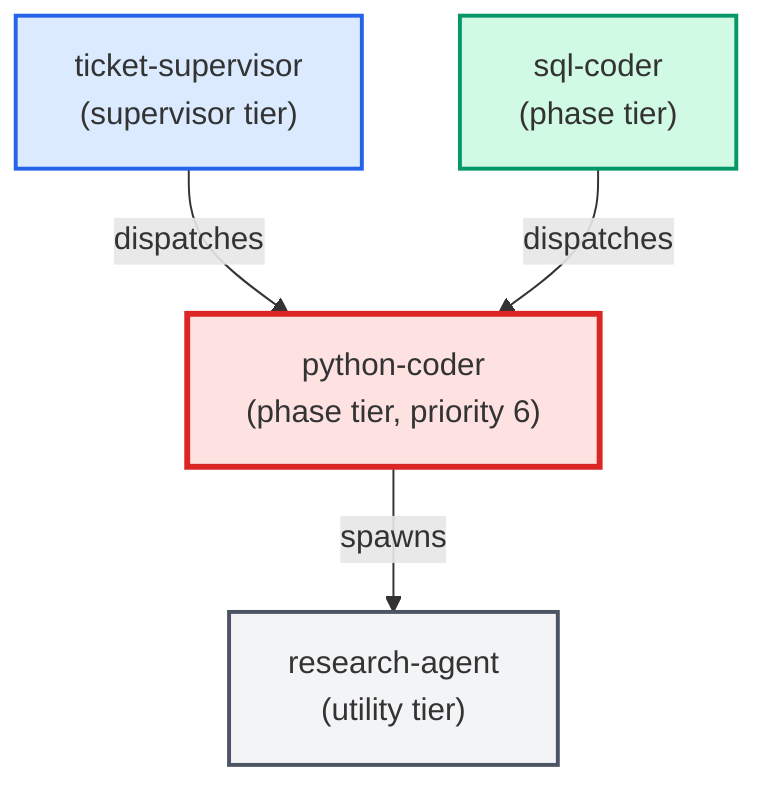

# python-coder

**Standards-enforcing Python implementation agent. Writes, edits, and refactors
Python code while automatically pulling in project conventions and running
doc-enforcer + complexity-reduction before declaring the task done.
Use when: user asks to implement a ticket in Python; says "write the code for X";
asks to refactor or extend a Python module; or any task that produces edited or
new Python files (excluding .sql files — defer those to sql-coder).**

| Field | Value |
|-------|-------|
| Model | sonnet |
| Tier | phase |
| Priority | 6 |
| Portable | Yes |
| Sign-off capable | Yes |

---

## When to Use

### Spawned By

- `ticket-supervisor`
- `sql-coder`
---

## Knowledge Flow

| Channel | Source | Injection Mode | Description |
|---------|--------|----------------|-------------|
| 1 | [Root CLAUDE.md](../../../CLAUDE.md) | always | Project instructions, error handling policy, shell conventions |
| 2 | Per-folder README.md | on-demand | Module-level context when cwd overlaps edited module folder |
| 5 | [signoff SKILL.md](../../../templates/skills/signoff/SKILL.md); [doc-enforcer SKILL.md](../../../templates/skills/doc-enforcer/SKILL.md); complexity-reduction; collector-enforcer | on-demand | Sign-off protocol, docstring enforcement, complexity scoring, collector pattern enforcement |
| 6 | Agent frontmatter | spawn-scoped | Model: sonnet, tools: Bash/Read/Edit/Write/Agent, signoff: true, config_keys, portable: true |
| 7 | [skills_config.json + settings.json](../../../templates/settings.json) | spawn-scoped | test_command, collector_enforcer_paths, file_size_limit_py |
| 8 | Ticket frontmatter | ticket-scoped | Agents map, files_touched, depends_on, ACs, Agent Contracts section |
| 9 | Auto-memory (memory/*.md) | always | Persistent cross-session learnings |
| 10 | MCP server prompts + tool descriptions | always | Available tool surface and usage guidance |
| 11 | Glossary (docs/glossary.md) | always | Project jargon definitions via CLAUDE.md ref |
---

## Spawn and Dependency

---

## Input / Output Contract

### Inputs

| Name | Type | Description |
|------|------|-------------|
| `ticket_path` | file_path | Path to the ticket markdown file (.md) |
| `ticket_body` | structured_payload | Ticket body sections: ACs, Implementation Tasks, Agent Contracts |
| `red_baseline` | config_value | Red test list from test-writer sign-off comment, if present |
| `cited_adrs` | file | Referenced ADR files under docs/architecture/adrs/ |
| `python_conventions` | file | Relevant files under docs/conventions/ |

### Outputs

| Name | Type | Description |
|------|------|-------------|
| `edited_py_files` | file | Edited or newly created .py files |
| `completion_report` | structured_response | Structured completion report payload (Files changed, Skills run, Tests, Notes) |
| `sign_off_comment` | sign_off_comment | Sign-off comment with status: ok | handoff | blocker |
| `red_baseline_results` | structured_response | Per-test results showing which red_baseline tests moved to green |
| `completion_manifest` | structured_response | Artifact checklist in sign-off comment per signoff §2b |

### Mutates (Side Effects)

| Name | Type | Description |
|------|------|-------------|
| `ticket_frontmatter_agents_status` | — | Sets agents.python-coder to signed_off or failed |
| `sign_offs_checklist` | — | Checks the python-coder checkbox with timestamp |
| `implementation_task_checkboxes` | — | Flips all - [ ] tasks in ### python-coder section to - [x] |
| `agent_contracts_ac_checkboxes` | — | Flips AC checkboxes and appends inline sig; v2 tickets only |
| `ac_coverage_table` | — | Fills Implementation column in ## AC Coverage table; v2 tickets only |
---

## Tools Available

| Tool |
|------|
| `Bash` |
| `Read` |
| `Edit` |
| `Write` |
| `Agent` |
---

## Skills Used

| Skill | Mode | Condition |
|-------|------|-----------|
| `signoff` | always | — |
| `doc-enforcer` | always | — |
| `run-tests` | always | — |
---

## Configuration

| Key | Required | Description |
|-----|----------|-------------|
| `test_command_live_trader` | No | Command to run the fast unit test suite |
| `test_output_dir` | No | Temp directory for test output (outside project root) |
| `collector_enforcer_paths` | No | Paths that trigger the collector-enforcer skill |
| `file_size_limit_py` | No | Maximum lines for new .py files; referenced as {{config.file_size_limit_py}} |
| `testing_context.max_test_duration_seconds` | No | 5-second ceiling for auto-run tests |
---

## Contributor Notes

### Key Behavioral Patterns

| Pattern | Trigger | Behavior | Related Agent |
|---------|---------|----------|---------------|
| Contract-Aware Mode | Ticket body contains ## Agent Contracts with ### python-coder sub-heading | Contract block becomes primary spec, superseding ## Implementation Tasks for scope and interface decisions | `None` |
| TDD Red-Baseline Gate | test-writer signed off before python-coder; red_baseline present in sign-off comment | Must turn all red_baseline tests green; cannot skip or xfail any listed test | `test-writer` |
| Stop-and-Ask | Implementation task requires editing a .sql file | Halts immediately and instructs caller to use sql-coder for the SQL portion | `sql-coder` |
| Contract-Shrinkage Guard | About to narrow a return shape, function signature, or dictionary structure | Must enumerate consumers via research-agent first; blocked if any consumer depends on removed field | `research-agent` |
| Test Delegation | Implementation requires new or updated unit tests | Adds tasks to ### test-writer section and uses (status: handoff) instead of (status: ok) | `test-writer` |
| File-Size Limit | New .py file would exceed {{config.file_size_limit_py}} lines | Plans module splits upfront using build_phases.py / build_helpers.py precedent | `None` |
| Research Delegation | Any cross-file or symbol-level question arises during implementation | Delegates to research-agent via Agent tool; never guesses or searches directly | `research-agent` |
---

## References

- [Agent Knowledge Plane](../../architecture/agent_knowledge_plane.md)
- [Agent Conventions](../conventions.md)
---

## AC Assignments

### python-coder

- ACD-1100a-2: Legacy pipeline agent registry entries are removed
- ACD-1100a-3: No workflow or skill dispatches a removed legacy agent
- ACD-1100b-2: Agent registry entries use canonical names without version suffixes
- ACD-1100b-3: All cross-references to v3 agent names are updated to canonical names
- ACD-1100b-3-i: Edge case: no agent in the entire registry carries any version suffix
- ACD-1100c-2: Old /create-ac command surface is fully absent
- ACD-1100e-1: Version file exists with semver 2.0.0
- ACD-1100e-2: Build output references the package version
- ACD-1100f-1: Historical origin_agent values pass AC schema validation
- ACD-1100f-1-i: Edge case: origin_agent accepts any historical agent name without allowlist
- ACD-1200a-10: Leaf collection excludes done and superseded ACs while still recursing into a superseded AC's replacement children
- ACD-1200a-10-i: A goal whose every leaf is done or superseded yields an empty leaf set and triggers the zero-leaf error path, not an empty epic
- ACD-1200a-2: One ticket file is generated per leaf AC in the collected set
- ACD-1200a-3: Generated tickets are assembled into a named EPIC folder ready for the supervisor
- ACD-1200a-3-i: Goal with zero leaf ACs beneath it produces an error, not an empty epic
- ACD-1200a-3-ii: Apostrophes and quote characters in the goal title are stripped before PascalCasing the epic folder name
- ACD-1200a-8: Epic folder includes a Master_Plan.md so /build-feature can drive it
- ACD-1200a-9: Each epic ticket is written only inside the epic folder, with its back-reference pointing at the epic-folder path
- ACD-1200a-9-i: A ticket whose basename already exists at the epic-folder path is resolved deterministically, never duplicated to a second location
- ACD-1200b-1: Readiness report surfaces count and IDs of unapproved ACs before generation
- ACD-1200b-1-i: When all leaf ACs are already approved the readiness gate is skipped entirely
- ACD-1200c-1: AC depends_on relationships are propagated to ticket depends_on fields
- ACD-1200c-1-i: Circular dependency among leaf ACs is detected and reported before ticket generation
- ACD-1200c-2: Multi-hop dependency chains produce transitive ticket ordering
- ACD-1200c-3: A dependency cycle in one subtree degrades the store-wide scan to a warning, while a real intra-scope cycle still hard-fails a scoped epic build
- ACD-1200c-3-i: The store-wide cycle warning lists the full cycle path and the scan still exits 0 when the cycle is outside the requested scope
- ACD-1200d-1: All in-scope leaf ACs receive target_epic matching the generated epic folder name
- ACD-1200d-1-i: AC already tagged with a different target_epic triggers a conflict warning
- ACD-1200d-2: ACs excluded by the approval gate do NOT receive target_epic
- ACD-1200f-1: Tree traversal collects only leaf-level ACs beneath the target goal
- ACD-1200f-1-i: Traversal from an L1 collects only the leaves beneath that L1, not the whole L0 tree
- ACD-1200f-2: Level-based leaf detection: _dfs_collect_leaves uses level field, not covered_by emptiness
- ACD-1200f-2-i: traverse_ac_tree emits each leaf once even when reachable by multiple covered_by paths
- ACD-1500a-1: Router reads only the unresolved feedback set as its work queue
- ACD-1500a-2-i: Entry resolved between scan and route is dropped without action
- ACD-1500a-3: Routing matrix sends each classified entry to its destination
- ACD-1500b-2: Classifications below the confidence floor are parked, not auto-acted
- ACD-1500b-2-i: Confidence exactly at the floor is allowed to proceed
- ACD-1500b-3: Blocker-category entries are always parked regardless of confidence
- ACD-1500b-3-i: High-confidence blocker is still parked — blocker rule wins
- ACD-1500b-4: Parked entries remain unresolved so feedback-review still surfaces them
- ACD-1500c-1: After producing an artifact, the entry is resolved with a back-reference
- ACD-1500c-1-i: Half-succeeded artifact creation must not mark the entry resolved (atomicity)
- ACD-1500c-2: Resolved entries are excluded from the next scan
- ACD-1500c-2-i: Re-running the router is idempotent for already-resolved entries
- ACD-1500c-3: The back-reference is recoverable from feedback id to the artifact
- ACD-1500d-1: Feature-type items are checked for roadmap alignment before auto-authoring
- ACD-1500d-1-i: Missing roadmap fails safe — entry is parked, not assumed aligned
- ACD-1500d-2: A configurable per-run cap limits how many artifacts the router auto-creates
- ACD-1500d-2-i: Cap reached mid-run parks the remainder and ends the run cleanly
- ACD-1500d-3: The router never auto-commits on a protected branch
- ACD-1500e-1: Thin feedback that blocks confident routing triggers the router's own process-feedback
- ACD-1500e-1-i: Process-feedback is deduplicated to prevent feedback storms
- ACD-1500e-2: Emitted process-feedback names the specific deficiency so it is actionable
- ACD-1500e-3: Emitted process-feedback is itself routable by a future run so the loop compounds
- ACD-1500e-3-i: Router-emitted process-feedback cannot drive an infinite self-referential loop
- ACD-1500e-4: Process-feedback recommends faster, more verbose, more structured emission
- ACD-300b: A workflow script orchestrates the authoring agents in sequence based on the triage decision
- ACD-300b-1: The strategic route dispatches PO v3, then BA v3, then IT PO v3 in strict sequence
- ACD-300b-2: The behavioral and technical routes skip upstream agents and start at the correct stage
- ACD-300c: The user confirms each authoring stage before the next agent begins
- ACD-300c-1: Gate after PO v3 shows L0/L1 ACs and offers approve, edit, or cancel
- ACD-300c-2: Gate after BA v3 shows L2/L3 ACs and offers approve, edit, or cancel
- ACD-300c-3: Final gate after IT PO v3 allows the user to set priority and promote to approved
- ACD-300d: All authoring output is written to the AC store, never to ticket files
- ACD-300d-1: Each authoring agent writes ACs to the correct component subdirectory with valid schema
- ACD-300g: Each stage's AC output is committed to git before the workflow advances to the next stage
- ACD-300g-1: Approved stage output is committed before the next agent is dispatched
- ACD-300g-1-i: Commit failure aborts the pipeline with an actionable error
- ACD-300g-2: The commit includes only AC files from the current stage
- ACD-300g-2-i: Partial-run recovery: uncommitted AC files from a prior crashed session are detected
- ACD-300g-3: The commit message identifies the workflow run, stage, and AC IDs produced
- ACD-300g-4: Cancel or abort does not commit -- draft files remain on disk uncommitted
- ACD-400a: Scanner identifies todo, unblocked leaf ACs and presents them as a prioritized ready list
- ACD-400a-1: Leaf scanner filters to todo, active, unblocked L2/L3 ACs and sorts by complexity then id
- ACD-400a-1-i: Scanner returns empty ready list when AC store contains no eligible files
- ACD-400a-1-ii: Scanner reports unparseable YAML files as diagnostics without crashing
- ACD-400a-1-iii: Scanner detects and reports circular dependencies without entering an infinite loop
- ACD-400a-2: Scanner JSON output conforms to a defined schema with ready and blocked lists
- ACD-400b: Generator produces a valid, wired ticket from any ready AC with bidirectional traceability
- ACD-400b-1: Generator produces a valid ticket file with correct frontmatter, agents map, and criteria body
- ACD-400b-1-i: Generator rejects an AC that has no criteria field with a descriptive error
- ACD-400b-2: Generator writes implemented_by back-reference into source AC without modifying other fields
- ACD-400b-2-i: Back-reference write preserves YAML formatting by using targeted append rather than full rewrite
- ACD-400b-3: Generator is idempotent -- re-run with existing ticket exits non-zero without duplicating
- ACD-400b-4: Generated ticket passes ticket_frontmatter_guard with correct structure and sign-offs
- ACD-500a: The ticket prioritizer merges AC readiness into its output with a single opt-in flag
- ACD-500a-1: Merged output contains both ticket and AC entries sorted by unified priority
- ACD-500a-1-i: Merged output is empty when both ticket backlog and AC store return zero ready items
- ACD-500a-1-ii: Merged output handles AC scanner returning malformed JSON gracefully
- ACD-500a-2: Deduplication suppresses an AC entry when a ticket with source_ac exists
- ACD-500a-2-i: Deduplication handles multiple tickets referencing the same AC without duplicating the ticket
- ACD-500a-3: The --include-acs flag defaults to off preserving backward compatibility
- ACD-500a-4: Complexity-to-priority mapping converts AC sizes to the ticket priority scale
- ACD-500a-4-i: Complexity mapping rejects unknown estimated_complexity values with a warning
- ACD-500a-5: AC prioritizer reports a clear error when the AC store scanner is unavailable
- ACD-600a: mark_ac_done script sets work_status to done for a given AC or ticket
- ACD-600a-1: mark_ac_done marks the source AC done given a ticket path with source_ac
- ACD-600a-1-i: mark_ac_done rejects marking an AC that has status: deprecated
- ACD-600a-1-ii: mark_ac_done with --ac directly sets work_status done without needing a ticket
- ACD-600a-2: mark_ac_done is idempotent when AC is already work_status: done
- ACD-600a-3: mark_ac_done rejects a non-existent AC ID with exit code 1
- ACD-600a-4: mark_ac_done rejects a ticket that has no source_ac field
- ACD-600b: Post-merge hook automatically marks ACs done for completed tickets in the merge
- ACD-600b-1: Post-merge hook marks ACs done for all source_ac tickets in the merge
- ACD-600b-1-i: Post-merge hook exits 0 even when mark_ac_done fails for one ticket
- ACD-600b-1-ii: Post-merge hook ignores non-ticket files touched by the merge
- ACD-600b-2: Post-merge hook skips tickets without source_ac and exits 0
- ACD-800a: Exact-criteria text matching discovers high-confidence implementations
- ACD-800a-1: Audit finds exact-criteria matches at high confidence
- ACD-800b: Keyword-and-component matching discovers medium-confidence implementations
- ACD-800b-1: Audit finds keyword-and-component matches at medium confidence
- ACD-800c: The --apply flag atomically backfills high-confidence matches into AC metadata
- ACD-800c-1: --apply writes implemented_by for high-confidence matches only
- ACD-800c-2: --apply is idempotent for already-linked ACs
- ACD-800d: Every audit run produces a persistent JSON report for human review
- ACD-800d-1: JSON report is written to debugging/logs/ with defined schema
- ACD-900a: pick_next.py presents the highest-priority work item from the merged ticket-and-AC list
- ACD-900a-1: Default invocation outputs the single highest-priority item with all required fields
- ACD-900a-1-i: Upstream prioritizer failure produces a diagnostic error and exit code 1
- ACD-900a-2: The --top N flag lists exactly N items in priority order
- ACD-900a-2-i: The --top N flag with N larger than the ready list returns all available items without error
- ACD-900a-3: The --json flag outputs machine-readable JSON matching the defined schema
- ACD-900a-4: Empty ready list produces an informational message and exits successfully
- ACD-900a-4-i: Empty ready list with --json flag returns a valid JSON object with an empty top array
- ACS-100a: Every required field is validated individually at commit time
- ACS-100a-1: Required fields reject missing values at commit time
- ACS-100a-2: ID field enforces PREFIX-NNN regex pattern
- ACS-100a-3: Status field accepts only the three allowed enum values
- ACS-100a-4: Additional properties are rejected to prevent schema drift
- ACS-100a-5: superseded_by field enforces conditional constraint with status
- ACS-100a-6: Dangling depends_on and expects_from references blocked at commit time
- ACS-100b: Find any requirement instantly by its ID
- ACS-100b-1: Feature folder naming follows PREFIX-NNN-kebab-slug convention
- ACS-100b-2: L0 file uses the folder's base ID as its own ID
- ACS-100b-3: L1 IDs extend the L0 ID with a lowercase letter suffix
- ACS-100b-4: L2 IDs extend the L1 ID with a hyphen-number suffix
- ACS-100b-5: Tooling can reconstruct the parent-child tree from hierarchical IDs
- ACS-100c-1: AC tree branching factor is capped to keep folders readable
- ACS-100c-2: Sparse AC parents receive a non-blocking advisory
- ACS-100c-3: L0 and L1 ACs are authored by product-owner-class agents only
- ACS-100c-4: Child ACs can be amended without modifying the parent AC
- ACS-100c-5: Parent AC amendment does not invalidate existing child ACs
- ACS-100d: Named authorship on every requirement
- ACS-100d-1: origin_agent field records the creating agent's identity
- ACS-100d-2: created_by field links to the originating ticket path
- ACS-100d-3: amended_by array accumulates ticket paths for each modification
- ACS-100d-4: origin_agent accepts any string value without closed enum restriction
- ACS-100e: Your team's names appear on requirements automatically
- ACS-100e-1: Agent template can declare a default origin_agent value
- ACS-100e-2: Explicit origin_agent in AC creation overrides the template default
- ACS-100e-3: Skill metadata can declare a default origin_agent for skill-created ACs
- ACS-100e-4: Missing default_origin_agent falls back to the agent's own name
- ACS-100f: Agents find the requirements they need without manual lookups
- ACS-100f-1: Query by flight level returns ACs at the requested level(s)
- ACS-100f-2: Parent chain traversal returns ancestors up to L0
- ACS-100f-3: Related ticket lookup finds tickets that created or amended matched ACs
- ACS-100f-4: Compound filter combines multiple criteria with AND semantics
- ACS-100f-5: Children lookup returns all ACs that depend on a given AC
- ACS-100g: Bulk AC approval workflow for cold-start bootstrap
- ACS-100h-7a: A shared AC-tree-limit check is callable at scaffold time and returns the violation set
- ACS-100i: Cross-field constraints and relational references are enforced together
- ACS-100i-1: Parent ID is derived from child ID by stripping the last segment
- ACS-100i-2: Pre-commit hook blocks a child AC whose parent covered_by omits it
- ACS-100i-2-i: Hook fails open when a staged YAML file contains non-UTF-8 binary content
- ACS-200d: New tickets must reference their source AC
- ACS-300g: Complete component coverage in the registry
- ACS-300g-1: Each backfilled component entry satisfies the minimum schema
- ACS-300g-1-i: Entry with null detail_ref is accepted without error
- ACS-300g-1-ii: Entry with detail_ref pointing to a non-existent file is rejected
- ACS-300g-2: Existing component entries are preserved unmodified during backfill
- ACS-300g-3: Every agent-backed subsystem has a corresponding component entry
- ACS-300g-4-i: Write tooling rejects duplicate component ID
- ACS-300g-4a: Write tooling Python script for adding component entries to the registry
- ACS-300g-5: Component integrity hook skips the new-component check during a merge
- ACS-300g-6: Component integrity hook resolves REPO_ROOT to the actual repository top-level
- ACS-300h: Agent affinity field maps components to default agents
- ACS-300h-1: Agent affinity field is present on every component entry
- ACS-300h-2: Every agent ID in agent_affinity exists in the agent registry
- ACS-300h-2-i: Stale agent ID detection after registry removal
- ACS-300h-3: Ordering in agent_affinity conveys implementor priority
- ACS-300i: Exposed interfaces field documents component boundaries
- ACS-300i-1: Interface descriptor schema is enforced on exposed_interfaces elements
- ACS-300i-1-i: Interface path referencing a non-existent file emits a warning but is accepted
- ACS-300i-2: Components with no external interfaces have an empty array
- ACS-300i-3: Interface type values are restricted to the enumerated set
- ACS-300j: Component dependency graph in the registry
- ACS-300j-1: depends_on field references only valid component IDs
- ACS-300j-1-i: Self-referencing dependency is rejected
- ACS-300j-2: Dependency graph is verified as acyclic
- ACS-300j-2-i: Circular dependency is detected and rejected with cycle identification
- ACS-300j-3: Known minimum dependency set is captured in the registry
- ACS-300k: Agents use components.json as the single source of component knowledge
- ACS-300k-1: build.py injects components data into agent templates via a placeholder
- ACS-300k-1-i: build.py fails gracefully when components.json is missing
- ACS-300k-1-ii: build.py fails gracefully when components.json is malformed JSON
- ACS-300k-3: index.yaml is scoped solely to AC-prefix assignment
- ACS-300k-4: Compiled agents reflect current component data after rebuild
- ACS-400a-1: Authorized requirement agents can create the criteria field
- ACS-400a-2: Authorized agents can modify the criteria field on an existing AC
- ACS-400a-3: Unauthorized agents are rejected when writing the criteria field
- ACS-400a-3-i: Human user is always authorized regardless of agent registry membership
- ACS-400b-1: Implementation agents can update work_status field
- ACS-400b-2: Implementation agents can update implemented_by and covered_by fields
- ACS-400b-3: Implementation agents are rejected when touching protected requirement fields
- ACS-400b-3-i: Mixed commit with both allowed and disallowed field changes is fully rejected
- ACS-400c-1: New AC creation records origin_agent identifying the author
- ACS-400c-2: Criteria amendment appends the author to amended_by
- ACS-400c-2-i: Criteria change with stale amended_by entry is rejected
- ACS-400d-1: Governance rules appear in deployed agent instructions after build
- ACS-400d-2: Governance rules are included by default with no opt-in required
- ACS-400d-2-i: Projects without an AC store are not affected by governance rules
- ACS-400e-1: Blocked commit produces a clear, actionable error message
- ACS-400e-1-i: Hook failure does not block legitimate commits (fail-open)
- ACS-400e-2: Only staged AC YAML files are inspected — unmodified files are ignored
- ACS-400e-3: Non-AC files in the same commit are not affected by governance rejection
- ACS-500a-1: A pattern AC defines shared behavior with parameterized slots
- ACS-500a-2: Pattern definitions live in the existing component registry hierarchy
- ACS-500a-3: Schema validates implements_pattern references point to existing ACs
- ACS-500a-3-i: pattern_bindings with missing keys are rejected at commit time
- ACS-500a-3-ii: implements_pattern referencing a deprecated pattern is rejected
- ACS-500b-1: A consuming AC declares pattern reference and page-specific bindings
- ACS-500b-1-i: AC with implements_pattern but empty criteria is valid
- ACS-500b-2: Pattern deviations are separate page-specific ACs, not inline overrides
- ACS-500c-3: Duplicate detection rejects AC whose criteria duplicates an existing pattern
- ACS-500d-1: Updating a pattern AC's criteria changes effective behavior for all consumers
- ACS-500d-1-i: Deleting a pattern AC is blocked when consumers still reference it
- ACS-500d-2: Existing page deviations survive pattern updates unchanged
- ACS-500e-1: Atomic pattern ACs compose into named composite pattern ACs
- ACS-500e-1-i: Circular composition dependency is detected and rejected
- ACS-500e-2: Composition depth is visible through the AC parent-child hierarchy
- ACS-500f-1: Binding-completeness and field-preservation checks fire at commit time
- ACS-500f-1-i: Schema hook fails open and never blocks an unrelated commit on its own error
- ACS-500f-1-ii: Phase 2 field-preservation binds its git diff to the project root, not process cwd
- ACS-500f-3: AC store schema accepts the real hierarchical id format and the pattern_slots field
- ACS-500f-3-i: Widened schema still rejects malformed ids and unknown fields
- ACS-600e: Stale diagrams and ADRs get flagged automatically
- ACS-800a: Every requirement gets a permanent name of its own
- ACS-800a-1: A new requirement is assigned the next sequential opaque UID at creation
- ACS-800a-1-i: Two requirements created concurrently never receive the same UID
- ACS-800a-2: A requirement's UID is immutable for the life of the requirement
- ACS-800a-2-i: A requirement's UID survives a re-home unchanged
- ACS-800a-3: Every requirement in the store has exactly one unique UID
- ACS-800b: A requirement's place in the tree is information, not its name
- ACS-800b-1: A requirement names its parent by the parent's stable UID
- ACS-800b-1-i: A parent pointer to a non-existent UID is detected
- ACS-800b-2: A requirement's level is recorded as an explicit field
- ACS-800b-3: A requirement's order among its siblings is recorded as an explicit field
- ACS-800b-4: Root requirements have no parent and child level is exactly one below the parent
- ACS-800b-4-i: A child whose level does not sit one below its parent is rejected
- ACS-800c: Re-home a requirement with a single change
- ACS-800c-1: Re-parenting a requirement is a single parent-pointer change with no rename
- ACS-800c-2: Re-homing a requirement rewrites no cross-references anywhere in the store
- ACS-800c-3: A re-home keeps both ends of the parent-child link consistent and is auditable
- ACS-800c-3-i: A re-home that would make a requirement its own ancestor is rejected
- ACS-800d: Everything you already wrote keeps working
- ACS-800d-1: Migration assigns a UID and populates hierarchy metadata for every existing requirement
- ACS-800d-1-i: Migration surfaces a requirement whose legacy name cannot be parsed
- ACS-800d-2: Existing cross-references keep resolving after migration
- ACS-800d-2-i: Migration surfaces a reference that points at a non-existent requirement
- ACS-800d-3: Migration leaves zero dangling references it did not already find
- ACS-800d-4: Re-running the migration changes nothing
- ACS-800e: The tooling reads the tree from the facts, not the name
- ACS-800e-1: Child-count limit checks count children from parent-pointer metadata
- ACS-800e-2: The parent-child coverage check verifies the link by parent-pointer metadata
- ACS-800e-3: Tree traversal for epic generation follows parent-pointer metadata
- ACS-800e-4: The id-string parent-derivation module is replaced by a metadata lookup
- ACS-800e-4-i: During the migration window tooling accepts both metadata and name-derived hierarchy
- ACS-800e-5: The schema accepts an opaque id and validates the new hierarchy metadata fields
- ACS-900a-1: Check fires only when an AC's status transitions to a retired state in the staged diff
- ACS-900a-1-i: A brand-new AC file authored directly in a retired state does not arm the check
- ACS-900a-2: Orphaned-code check inspects the retired AC's implemented_by file list
- ACS-900b-1: Leftover live code behind a retired AC blocks the commit
- ACS-900b-1-i: An internal hook error fails open and never hard-blocks the commit
- ACS-900b-2: The deprecation-hygiene hook is wired into the commit_guardian framework
- ACS-900c-1: Block message names the retired AC, the surviving files, and the two remedies
- ACS-900c-1-i: For a superseded_by retirement, the message names the successor AC to re-point to
- ACS-900d-1: Retirement with the implementing code removed passes cleanly
- ACS-900d-1-i: Retiring an AC that never claimed any code passes cleanly
- ACS-900d-2: Superseded AC re-pointed to its successor passes cleanly even with the code intact
- ACS-900e-1: Detection reuses the audit tool's traceability logic rather than re-implementing it
- BO-100a: Dependencies are resolved automatically so nothing runs out of order
- BO-100a-1: Empty epic folder produces an empty graph and immediate completion
- BO-100a-2: Linear dependency chain produces one-at-a-time sequential dispatch
- BO-100a-3: Diamond dependency resolves without duplicate dispatch
- BO-100a-4: Cycle detection halts the epic with a diagnostic naming all cycle members
- BO-100a-5: Unknown dependency references are treated as satisfied (not blocking)
- BO-100b: Work runs in parallel up to a safe limit you control
- BO-100b-1: Default batch cap of 3 limits dispatch when ready set exceeds cap
- BO-100b-2: Custom cap overrides default when configured in epic metadata
- BO-100b-3: Ready set smaller than cap dispatches all available tickets
- BO-100b-4: NN execution-order prefix breaks ties deterministically within cap
- BO-100c: Parallel work never creates merge conflicts
- BO-100c-1: Disjoint files_touched sets allow parallel dispatch in same batch
- BO-100c-2: Overlapping files_touched removes conflicting ticket from batch
- BO-100d-1-i: Missing log directory is created and re-probed rather than hard-failing on first miss
- BO-100d-1-ii: Only a genuine write failure after remediation hard-blocks the drive
- BO-100d-1a: build-epic.js hard-blocks the drive before dispatch when the telemetry sink is unreachable
- BO-100d-2-i: Remediation that makes a failing probe pass lets the drive proceed
- BO-100d-2a: build-epic.js lets the drive proceed when the telemetry sink is reachable
- BO-1100a-1: Staged files are classified into exactly one routing group per file
- BO-1100a-1-i: Files matching multiple groups are escalated to mixed-change handling
- BO-1100a-6: Path rules match only their intended directory subtree, not unrelated paths sharing a substring
- BO-1100a-6-i: Paths containing target directory name as an infix in a longer segment are not matched
- BO-1100c-1: Routing configuration is a single JSON file with an array of pattern entries
- BO-1100c-1-i: Malformed routing config is rejected with a specific parse error
- BO-1100c-2: Adding a new routing pattern requires only a single entry addition
- BO-1100c-4: Pattern config reflects the current file contents on every classification invocation
- BO-1100d-1: Unmatched file groupings are logged with their structural shape
- BO-1100d-1-i: Shapes differing only in file count are treated as the same shape
- BO-1100d-5: Observation store write failure does not crash the commit workflow
- BO-1100d-6: Already-classified shapes are not recorded as unknown observations
- BO-1100e-1: Filtering skill narrows git log to commits touching the same directory set
- BO-1100e-1-i: Fewer than 10 commits in filtered path set returns all available without error
- BO-1100e-2: Filtering skill returns at most a bounded number of candidate commits
- BO-1100e-2-i: Path pattern matching zero commits returns an empty result set without error
- BO-1100e-3: Each candidate commit includes subject line and list of files changed
- BO-1100e-4: History filter is invoked by the learning pipeline and enforces a positive commit bound
- BO-1100e-4-i: Negative max_commits value is rejected before querying git history
- BO-1300d-1: The same three-reviewer spot-check runs automatically as the closing step of a build
- BO-1300d-1-i: Blocking spot-check findings are surfaced in the build's completion output
- BO-1300e-1: Each spot-check finding is written as a ticket into the inbox for the fix flow
- BO-1300e-1-i: A clean spot-check creates no tickets and signs off the feature
- BO-1300e-1-ii: Duplicate findings across reviewers are deduplicated to one ticket per distinct issue
- BO-1500a-1: Authoring runs in a dedicated worktree on a new branch cut from origin/main
- BO-1500a-1-i: An existing authoring worktree/branch from a prior run is reused, not blindly recreated
- BO-1500a-2: The original checkout and any concurrent worktree are left untouched
- BO-1500b-1: Each authoring stage commits its AC files before the next stage starts
- BO-1500b-1-i: The fresh authoring worktree is bootstrapped so pre-commit hooks do not silently skip
- BO-1500b-2: A crash mid-pipeline leaves completed stages committed and resumable
- BO-1500c-1: Final approval pushes the authoring branch and opens a PR to main automatically
- BO-1500c-1-i: Cancelling before final approval leaves draft ACs on the branch and opens no PR
- BO-1500c-2: The authoring PR passes the same CI gates as any other change
- BO-1500c-3: AC files are never committed directly onto main during authoring
- BO-1500d-1: The PR number and URL are reported back to the user the moment the PR is opened
- BO-1500e-1: Authoring works when invoked while checked out on protected main (the common case)
- BO-1500e-2: Authoring works when run from a deployed/installed copy, not just the dev layout
- BO-1500e-3: PR creation tolerates the active gh account silently reverting to an EMU account
- BO-1600a-1: Commit phases of concurrent supervisors are serialized at the git layer
- BO-1600a-2: A second supervisor waits for the git write portion, then commits cleanly
- BO-1600a-3: Concurrent commits no longer produce a zero-byte object or a broken index
- BO-1600b-1: An interrupted commit leaves no half-written object behind
- BO-1600b-2: An interrupted commit leaves no poisoned index or stranded lock
- BO-1600b-3: The next delivery commits cleanly into a worktree left by a failed one
- BO-1600c-1: Detected repository corruption halts the drive before the next commit
- BO-1600c-2: The halt message names what is wrong and what the operator should do
- BO-1600c-3: The drive never presses on against a repository known to be corrupted
- BO-200a: Every commit knows exactly what it contains and why
- BO-200a-1: Work envelope contains ticket reference and changed file list
- BO-200a-2: Work envelope includes sign-off records from completed phase agents
- BO-200a-3: Incomplete work envelope is rejected before commit attempt
- BO-200b: Failed commits roll back cleanly instead of leaving a mess
- BO-200b-1: All envelope files are staged and committed as a single atomic unit
- BO-200b-2: Failed commit rolls back staging area to pre-commit state
- BO-200b-3: Automatic retry attempts commit again after recoverable hook failure
- BO-210a: The auto-fix routing config is populated to the documented schema with a single gating list
- BO-210a-1: Routing config is rewritten from the dead stub to the documented defaults/commit_review/rules shape
- BO-210a-1-i: The packaged template source of the routing config matches the deployed config byte-for-content
- BO-210a-2: A blocking_hook_ids array is the single authority on which hooks gate a commit
- BO-210b: Coders emit a design-context capsule in their sign-off when they trip a warn-tier signal
- BO-210c: Auto-fix re-dispatches the originating coder with its capsule instead of a context-free fixer
- BO-300a: Epic completion shows summary, worktree, test hints, and finalize command
- BO-300a-1: Step 6 return object includes worktree_path and manual_tests fields
- BO-300a-2: Step 6 message string contains all four sections in order
- BO-300a-2-1: Zero files_touched across all tickets still renders the manual_tests section
- BO-300a-3: build-feature.md On-ok block renders all four sections from the return value
- BO-300a-4: build-feature.md inline fallback template includes all four sections with placeholders
- BO-300b: Single-ticket completion shows summary, worktree, test hints, and finalize command
- BO-300b-1: build-single-ticket Step 4c template includes all four completion sections
- BO-300c: Finalize command always uses the epic or branch name, never a raw path
- BO-300c-1: Finalize command uses epic or branch name, not a raw path, in all three locations
- BO-300c-1-1: Nested epic path is reduced to just the epic name in the finalize command
- BO-400a-4: Dependency graph uses frontmatter status to determine completed tickets
- BO-400a-5: ticket-prioritizer excludes in_progress tickets from the ready set
- BO-400b-1: set_ticket_status.py accepts a ticket path and target status
- BO-400b-1-i: Script refuses done when agents map has needed entries
- BO-400b-2: Script validates status transitions against an allow-list
- BO-400b-2-i: Script handles missing status field gracefully
- BO-400b-3: Script stages the modified ticket file after a successful update
- BO-400c-1-i: Backward compatibility: old epics with done/ subfolder still work
- BO-400c-3: Parity guard rejects commits that move ticket files into epic subfolders
- BO-510-1: Agent registry entries carry a produces trait field from a defined enum
- BO-550-1: Ticket frontmatter supports a structured test_constraints field
- BO-570-1: Deterministic render-smoke runner helper for the frontend sign-off gate
- BO-570-3: Deterministic repo-ruff runner helper for the python sign-off gate
- BO-610-1: change_target enum definition with 10 canonical values
- BO-610-2: risk_surface enum definition with 6 canonical values
- BO-610-3: Multi-value classification: a work unit carries one or more change_targets
- BO-610-4: Every ticket frontmatter includes change_target and risk_surface fields
- BO-610-5: Unrecognized change_target or risk_surface value is rejected at validation
- BO-620-1: Schema-contract pair maps to migration plan + backward-compat check + consumer notification
- BO-620-2: Code-internal pair maps to standard TDD guardrail only
- BO-620-3: Infra-contract pair maps to plan review + blast-radius label
- BO-620-4: Prompt-safety pair maps to red-team eval + human sign-off
- BO-620-5: UI-internal pair maps to visual regression + a11y audit + TDD
- BO-630-1: Low and medium complexity tasks route to the faster model tier
- BO-630-2: High complexity tasks route to the deeper-reasoning model tier
- BO-640-1: High-complexity assessment triggers a decomposition challenge before escalation
- BO-640-2: Successful decomposition reduces complexity to medium and routes to faster model
- BO-640-3: Challenge failure (irreducible complexity) accepts high and routes to deeper model
- BO-650-1: Architect discovers and reads existing architecture docs before producing artifacts
- BO-650-5: Architect runs at L0/L1 level, before implementation tickets are created
- BO-660-1: New agent type inherits guardrails from its declared produces trait
- BO-660-2: New change_target value inherits guardrails from its declared risk_surface
- BO-700a-1: Changelog entry content is assembled from AC fields of completed tickets
- BO-700a-1-i: Ticket completed without a source_ac produces a placeholder entry
- BO-700a-2: Changelog entries are emitted at ticket completion (done-link closure)
- BO-700a-2-i: Duplicate completion events do not produce duplicate changelog entries
- BO-700a-3: Changelog entries group into releases by version tag boundary
- BO-700b-1: Version computation reads the highest AC level among completed tickets since last tag
- BO-700b-1-i: No tickets completed since last tag produces no version bump
- BO-700b-2: L1 completion bumps the minor segment; L2/L3 completions bump the patch segment
- BO-700b-2-i: Mixed L1 and L3 completions in one release yield a single minor bump (highest wins)
- BO-700b-3: Major version is never bumped without explicit human override
- BO-700c-1: Each changelog entry includes the parent L0 title and the L1 feature title
- BO-700c-1-i: An L3 fix with no L0 ancestor renders under an Ungrouped fixes heading
- BO-700c-2: Entries sharing the same L0 parent are grouped under a goal heading
- BO-700d-1: A Markdown CHANGELOG file is rendered from the release data
- BO-700d-1-i: An empty release (no tickets between tags) produces a No changes entry
- BO-700d-2: A structured YAML release manifest is produced alongside the Markdown
- BO-700e-1: The done-link closure invokes changelog emission as a mandatory step
- BO-700e-1-i: A ticket moved to done/ manually (bypassing done-link) is detected by the validation scan
- BO-700e-2: A pre-release validation scan reports tickets missing changelog entries
- BO-900a-1: Commit-count divergence detection after each batch
- BO-900a-1-i: Unreachable remote is treated as zero divergence (safe default)
- BO-900a-2: User prompt with merge-or-continue choice when threshold exceeded
- BO-900a-3: Automatic merge execution when user accepts sync
- BO-900a-3-i: Merge conflict halts the epic with actionable diagnostics
- BO-900a-4: Configurable divergence threshold with sensible default
- BP-006a-1: Each skill directory has a registry entry with all required fields
- BP-006b-1: sys.path includes scripts/ directory before build_helpers module load
- BP-006b-2: Edge case: duplicate sys.path insertion is prevented by guard
- BP-006c-1: build_workflow_scripts() output directory is target_root/.claude/workflows/
- BP-1000a-1: Any diff between a source script and its shipped template copy blocks the merge
- BP-1000a-1-i: The merge-gate parity check catches cumulative cross-ticket drift that per-ticket sync verification let through
- BP-1000a-2: A source script edited during the drive whose template copy was not updated is reported as drift and blocks
- BP-1000a-3: When every mirrored script is byte-identical the parity check passes and the merge proceeds
- BP-1000b-1: The parity check runs as a pre-merge gate, positioned before the PR-merge step in finalize
- BP-1000b-2: When the parity gate finds drift, finalize HALTs and the PR-merge step is never reached
- BP-1000b-2-i: Drift caught at this gate is caught before merge, never discovered in a post-merge spot-check
- BP-1000b-3: When the parity gate passes, finalize proceeds to the PR-merge step normally
- BP-1000c-1: A parity failure names each drifted script and shows how the shipped copy differs from its source
- BP-1000d-1: A source script with no shipped template counterpart is never flagged as a parity failure
- BP-1000e-1: Any diff between a workflow source script and its shipped mirror blocks the merge
- BP-1000e-2: A workflow template edited without its mirror is caught and blocked
- BP-1000e-3: When every workflow mirror matches its source, the merge proceeds
- BP-1000e-4: Only workflow scripts that have a shipped mirror are compared
- BP-1000e-5: A workflow-mirror drift failure names every drifted file and shows the diff
- BP-100a-1: Build emits a warning for each registered hook whose script file is absent
- BP-100a-2: Build emits no integrity warnings when all hook scripts are present
- BP-100b-1: Build creates a symlink so agents reach compiled workflows at .claude/workflows/
- BP-100b-11: Registry referential integrity: every commit-guardian hook entry points at a script that exists, and the deployed registry is derivable from the canonical template
- BP-100b-11-i: A dangling registry entry is caught at build/commit time, never silently shipped to consumers
- BP-100b-2: Output mappings track workflow source-to-destination pairs for compare-before-write
- BP-100b-3: Stale workflow artifacts are removed during build cleanup
- BP-100b-4: Source manifests include workflows for content fingerprinting
- BP-100b-5: Drift detection scans .claude/workflows/ for compiled workflow changes
- BP-100b-5-i: Drift detection does not false-positive on the legacy .agents/workflows/ path
- BP-100b-7: Pre-commit drift hook triggers on compiled workflow files
- BP-100c-1: Ticket lifecycle scaffold uses config-driven inbox path instead of hardcoded default
- BP-100c-1-i: Folder remap applies config overrides to all lifecycle subdirectories
- BP-100c-2: Ticket lifecycle skips scaffold when manifest already exists
- BP-100c-2-i: Force flag bypasses the skip guard and overwrites existing manifest
- BP-100c-3: Project paths table overlays config values onto paths.json defaults
- BP-100c-3-i: Partial config overlay leaves unspecified paths at their defaults
- BP-100c-4: Template compiler threads config to project paths table generation
- BP-100c-5: Consumer project with no config override gets standard default paths
- BP-100d-1: Contract-shrinking hook excludes commit_guardian paths from production classification
- BP-100e-1: Signoff skill recipe mandates timestamp capture before any edit
- BP-100e-2: Pre-commit hook rejects signed-off lines with imprecise timestamp suffixes
- BP-100e-5: Pre-commit hook rejects comment headings with imprecise timestamps
- BP-100f-1: finalize-feature emits warning and skips git steps outside a git worktree
- BP-100f-1-i: No secondary git calls fire before the guard in finalize-feature
- BP-100f-2: changelog-agent emits warning and skips git steps outside a git worktree
- BP-100f-2-i: No secondary git calls fire before the guard in changelog-agent
- BP-100g-1: build.py exits non-zero when a SKILL.md has invalid YAML frontmatter
- BP-100g-2: build.py exits non-zero when SKILL.md name does not match directory name
- BP-100g-3: build.py exits non-zero when SKILL.md allowed-tools contains unrecognised tool
- BP-100g-6: pr-reviewer template includes skill-file checklist items
- BP-100i-1: Script parity: every .py file in the runtime commit_guardian directory has a counterpart in the canonical template directory
- BP-100i-1-i: Scripts listed in a parity-exclusion allowlist do not trigger violations
- BP-100i-1-ii: Non-hook utility files (e.g. __init__.py, README.md) are excluded from script parity checks
- BP-100i-2: Manifest parity: every hook registered in one commit_guardian.json appears in all commit_guardian.json files
- BP-100i-2-i: Disabled hooks in the legacy manifest still require canonical presence
- BP-100i-3: Deployed output parity: every hook in the canonical template also appears in the build output directory
- BP-100i-3-i: Parity check degrades gracefully when the deployed output directory does not exist
- BP-100i-4: Hook fires at pre-commit when commit_guardian files are staged
- BP-100i-5: No violations when all directories are in sync — silent pass
- BP-1100d-1: A pre-commit guard blocks workflow JavaScript that pairs git commit with a non-commit agent
- BP-1100d-1-i: A git commit string in a documentation file does not trip the workflow commit-delegation guard
- BP-1200a-1: Full test suite passes on a fresh clone using the documented CI test command
- BP-1200a-1-ii: No test fails at collection time because a build-generated dependency is missing from the fresh clone
- BP-1200a-1-iii: On a fresh clone the build's deployable-script preflight does not abort for want of a tracked feedback source
- BP-1200b-1: A blocking test check runs the full suite on every pull request and fails when any test fails
- BP-1200b-1-i: A pull request containing a deliberately failing test is blocked from merging
- BP-1200b-1-ii: A pull request whose full suite passes reports a passing test check and is allowed to merge
- BP-1200c-1: Branch protection on main requires both the lint check and the new test check
- BP-1200c-1-i: The test gate cannot be bypassed — a missing or failing test check leaves the PR un-mergeable
- BP-300a-1: debug.js dispatches three parallel Explore agents in Phase 1
- BP-300a-1-i: debug.js returns structured error when userInput is empty
- BP-300a-2: Synthesis proceeds without prompt when all investigators agree with high confidence
- BP-300a-3: Workflow prompts user for clarification when investigators disagree or have low confidence
- BP-300a-4: Phase 3 calls build-ticket workflow, not build-epic
- BP-300a-4-i: Workflow returns error when create-ticket does not return a ticket_path
- BP-300a-5: Phase 4 finalize prompts user and respects their choice
- BP-300a-6: Workflow return object contains all required structured fields
- BP-300b-1: Planner derives signed_off status from Sign-offs checklist when frontmatter says needed
- BP-300b-2: Planner derives needed status from Sign-offs checklist when frontmatter says signed_off
- BP-300b-3: Planner emits no drift warnings when frontmatter and Sign-offs are consistent
- BP-300b-3-i: Planner falls back to frontmatter when Sign-offs section is absent
- BP-300b-4: Planner recognizes failed sign-off lines and derives failed status
- BP-400a-1: emit_event.py exists at the deployed path and produces valid JSONL
- BP-400a-1-i: emit_event.py write failure is non-fatal (exits 0 with stderr warning)
- BP-400a-2: emit_event.py creates missing log directories automatically
- BP-400a-4: Post-drive aggregation for subagent-quality returns non-empty results
- BP-400b-1: Git rename fallback populates commit dates for a moved epic folder
- BP-400b-2: Non-zero exit and stderr warning when no commits found after all fallbacks
- BP-400b-3: CLI SHA override bypasses path-based git log and derives dates from supplied commits
- BP-400b-4: Pre-move happy path remains unchanged (no behavioral regression)
- BP-400c-1: Build system deploys all feedback analysis pipeline artifacts
- BP-400c-2: trend_report.py produces a prioritized report from multi-category feedback
- BP-400c-2-i: trend_report.py handles empty or absent feedback.jsonl gracefully
- BP-400c-3: trend_report.py computes week-over-week trend indicators
- BP-400c-4: Date filtering via --since limits report to matching entries only
- BP-700b-1: Agent registry entry has default_status not_needed
- BP-700b-2: Trigger conditions match only frontend file extensions
- BP-700c-4: Agent registry entry preserves all existing selection criteria and metadata
- BP-700d-1: build.py deploys unified template and removes legacy skill directory
- BP-700d-1-i: Fresh install without prior frontend-design skill succeeds cleanly
- BP-700d-1-ii: Upgrade with customised PROJECT_CONTEXT.md preserves project design system
- BP-700d-3: skills_config.json frontend key updated to remove frontend-design reference
- BP-800a-1: Language detection from file extensions and manifest files
- BP-800a-1-i: Empty project produces an empty detection result without error
- BP-800a-2: Framework detection from dependency declarations
- BP-800a-3: Database technology detection from connection strings and driver dependencies
- BP-800a-4: Detection produces a stable technology manifest
- BP-800b-1: Agent template generated from technology manifest entry
- BP-800b-1-i: Duplicate technology entries in manifest do not produce duplicate agents
- BP-800b-2: Multiple technologies produce independent specialists without interference
- BP-800b-3: Technology with no best-practice file produces a minimal specialist with a warning
- BP-800b-4: Framework specialist inherits and extends parent language best practices
- BP-800c-1: Best-practice files are versioned independently from agent templates
- BP-800c-1-i: Corrupted best-practice file does not crash the build
- BP-800c-2: Best-practice knowledge files follow a standard structure
- BP-800c-3: Package update with new best practices does not require user action
- BP-800d-1: Legacy hardcoded agent is superseded when a generated specialist exists for the same technology
- BP-800d-1-i: Legacy agent with user customizations preserves those customizations
- BP-800d-2: Legacy agent knowledge is migrated into the best-practice knowledge layer
- BP-800d-3: All existing legacy language agents are accounted for in the migration
- BP-800e-1: Build detects the legacy agent layout and triggers migration
- BP-800e-1-i: Migration failure does not leave the project in an inconsistent state
- BP-800e-2: Migration transfers project context into the new structure without user action
- BP-800e-3: Migration is idempotent — re-running the build does not re-migrate
- BP-800f-1: Graph database detected and specialist generated with graph-specific best practices
- BP-800f-1-i: Unknown database driver is detected but categorized as unclassified paradigm
- BP-800f-2: Document database detected and specialist generated with document-specific best practices
- BP-800f-3: Multiple database paradigms in one project produce independent specialists
- BP-811: Workflow .js scripts are reachable via the .claude/workflows shim in a consumer install
- BP-812: check_secrets.py treats templates/skills/ prose files as prose (no placeholder false-positives)
- BP-900a-1: build.py deploys all ac_store scripts to the consumer project
- BP-900a-1-1: Build fails if a source ac_store script is missing from the templates directory
- BP-900a-2: build.py deploys standalone scripts goal_to_epic.py and build_ac_mode_detection.py
- BP-900a-3: Deployed ac_store scripts are importable via the paths agent templates use
- BP-900b-1: Guard extracts script path references from all compiled agent templates and skill files
- BP-900b-1-1: Allowlisted external scripts do not trigger broken-reference failures
- BP-900b-2: Guard cross-checks extracted references against the deployable script manifest
- BP-900b-3: Build exits non-zero when broken references are found
- BP-900c-1: Each broken-reference entry names the missing script, the referencing template, and a suggested action
- BP-900c-1-1: Multiple templates referencing the same missing script produce a consolidated entry
- BP-900c-2: Error report is emitted to stderr in a structured, parseable format with non-zero exit
- BP-900c-3: When the source directory exists but the script file is missing or untracked, the suggested action says to commit the source under templates/scripts/
- BP-900c-3-i: When the source directory itself is absent, the suggested action still points to a deploy phase, not to committing source
- BP-900d: Consumer-facing onboarding script is deployable, so build.py preflight does not abort
- BP-900e-1: A hook registered in commit_guardian.json with no template copy fails the registry-completeness gate
- BP-900e-1-i: A template-referenced script with no template copy is also flagged, coordinated with the BP-900b preflight
- BP-900e-2: A registered hook that does have a template copy passes without a false alarm
- BP-900e-3: A source-only script that is neither registered nor referenced is never flagged
- BP-900e-3-i: Allowlisted external scripts are exempt from the registry-completeness check
- BP-900e-4: The failure report names each undeployed script, where it was promised, and the action to resolve it
- BP-900e-5: The registry-completeness check fires at the finalize merge gate, not the build preflight
- BP-900f-1: Guard classifies every deployable-script source path as tracked or untracked in git
- BP-900f-2: Build fails non-zero and names every untracked deployable-script source
- BP-900f-3: The tracked-source guard generalizes beyond feedback and catches any newly untracked deployable directory on a fresh clone
- BP-901: goal_to_epic.py main() only resolves the worktree root when a default path is actually needed
- GE-100: Pre-commit hook detects duplicate code and blocks or warns on copy-paste clones in staged files
- GE-100a: jscpd hook exits cleanly when the jscpd binary is not installed
- GE-100a-1: jscpd hook rejects version 4.x with an actionable error and exits fail-open
- GE-100a-2: jscpd hook forces staged-only mode when working tree is under /mnt/c/ (WSL2)
- GE-100b: jscpd hook reports duplicate code blocks that overlap with staged files
- GE-100b-1: jscpd hook filters results to only report clones involving staged files
- GE-100c: jscpd hook blocks commit when strict mode is enabled and duplicates exceed threshold
- GE-100c-1: jscpd hook exits fail-open when the jscpd subprocess exceeds the 30-second timeout
- GE-100g: Onboarding wizard offers opt-in enablement for jscpd and diff-cover hooks
- GE-100g-1: Onboarding wizard offers diff-cover enablement following the same detect-then-prompt pattern
- GE-100h: Both hooks ship disabled in commit_guardian.json with correct hooks_manifest entries
- GE-100h-1: Both hooks ship disabled by default and are not emitted to .pre-commit-config.yaml until enabled
- GE-101: Diff coverage gating blocks or warns when changed lines lack test coverage
- GE-101a: diff-cover hook exits cleanly when the diff-cover tool or coverage artifact is absent
- GE-101a-1: diff-cover hook falls back through compare branch chain when origin/main is unavailable
- GE-101b: diff-cover hook reports uncovered lines in changed files against the configured threshold
- GE-101b-1: diff-cover hook blocks commit when strict mode is enabled and coverage is below threshold
- GE-101c: diff-cover hook warns on stale coverage artifact and degrades gracefully in shallow clones
- GE-101c-1: diff-cover hook uses HEAD~1 as fallback when all compare branches are unreachable in a shallow clone
- GE-102: Deterministic transform hooks auto-fix mechanical doc fields and hooks declare their fixer tier
- GE-102a: Doc-frontmatter transform hook fills missing dates and defaults in place, stages, and exits clean
- GE-102a-1-i: Doc-frontmatter transform fails open on parse uncertainty and no-ops when the docs layout is absent
- GE-102b: Description-field transform hook stubs a missing description from the title in place
- GE-102b-1-i: Description-field transform fails open when no title exists and no-ops on absent layout
- GE-102c: Each manifest hook declares a tier and transform hooks are ordered before their validators
- GE-102d: Exception-handling check emits an AUTOFIX_AGENT line on the violation path
- GE-102d-1-i: Exception-handling check emits no AUTOFIX_AGENT line on a clean pass
- GE-103: Every commit_guardian hook module imports cleanly so doc-frontmatter enforcement stays live
- GE-104a-1: Commit-time guardrail blocks a new frontend page that ships without its reference doc
- GE-104a-1-i: Page-path to doc-path mapping is deterministic for a simple route segment
- GE-104a-1-ii: Nested and dynamic route segments derive a single deterministic doc path
- GE-104a-1-iii: Deleting or renaming a page does not falsely block the commit
- GE-104a-1-iv: Page-documentation hook is registered in commit_guardian.json with a hooks_manifest entry
- GE-105: diagram_type enum accepts canonical values so valid arch docs are not rejected at commit
- GE-106: AC tree-limit hook counts children by ID-derived parent, not depends_on membership
- GE-107: check_exception_handling hook avoids cursor false-positives and degrades gracefully on unreadable files
- GE-108a: Exception-handling guard treats subprocess calls as a mandatory I/O boundary
- GE-108b: Blind-catch handler is cleared only by genuine WARNING-or-higher logging
- GE-108c: Tuple exception types are rendered in full in the violation message
- GE-109a: Exception-handling guard skips test files
- GE-110: Test-file exemption is present in the canonical exception-handling guard tree
- GE-111a-1: A commit with a broken AC-to-code link is blocked; an honest commit proceeds
- GE-111a-2: Blocking is the default; a warn-only tier exists only as an explicit opt-in
- GE-111b-1: File-path floor: a vanished implemented_by path is drift, with no external tooling
- GE-111b-1-i: An anchorless implemented_by entry is evaluated at file-path tier only
- GE-111b-2: Symbol tier: a #symbol anchor that no longer resolves in a surviving file is drift
- GE-111b-2-i: Symbol tier fails open when tooling is unavailable; the file-path floor still applies
- GE-111b-3: Suggest the new location when a moved symbol can be located
- GE-111c-1: Only links whose source the commit staged are evaluated
- GE-111c-1-i: A pre-existing broken link in untouched source never blocks an unrelated commit
- GE-111d-1: Reconcile by updating implemented_by to the code's new location
- GE-111d-2: Reconcile by confirming the code still satisfies the criterion
- GE-111d-3: The block tells the developer which reconciliation routes apply
- GE-111e-1: The block message names the criterion, the broken link, what changed, and the fix options
- GE-112: AC schema hook treats the JSON Schema as authoritative; manual field checks are a fallback only
- GE-113a-1: A staged test outside the configured test root blocks the commit with a fix-it message
- GE-113a-1-i: A test inside a nested subfolder of the configured test root is allowed
- GE-113a-1-ii: A test placed directly at the configured test root boundary is allowed
- GE-113a-1-iii: A non-test file outside the test root is not blocked by the test-placement guard
- GE-113b-1: A structural-change bypass does not suppress the misplaced-test block
- GE-113b-1-i: Bypass token present and the artifact correctly placed lets the commit proceed
- GE-113b-2: The structural-change bypass still governs only the structural-change check
- GE-113c-1: In the deployed .leafcutter layout a guard resolves the project root to the consumer project root
- GE-113c-1-i: The same guard resolves the project root correctly in the source-repo layout
- GE-113c-2: A guard runs its check against the consumer project tree in the deployed layout
- INF-1000a-1: Detect stale fixtures when a required field is added to a schema
- INF-1000a-1-i: Schema file with no required-field changes passes without scanning fixtures
- INF-1000a-1-ii: Fixture files that already contain the new field are not flagged
- INF-1000a-2: Report identifies each stale fixture file and the missing field
- INF-1000a-3: The check runs at commit time as a pre-commit hook
- INF-100b-1: _resolve_repo_root() returns correct root when .git is a file (worktree)
- INF-100b-1-i: Fix uses .exists() not .is_dir() to check .git presence
- INF-100b-2: _resolve_repo_root() returns correct root when .git is a directory (standard checkout)
- INF-100b-2-i: DECISION HISTORY entry documents the is_dir-to-exists fix
- INF-100b-3: All 8 worktree-environment emit_entry test failures resolve after fix
- INF-100c-1: Config resolution uses the script's own location as anchor
- INF-100c-1-i: Config resolution in a worktree of a deployed project
- INF-100c-2: Config resolution works from the source repo location
- INF-100c-3: All phase agents are recognized as valid writers for their categories
- INF-100c-3-i: Unknown agent is still rejected with a clear error
- INF-100c-4: Feedback submission error message identifies the missing config path
- INF-1100c-1: Compiled agent instructions contain the resolved work-location path
- INF-1100c-1-i: A work-location placeholder with no configured value fails compilation loudly
- INF-1100c-2: An automated test guards compiled prompts against unresolved work-location placeholders
- INF-200a-1: check_no_print pre-commit hook blocks print() outside CLI entry points
- INF-200a-2: check_no_print hook registered in commit_guardian.json with config section
- INF-200a-4: Rule and pre-commit hook are a paired unit — one manages both
- INF-200a-5: Customer opts into leafcutter dev rules during onboarding — skipped rules skip their hooks
- INF-200b-1: [Phase 2] Convention detector scans customer codebase and presents findings
- INF-200b-2: [Phase 2] Hook generator produces project-specific pre-commit template
- INF-400c-2: A harvester agent reads learning emissions and routes each to the correct knowledge surface
- INF-400c-2-i: Harvester skips events with an unrecognized entry_kind without crashing
- INF-400c-3: The harvester is idempotent: re-running it does not duplicate persisted learnings
- INF-400d-1: Each component's AC directory has a README.md that accumulates domain conventions
- INF-400d-2: Skill-scoped PROJECT_CONTEXT.md files grow with each agent run that discovers skill-relevant learnings
- INF-400d-3: Context files remain readable and useful as they accumulate entries over many runs
- INF-400g-1: emit_event.py exists and is deployed by the build system
- INF-400g-2: emit_event.py appends a valid JSON line when invoked with valid arguments
- INF-400g-3: emit_event.py creates missing log directory automatically
- INF-400g-4: epic-supervisor CFCS emit block is imperative, not example code
- INF-400g-5: ticket-supervisor executes feedback emission on mechanical retry (section 3.1)
- INF-400g-6: ticket-supervisor executes feedback emission on cross-agent rework (section 3.2)
- INF-400g-7: ticket-supervisor executes feedback emission on brainstorm escalation (section 3.3)
- INF-400g-8: ticket-supervisor executes feedback emission on adjudication exhaustion (section 3.4)
- INF-500a-1: extract_epic_facts.py resolves git history via rename fallback for moved folders
- INF-500a-1-i: Output includes git_resolved_path showing the rename-recovered original path
- INF-500a-2: extract_epic_facts.py exits non-zero with clear warning when no commits found
- INF-500a-3: Manual SHA overrides bypass git log path queries
- INF-500b-1: Build system deploys feedback-analysis skill, feedback-analyst agent, and command
- INF-500b-2: trend_report.py produces prioritized report with per-category sections
- INF-500b-3: trend_report.py computes week-over-week trend indicators
- INF-500b-4: trend_report.py gracefully handles empty or absent feedback data
- INF-500b-5: feedback-analyst agent reads data and returns report without modifying files
- INF-500b-6: feedback-report command supports --since date filtering
- INF-600a-1: Registry declares every skill an agent invokes, with invocation mode
- INF-600a-1-i: skills_invoked rejects skill IDs that do not resolve to a template or project-local skill
- INF-600a-2: Agent frontmatter declares structured inputs, outputs, and mutates
- INF-600a-2-i: Agent with empty inputs array is valid (utility agents spawned without payload)
- INF-600a-3: Registry declares which knowledge channels feed each agent
- INF-600a-3-i: knowledge_channels rejects channel numbers outside the 1-11 range
- INF-600a-4: Every config value referenced in the template body is declared in config_keys
- INF-600a-4-i: Build detects Mustache variables in template body that are not declared in config_keys
- INF-600a-5: Agent frontmatter declares structured pre-flight reads
- INF-600a-6: Agent frontmatter declares structured behavioral patterns
- INF-600b-1: Generated card includes hyperlinks to component docs and architecture references
- INF-600b-1-i: Card omits hyperlinks for documents that do not exist on disk
- INF-600b-2: Generated card surfaces per-agent AC assignments so agents can work AC-by-AC
- INF-600d-1: spawn_allowlist excludes agents whose capability is performed via a skill rather than delegation
- INF-600d-1-i: Agent that delegates to a specialist for complex cases AND has a fallback skill declares both
- INF-600g-1: Build validates that spawned_by entries are reciprocal with spawn_allowlist entries
- INF-600g-2: Build detects phase agents redundantly listed alongside __ticket_phase_agents__ macro
- INF-600g-2-i: Non-phase agent individually listed alongside __ticket_phase_agents__ is valid
- INF-600g-3: Build cross-references skills_invoked against actual skill usage in agent template body
- INF-600g-3-i: Project-local skill referenced in skills_invoked resolves via .claude/skills/ fallback
- INF-600k-1: A workflow filename in spawned_by passes registry validation as an external caller
- INF-600k-2: A direct user trigger in spawned_by passes registry validation as an external caller
- INF-600k-3: A genuinely unknown agent in spawned_by is still rejected
- KM-KGS-100a-1: The acceptance-criteria store is a declared surface in the surfaces config
- KM-KGS-100a-2: Each acceptance-criterion file becomes one node in the knowledge map
- KM-KGS-100a-2-i: Non-criterion and unparseable files under the acs surface produce no spurious nodes
- KM-KGS-100a-3: An acceptance criterion's four relationship fields each become a distinct edge
- KM-KGS-100b-1: Answer which code file delivers an acceptance criterion by following its edges
- KM-KGS-100b-2: Acceptance criteria and their links are visible in the knowledge-graph visualization
- KM-KGS-100c-1: Every surface declared in the config is ingested, however many there are
- KM-KGS-100c-2: Declaring a new surface makes it join the map with no code change
- KM-KGS-100d-1: Each declared surface is validated for the relationship kinds it promises
- KM-KGS-100d-2: Every edge points to a node that actually exists
- KM-KGS-100d-2-i: A relationship pointing at a missing target is dropped, not rendered as a dead end
- KM-KQS-019: paths.json surfaces section does not break check_paths_integrity.py
- KM-KQS-020: knowledge_query.py produces zero nodes gracefully for an empty surface directory
- KM-KQS-021: Components frontmatter field produces edges from declaring node to component hub node
- KM-KQS-022: depends_on file paths are resolved to node IDs by stripping to filename stem
- KM-KQS-024: Edges targeting phantom nodes are filtered from output
- KM-KQS-026: depends_on path that matches no existing node is silently dropped
- KM-KQS-027: Component value not matching any existing component doc still produces a hub node
- KM-KQS-028: depends_on value that is already a bare node ID is passed through unchanged
- KM-KQS-029: Node with empty components list produces no component_membership edges
- KM-KQS-030: Phantom target filtering uses node-existence check not a hardcoded blocklist
- PER-100a-1: Persona directory contains a structured YAML definition file
- PER-100a-1-i: Duplicate persona directory name is rejected
- PER-100a-2: Persona definition includes phase-specific detail sections
- PER-100a-3: Persona schema validation rejects malformed persona files
- PER-100a-3-i: Persona file with invalid YAML syntax produces a parse error
- PER-100b-1: AC YAML schema accepts an optional persona_for field
- PER-100b-1-i: persona_for field with non-string value is rejected by schema validator
- PER-100b-2: persona_for value must reference an existing persona directory
- PER-100b-3: Orphan AC report lists ACs with no persona_for value
- PER-100c-1: Query AC store by persona returns all ACs targeting that persona
- PER-100c-1-i: Query for a persona with no matching ACs returns an empty result
- PER-100c-2: Persona capability inventory groups results by component and level
- PER-100d-1: Persona summary is injected into PO and BA agent context at spawn
- PER-100d-1-i: Persona summary injection gracefully handles zero defined personas
- PER-100d-2-i: Requesting detail for a non-existent persona returns an informative error
- PER-100d-2b: Persona-detail script reads and formats full persona YAML content
- PER-100d-3: Persona injection is scoped to agents that need audience awareness
- PER-100e-1b: Persona creation script writes validated persona.yaml from structured input
- PER-100e-2: Persona expert refines an existing persona with new evidence
- PER-100e-3: Persona expert derives insights from feature patterns in the AC store
- TKT-300b: No phase can pass without showing its work
- TKT-300b-1: Sign-off requires at least one concrete artifact reference
- TKT-300b-2: Sign-off records what was produced alongside the status
- TKT-300b-3: Assertion-only sign-offs without evidence are rejected
- TKT-300b-4: Sign-off status is tracked in AC metadata and queryable
- TKT-300c: You approve the plan before any building starts
- TKT-400i: Business agents cannot accidentally read or modify source code
- TKT-500a-1: Supervisor resolves AC file path and passes it to the dispatched agent
- TKT-500a-1-i: Agent fails gracefully when the AC file is missing or unreadable
- TKT-500a-4: No intermediate document duplicates AC criteria text
- TKT-500b-1: Test-writer is dispatched as the first phase agent for a leaf AC
- TKT-500b-1-i: No test-writer in agent registry for this AC's language — supervisor halts
- TKT-500b-2: Coder agent is blocked until test-writer signs off
- TKT-500b-2-i: Coder dispatched to a tests-after AC does not wait for nonexistent test sign-off
- TKT-500b-3: IT-PO tests-after override reverses the sequence
- TKT-500b-4: tests-after override is visible in the AC state
- TKT-500c-1: work_status transitions from todo to in_progress when first agent is dispatched
- TKT-500c-1-i: Sequential sign-off writes to the same AC YAML do not corrupt the file
- TKT-500c-2: Agent sign-off is recorded on the AC YAML itself
- TKT-500c-3: work_status transitions to done when all assigned agents have signed off
- TKT-500c-3-i: AC with zero assigned agents cannot reach done status
- TKT-500c-4: Progress is queryable at individual AC granularity
- TKT-500d-1: Supervisor discovers L0 children and walks them in dependency order
- TKT-500d-1-i: Cycle in depends_on among L0 children is detected and rejected
- TKT-500d-2: L0 is marked done only when all leaf-level descendants have work_status: done
- TKT-500d-2-i: L0 with a mix of L1 and L2 children — done requires all leaves, not just direct children
- TKT-500d-3: No epic folder or ticket grouping mechanism is required
- TKT-500d-4: Cross-goal isolation is enforced via separate branches
- TKT-500f-2: ac-supervisor completes a full dispatch cycle on a single test AC
- TKT-500f-3: Old and new pipelines produce equivalent outcomes on the same AC
- TKT-500f-4: Old ticket pipeline remains functional after ac-supervisor is deployed
- TKT-500f-5: Generators emit only ticket-phase agents, substituting non-phase assignments
- TKT-500f-5-i: Generator substitutes a safe default when assigned_agent is absent from the registry
- TKT-500f-6: Generated ticket carries Test Requirements when an implementation .py is in scope
- TKT-500f-6-i: A mix of one implementation .py and several docs/config files still requires Test Requirements
- TKT-500f-6-ii: Test files and tickets-path .py do not trigger the Test Requirements section
- TKT-500f-6-iii-a: Generator emits the Test Requirements signal and owns the shared implementation-.py classification helper
- TKT-500f-7: Docs-and-config-only tickets omit the Test Requirements section
- TQ-100a-1: The suite runs every loadable test even when one file fails to load
- TQ-100a-1-i: A test file importing a nonexistent module does not stop the other files
- TQ-100a-1-ii: A test file that raises at module scope does not stop the other files
- TQ-100a-1-iii: Collection isolation still surfaces genuine failures among the loadable tests
- TQ-100b-1: A test linked to a not-done AC runs informationally and never fails the run
- TQ-100b-1-i: When its AC flips to done, the same test transitions from informational to enforced with no test edit
- TQ-100b-1-ii: A test tagged with an AC id absent from the store is enforced, not silently skipped
- TQ-100b-2: A test linked to a done AC is enforced and its failure fails the run
- TQ-100c-1: A test with no covers tag is enforced by default, requiring no backfill
- TQ-100c-1-i: Removing a covers tag makes a test unlinked-and-enforced, not informational
- TQ-100c-2: A done-AC test has no in-test path to downgrade itself to informational
- TQ-100c-2-i: An AC marked done with zero covering tests is flagged by the integrity check
- TQ-100c-2-ii: Downgrading an AC from done to not-done while its test is failing is flagged, not silently relaxed
- TQ-100d-1: A failing test on a valid, unexpired allowlist entry does not block the run
- TQ-100d-1-i: An allowlist entry whose expiry date has passed is flagged and fails the check
- TQ-100d-1-ii: An allowlisted test that has started passing is flagged so the stale entry is removed
- TQ-100d-1-iii: An allowlist entry missing its ticket reference or expiry date is rejected
- TQ-100e-1: Enforcement mode is one of three values selected by explicit configuration
- TQ-100e-1-i: Report-only mode surfaces results but never fails the run
- TQ-100e-1-ii: With no explicit config, enforcement defaults to the safe non-blocking mode
- UXP-100c-2: Pipeline blocks until the user provides an explicit prototype decision
- UXP-100c-2-i: Prototype with pending component research cannot be approved — only deferred
- UXP-100c-4: Rejection stops the pipeline and records the rejection rationale
- UXP-100e-1: UX designer and BA are dispatched concurrently after PO completes L0/L1 framing
- UXP-100e-1-i: Feature without UX involvement skips UX designer dispatch entirely
- UXP-100e-3: Neither agent's completion gates the other from finishing
