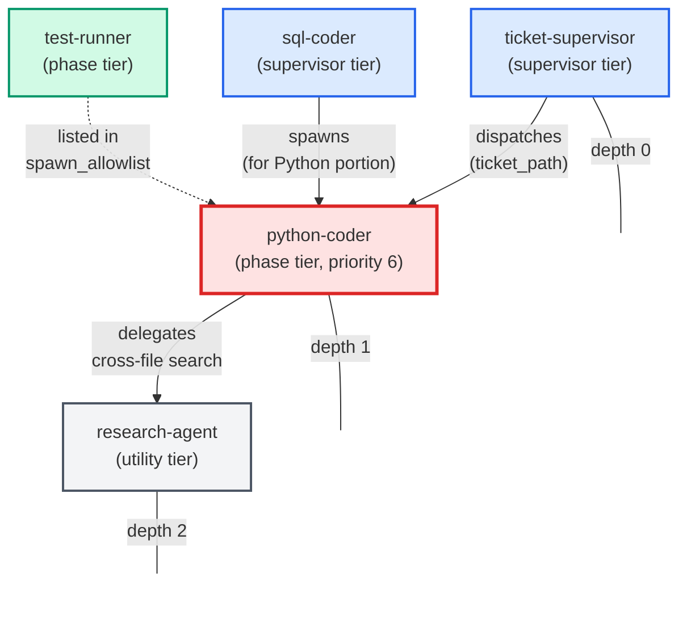
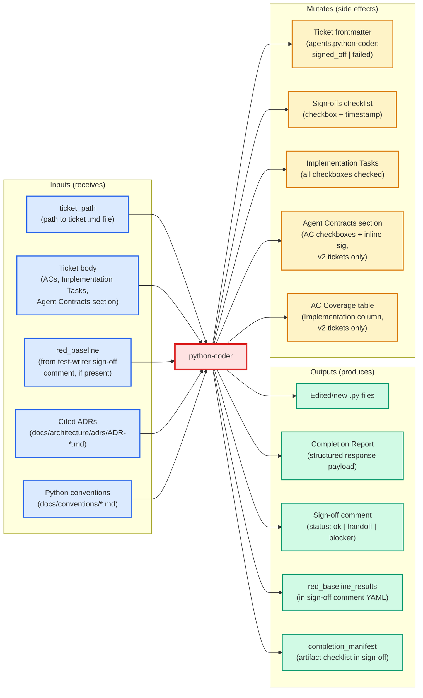

# python-coder

**Standards-enforcing Python implementation agent.**

| Field | Value |
|-------|-------|
| Model tier | Sonnet |
| Domain | General (no domain restriction) |
| Role | Coding |
| Tier class | Phase agent |
| Portable | Yes |
| Requires ticket section | Yes (`### python-coder` in `## Implementation Tasks`) |
| Owns file extensions | `.py` |
| Priority | 6 (runs after architectural review) |
| Sign-off capable | Yes |

---

## When to Use

### Trigger Phrases (operator / user)

- "Implement ticket X in Python"
- "Write the code for Y"
- Any task that produces new or edited `.py` files

### Slash Command

`/python-coder` — invokes the agent directly.

### Auto-Dispatch Conditions (from `agent_registry.json`)

| Type | Expression |
|------|-----------|
| DSL | `files_touched contains *.py` |
| LLM | "ticket involves creating, modifying, or refactoring Python code" |
| LLM | "ticket involves Python configuration or build scripts" |

### Do NOT Use When

- Task requires editing `.sql` files — use `sql-coder`
- Task is Alembic migrations — use `sql-coder`
- Task is architectural design — use `architect-review`
- Task is cross-codebase search only — use `research-agent` directly

---

## Knowledge Flow

The following diagram maps the 11 knowledge channels (from [Agent Knowledge Plane](../../architecture/agent_knowledge_plane.md)) to what python-coder actually receives at invocation time.

| Channel | Source | What It Provides | Injection Mode |
|---------|--------|-------------------|----------------|
| CH1 | Root CLAUDE.md | Project instructions, error handling policy, shell conventions | Always injected |
| CH2 | Per-folder README.md | Module-level context when cwd overlaps edited module folder | On-demand |
| CH3 | PROJECT_CONTEXT.md | Co-located skill context | On-demand |
| CH5 | signoff SKILL.md | Sign-off protocol and status enum | On-demand |
| CH5 | doc-enforcer SKILL.md | Docstring and documentation enforcement rules | On-demand |
| CH5 | complexity-reduction | Complexity scoring and refactoring triggers | On-demand |
| CH5 | collector-enforcer | Collector pattern enforcement (conditional: paths under `collector/`) | On-demand |
| CH6 | Agent frontmatter | Model: sonnet, tools: Bash/Read/Edit/Write/Agent, signoff: true, config_keys, portable: true | Spawn-scoped |
| CH7 | skills_config.json + settings.json | test_command, collector_enforcer_paths, file_size_limit_py | Spawn-scoped |
| CH8 | Ticket frontmatter | Agents map, files_touched, depends_on, ACs, Agent Contracts section | Ticket-scoped |
| CH9 | Auto-memory (memory/*.md) | Persistent cross-session learnings | Always injected |
| CH10 | MCP server prompts + tool descriptions | Available tool surface and usage guidance | Always injected |
| CH11 | Glossary (docs/glossary.md) | Project jargon definitions via CLAUDE.md ref | Always injected |
| — | Pre-Flight Self-Reads | Ticket body, cited ADRs, docs/conventions/*.md (agent self-reads, not harness-injected) | Ticket-scoped |

<!-- GAP: No structured field in agent_registry.json or frontmatter lists which
     knowledge channels are consumed by this agent. The mapping above is inferred
     from the template's prose instructions (Pre-Flight Reads, collector-enforcer
     auto-pick, etc.). Auto-generation would need a `knowledge_channels` array
     in the registry entry. -->

<!-- GAP: Channel 4 (auto-loaded skills via skills_config.json) — it is unclear
     from the config which skills, if any, are auto-loaded specifically for
     python-coder vs. all agents. The skills_config.default.json does not have
     per-agent skill targeting. -->

---

## Spawn and Dependency



**Orchestration position:** python-coder runs at depth 1 (spawned by ticket-supervisor at depth 0). Its child `research-agent` runs at depth 2. The nesting soft-cap is depth 3, so research-agent must not spawn further sub-agents.

<!-- GAP: The `spawned_by` field in agent_registry.json only lists
     ["ticket-supervisor", "sql-coder"]. In practice, the user can also invoke
     /python-coder directly — but "user" is not listed in spawned_by. This may
     be intentional (phase agents are not user-facing entry points) or an
     omission. -->

---

## Input / Output Contract



### Artifact Checklist (from frontmatter `default_artifact_checklist`)

| Artifact | Description |
|----------|-------------|
| `code_implemented` | Python code written and functional |
| `tests_passing` | Unit tests for touched module all green |
| `doc_enforcer_clean` | doc-enforcer ran with zero violations |
| `complexity_check_clean` | complexity-reduction ran, no flagged functions remain |

---

## Tools Available

| Tool | Purpose |
|------|---------|
| `Bash` | Run tests, invoke scripts, verify files |
| `Read` | Read ticket files, conventions, ADRs, source code |
| `Edit` | Modify existing Python files |
| `Write` | Create new Python files |
| `Agent` | Spawn `research-agent` or `test-runner` |

**Explicitly NOT available:** `Grep`, `Glob`, all MCP search tools (jcodemunch, serena, context7). Cross-file questions must be delegated to `research-agent`.

---

## Skills Used

| Skill | Invocation | Required | Source |
|-------|-----------|----------|--------|
| `signoff` | On-demand (Skill tool), after completion | Always (when `ticket_path` provided) | `templates/skills/signoff/SKILL.md` |
| `doc-enforcer` | On-demand (Skill tool), pre-completion check | Always | `templates/skills/doc-enforcer/SKILL.md` |
| `complexity-reduction` | On-demand (Skill tool), pre-completion check | Always (when functions flagged) | <!-- GAP: Not found in templates/skills/. Exists only as a project-local skill or is not yet packaged. --> |
| `collector-enforcer` | On-demand (Skill tool), conditional | Only when paths under `collector/` | <!-- GAP: Not found in templates/skills/. Exists only as a project-local skill or is not yet packaged. --> |
| `code-analysis` | On-demand (Skill tool), conditional | Only for AST-driven refactors | <!-- GAP: Not found in templates/skills/. Referenced in existing docs/agents/coding/python-coder.md but no template exists. --> |

<!-- GAP: The agent_registry.json `skills_used` field for python-coder only
     lists ["signoff"]. The template body references doc-enforcer, complexity-reduction,
     and collector-enforcer as mandatory pre-completion steps, but these are NOT
     reflected in the registry's skills_used array. For auto-generation, the
     registry needs to distinguish between "declared skills" (frontmatter) and
     "invoked skills" (template body prose). -->

---

## Configuration

Config keys declared in agent frontmatter (`config_keys:`):

| Key | Required | Description | Default (from `skills_config.default.json`) |
|-----|----------|-------------|----------------------------------------------|
| `test_command_live_trader` | No | Command to run the fast unit test suite | `poetry run python -m unittest discover -s unit_tests/live_trader -t . -p "test_*.py"` |
| `test_output_dir` | No | Temp directory for test output (outside project root) | `%TEMP%/bybit-trader-tests/` |
| `collector_enforcer_paths` | No | Paths that trigger the collector-enforcer skill | `["collector/"]` |

Additional config values consumed (from template prose, not declared in `config_keys`):

| Key | Source | Usage |
|-----|--------|-------|
| `file_size_limit_py` | Referenced as `{{config.file_size_limit_py}}` in template | Maximum lines for new `.py` files |
| `testing_context.max_test_duration_seconds` | `skills_config.default.json` | 5-second ceiling for auto-run tests |

<!-- GAP: `file_size_limit_py` is referenced via Mustache interpolation in the
     template but is NOT declared in the frontmatter `config_keys` block, nor
     does it appear in skills_config.default.json. It may be injected by
     build.py or defined elsewhere. Auto-generation cannot resolve this without
     a build-time config manifest. -->

---

## Contributor Notes

### Internal Execution Sequence

1. Read `red_baseline` from test-writer's sign-off comment (TDD gate)
2. Pre-flight reads: ticket body, cited ADRs, `docs/conventions/` scan
3. Activate Contract-Aware Mode if `## Agent Contracts` section present
4. Delegate cross-file lookups to `research-agent`
5. Invoke `collector-enforcer` if paths under `collector/`
6. Write/edit Python files
7. Run unit tests — confirm red_baseline green
8. Pre-completion checks: `doc-enforcer` + `complexity-reduction`
9. Emit structured response payload (Completion Report)
10. If `ticket_path` provided: execute atomic sign-off recipe

### Key Behavioral Patterns

| Pattern | Description |
|---------|-------------|
| Contract-Aware Mode | Activates when ticket has `## Agent Contracts` with `### python-coder`. Contract becomes primary spec, superseding Implementation Tasks. |
| TDD Red-Baseline Gate | If test-writer ran first, python-coder must turn all listed red tests green. Cannot skip/xfail tests. |
| Stop-and-Ask (SQL) | Halts immediately if task requires `.sql` edits; defers to sql-coder. |
| Contract-Shrinkage Guard | Before narrowing any return shape or function signature, must enumerate consumers via research-agent. Blocked if consumers depend on removed fields. |
| Test Delegation | Must NOT write/modify test files directly. Adds tasks to `### test-writer` section and uses `(status: handoff)`. |
| File-Size Limit | New `.py` files must not exceed configured limit. Plans splits upfront. |
| Research Delegation | All cross-file/symbol questions delegated to research-agent. Never guesses. |

### Error Handling Enforcement

Follows the project's 4-rule error handling policy (from CLAUDE.md):
1. External I/O must be wrapped in try/except
2. Never bare except
3. Never silently swallow
4. No try/except on pure internal functions

### Sign-off Variants

| Status | When Used |
|--------|-----------|
| `(status: ok)` | All work complete, tests green, all checks pass |
| `(status: handoff)` | Implementation done but test-writer needs to author tests |
| `(status: blocker)` | Cannot proceed — missing upstream deliverable, unresolvable test conflict, or ambiguous contract |
| `(status: failed)` | Work attempted but did not pass acceptance |

### Completion Report Structure (mandatory)

```
## Completion Report

### Files changed
- <path>: <one-line description>

### Skills run
- doc-enforcer: <pass / N violations fixed>
- complexity-reduction: <pass / N functions refactored>
- collector-enforcer: <invoked / not applicable>
- research-agent: <queries delegated / not needed>

### Tests
- Command: <command run>
- Result: <pass / N failures>

### Notes
<caveats, deferred items, or open questions>
```

---

## Auto-Generation Gap Summary

The following fields would need to be added to structured sources (agent_registry.json, frontmatter, or a new manifest) to enable fully automated card generation:

| Gap | Current State | Needed For Auto-Gen |
|-----|---------------|---------------------|
| Knowledge channels consumed | Inferred from template prose | `knowledge_channels: [1,2,5,6,7,8,11]` array in registry |
| All skills invoked (not just declared) | Registry only lists `["signoff"]`; template references 4+ | `skills_invoked` array distinguishing declared vs. runtime |
| Complexity-reduction skill template | Referenced but not in `templates/skills/` | Package the skill or mark as project-local |
| Collector-enforcer skill template | Referenced but not in `templates/skills/` | Package the skill or mark as project-local |
| Code-analysis skill template | Referenced in existing docs | Package or document as project-local |
| `file_size_limit_py` config source | Mustache var in template, no structured declaration | Add to `config_keys` frontmatter or config manifest |
| Pre-flight reads list | Prose instructions, not structured | `pre_flight_reads` array in frontmatter |
| Input/output contract | Inferred from template sections | Structured `inputs` / `outputs` / `mutates` in frontmatter |
| "User" in spawned_by | User can invoke via slash command but not listed | Clarify whether phase agents are user-invocable |
| Behavioral patterns | Embedded in template prose | `behavioral_patterns` structured array |

---

## Cross-References

- Template: [`templates/agents/python-coder.md`](../../../templates/agents/python-coder.md)
- Registry entry: [`config/agent_registry.json`](../../../config/agent_registry.json) (id: `python-coder`)
- Existing reference doc: [`docs/agents/coding/python-coder.md`](../coding/python-coder.md)
- Agent Knowledge Plane: [`docs/architecture/agent_knowledge_plane.md`](../../architecture/agent_knowledge_plane.md)
- ADR-006 (Model Tiers): [`docs/architecture/adrs/ADR-006-agent-model-tiers.md`](../../architecture/adrs/ADR-006-agent-model-tiers.md)
- Signoff skill: [`templates/skills/signoff/SKILL.md`](../../../templates/skills/signoff/SKILL.md)
- Doc-enforcer skill: [`templates/skills/doc-enforcer/SKILL.md`](../../../templates/skills/doc-enforcer/SKILL.md)
