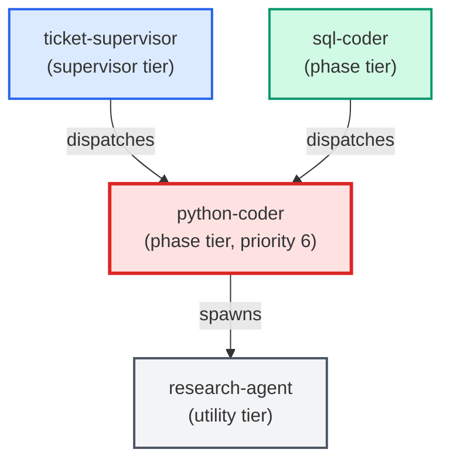

# python-coder

**Standards-enforcing Python implementation agent. Writes, edits, and refactors
Python code while automatically pulling in project conventions and running
doc-enforcer + complexity-reduction before declaring the task done.
Use when: user asks to implement a ticket in Python; says "write the code for X";
asks to refactor or extend a Python module; or any task that produces edited or
new Python files (excluding .sql files — defer those to sql-coder).**

| Field | Value |
|-------|-------|
| Model | sonnet |
| Tier | phase |
| Priority | 6 |
| Portable | Yes |
| Sign-off capable | Yes |

---

## When to Use

### Spawned By

- `ticket-supervisor`
- `sql-coder`
---

## Knowledge Flow

| Channel | Source | Injection Mode | Description |
|---------|--------|----------------|-------------|
| 1 | Root CLAUDE.md | always | Project instructions, error handling policy, shell conventions |
| 2 | Per-folder README.md | on-demand | Module-level context when cwd overlaps edited module folder |
| 5 | signoff SKILL.md; doc-enforcer SKILL.md; complexity-reduction; collector-enforcer | on-demand | Sign-off protocol, docstring enforcement, complexity scoring, collector pattern enforcement |
| 6 | Agent frontmatter | spawn-scoped | Model: sonnet, tools: Bash/Read/Edit/Write/Agent, signoff: true, config_keys, portable: true |
| 7 | skills_config.json + settings.json | spawn-scoped | test_command, collector_enforcer_paths, file_size_limit_py |
| 8 | Ticket frontmatter | ticket-scoped | Agents map, files_touched, depends_on, ACs, Agent Contracts section |
| 9 | Auto-memory (memory/*.md) | always | Persistent cross-session learnings |
| 10 | MCP server prompts + tool descriptions | always | Available tool surface and usage guidance |
| 11 | Glossary (docs/glossary.md) | always | Project jargon definitions via CLAUDE.md ref |
---

## Spawn and Dependency

---

## Input / Output Contract

### Inputs

| Name | Type | Description |
|------|------|-------------|
| `ticket_path` | file_path | Path to the ticket markdown file (.md) |
| `ticket_body` | structured_payload | Ticket body sections: ACs, Implementation Tasks, Agent Contracts |
| `red_baseline` | config_value | Red test list from test-writer sign-off comment, if present |
| `cited_adrs` | file | Referenced ADR files under docs/architecture/adrs/ |
| `python_conventions` | file | Relevant files under docs/conventions/ |

### Outputs

| Name | Type | Description |
|------|------|-------------|
| `edited_py_files` | file | Edited or newly created .py files |
| `completion_report` | structured_response | Structured completion report payload (Files changed, Skills run, Tests, Notes) |
| `sign_off_comment` | sign_off_comment | Sign-off comment with status: ok | handoff | blocker |
| `red_baseline_results` | structured_response | Per-test results showing which red_baseline tests moved to green |
| `completion_manifest` | structured_response | Artifact checklist in sign-off comment per signoff §2b |

### Mutates (Side Effects)

| Name | Type | Description |
|------|------|-------------|
| `ticket_frontmatter_agents_status` | — | Sets agents.python-coder to signed_off or failed |
| `sign_offs_checklist` | — | Checks the python-coder checkbox with timestamp |
| `implementation_task_checkboxes` | — | Flips all - [ ] tasks in ### python-coder section to - [x] |
| `agent_contracts_ac_checkboxes` | — | Flips AC checkboxes and appends inline sig; v2 tickets only |
| `ac_coverage_table` | — | Fills Implementation column in ## AC Coverage table; v2 tickets only |
---

## Tools Available

| Tool |
|------|
| `Bash` |
| `Read` |
| `Edit` |
| `Write` |
| `Agent` |
---

## Skills Used

| Skill | Mode | Condition |
|-------|------|-----------|
| `signoff` | always | — |
| `doc-enforcer` | always | — |
| `complexity-reduction` | conditional | when flagged functions exceed complexity threshold |
| `collector-enforcer` | conditional | when paths under collector/ are edited |
---

## Configuration

| Key | Required | Description |
|-----|----------|-------------|
| `test_command_live_trader` | No | Command to run the fast unit test suite |
| `test_output_dir` | No | Temp directory for test output (outside project root) |
| `collector_enforcer_paths` | No | Paths that trigger the collector-enforcer skill |
| `file_size_limit_py` | No | Maximum lines for new .py files; referenced as {{config.file_size_limit_py}} |
| `testing_context.max_test_duration_seconds` | No | 5-second ceiling for auto-run tests |
---

## Contributor Notes

### Key Behavioral Patterns

| Pattern | Trigger | Behavior | Related Agent |
|---------|---------|----------|---------------|
| Contract-Aware Mode | Ticket body contains ## Agent Contracts with ### python-coder sub-heading | Contract block becomes primary spec, superseding ## Implementation Tasks for scope and interface decisions | `None` |
| TDD Red-Baseline Gate | test-writer signed off before python-coder; red_baseline present in sign-off comment | Must turn all red_baseline tests green; cannot skip or xfail any listed test | `test-writer` |
| Stop-and-Ask | Implementation task requires editing a .sql file | Halts immediately and instructs caller to use sql-coder for the SQL portion | `sql-coder` |
| Contract-Shrinkage Guard | About to narrow a return shape, function signature, or dictionary structure | Must enumerate consumers via research-agent first; blocked if any consumer depends on removed field | `research-agent` |
| Test Delegation | Implementation requires new or updated unit tests | Adds tasks to ### test-writer section and uses (status: handoff) instead of (status: ok) | `test-writer` |
| File-Size Limit | New .py file would exceed {{config.file_size_limit_py}} lines | Plans module splits upfront using build_phases.py / build_helpers.py precedent | `None` |
| Research Delegation | Any cross-file or symbol-level question arises during implementation | Delegates to research-agent via Agent tool; never guesses or searches directly | `research-agent` |
