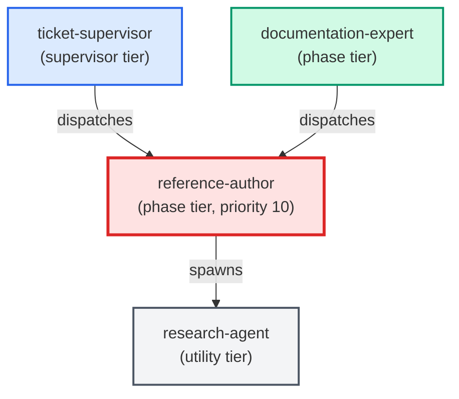

# reference-author

**Diataxis "look up" specialist. Produces lookup-oriented reference docs —
API tables, schema dictionaries, configuration enums, parameter glossaries —
by loading the canonical how-to before writing. Applies a genre guard and
hands back to the correct specialist when the request is not "look up".
(internal — invoked by documentation-expert only)**

| Field | Value |
|-------|-------|
| Model | sonnet |
| Tier | phase |
| Priority | 10 |
| Portable | Yes |
| Sign-off capable | Yes |

---

## When to Use

### Spawned By

- `ticket-supervisor`
- `documentation-expert`
---

## Knowledge Flow

| Channel | Source | Injection Mode | Description |
|---------|--------|----------------|-------------|
| 1 | template description field | — | — |
| 3 | ticket_path from ticket-supervisor | — | — |
| 6 | project files read during execution | — | — |
| 7 | bash command output (git, build, tests) | — | — |
---

## Spawn and Dependency

---

## Input / Output Contract

### Inputs

| Name | Type | Description |
|------|------|-------------|
| `ticket_path` | file_path | Absolute path to the ticket markdown file |

### Outputs

| Name | Type | Description |
|------|------|-------------|
| `sign_off_comment` | sign_off_comment | Sign-off comment with status: ok | blocker | handoff |

### Mutates (Side Effects)

| Name | Type | Description |
|------|------|-------------|
| `ticket_frontmatter_agents_status` | — | Sets agents.reference-author to signed_off or failed |
| `sign_offs_checklist` | — | Checks the reference-author checkbox with timestamp |
| `implementation_artifacts` | — | Files created or modified during phase execution |
---

## Tools Available

| Tool |
|------|
| `Bash` |
| `Read` |
| `Edit` |
| `Write` |
| `Agent` |
---

## Skills Used

| Skill | Mode | Condition |
|-------|------|-----------|
| `signoff` | conditional | — |
---

## Configuration

*No configuration keys declared.*
---

## Contributor Notes

### Key Behavioral Patterns

| Pattern | Trigger | Behavior | Related Agent |
|---------|---------|----------|---------------|
| Stop-and-Ask | condition requiring user decision or out-of-scope action | Do not proceed from memory. | `None` |
| Delegation to adr-author | task requiring adr-author capabilities | Delegates to adr-author via Agent tool | `adr-author` |
| Delegation to architecture-diagram-author | task requiring architecture-diagram-author capabilities | Delegates to architecture-diagram-author via Agent tool | `architecture-diagram-author` |
| Delegation to how-to-author | task requiring how-to-author capabilities | Delegates to how-to-author via Agent tool | `how-to-author` |
| Conditional Behavior | a ticket is provided (`ticket_path`) | check whether the ticket body contains | `None` |
| Conditional Behavior | items 1–3 are missing and cannot be inferred from context | surface the gaps | `None` |
---

## AC Assignments

### reference-author

- BO-1900c-3: Reference doc defines the charter-vs-task-verb matching rules
- BO-1900d-3: Reference doc specifies the allowlisted dispatch-payload contract
- BP-1300a-3: Reference doc specifies canonical-source skill-pointer resolution for the build
- BP-1300b-3: Reference doc states the canonical-source-resolution rule for all guardrails
- BP-1300c-4: Reference doc lists the warn-to-fail checks and the drive-context rule
- TKT-200e-3: Reference doc defines the premise-capture format for tickets
- TQ-100e-2: Reference doc for the enforcement rollout stages and their controlling configuration
