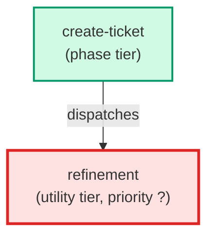

# refinement

**Technical refinement of the business-analyst output for single-ticket path.
Performs a five-lens technical clarifying-question pass over the BA payload:
(1) files_touched completeness, (2) agent assignment accuracy, (3) acceptance
criteria testability, (4) dependency detection, (5) risk identification.
Returns a validated/refined version of the BA payload. Spawned by create-ticket
after business-analyst in the standard_ticket path.**

| Field | Value |
|-------|-------|
| Model | sonnet |
| Tier | utility |
| Priority | — |
| Portable | Yes |
| Sign-off capable | No |

---

## When to Use

### Spawned By

- `create-ticket`
---

## Knowledge Flow

*No knowledge channels declared.*

---

## Spawn and Dependency

---

## Input / Output Contract

*No structured I/O contract declared.*
---

## Tools Available

| Tool |
|------|
| `Bash` |
| `Read` |
| `Agent` |
---

## Skills Used

*No skills declared.*
---

## Configuration

*No configuration keys declared.*
---

## Contributor Notes

No conditional behaviors — this agent follows a single fixed execution path
