# research-agent

**Central context-gathering hub. Accepts a structured question from a parent
agent, searches the codebase or documentation using the full search toolkit,
and returns curated findings: file paths with 1-3 line descriptions each, plus
a synthesis paragraph. Owns Grep, Glob, jcodemunch, serena, and context7 — no
other coding agent carries these tools.
(internal — invoked by parent agents only)**

| Field | Value |
|-------|-------|
| Model | sonnet |
| Tier | utility |
| Priority | — |
| Portable | Yes |
| Sign-off capable | Yes |

---

## When to Use

### Spawned By

- `architect-review`
- `business-analyst`
- `python-coder`
- `documentation-expert`
- `reference-author`
- `status-checker`
- `sql-coder`
- `sql-query`
- `sql-table-creator`
- `sql-test-writer`
- `sql-procedure-creator`
- `sql-function-creator`
- `sql-index-creator`
- `sql-view-creator`
- `test-writer`
- `frontend-coder`
- `llm-expert`
- `pr-reviewer`
---

## Knowledge Flow

| Channel | Source | Injection Mode | Description |
|---------|--------|----------------|-------------|
| 1 | template description field | — | — |
| 3 | ticket_path from ticket-supervisor | — | — |
| 6 | project files read during execution | — | — |
| 7 | bash command output (git, build, tests) | — | — |
---

## Spawn and Dependency

```mermaid
flowchart TD
    classDef supervisor fill:#dbeafe,stroke:#2563eb,stroke-width:2px
    classDef phase fill:#d1fae5,stroke:#059669,stroke-width:2px
    classDef utility fill:#f3f4f6,stroke:#4b5563,stroke-width:2px
    classDef target fill:#fee2e2,stroke:#dc2626,stroke-width:3px

    architect_review["architect-review\n(phase tier)"]:::phase
    business_analyst["business-analyst\n(phase tier)"]:::phase
    python_coder["python-coder\n(phase tier)"]:::phase
    documentation_expert["documentation-expert\n(phase tier)"]:::phase
    reference_author["reference-author\n(phase tier)"]:::phase
    status_checker["status-checker\n(phase tier)"]:::phase
    sql_coder["sql-coder\n(phase tier)"]:::phase
    sql_query["sql-query\n(phase tier)"]:::phase
    sql_table_creator["sql-table-creator\n(phase tier)"]:::phase
    sql_test_writer["sql-test-writer\n(phase tier)"]:::phase
    sql_procedure_creator["sql-procedure-creator\n(phase tier)"]:::phase
    sql_function_creator["sql-function-creator\n(phase tier)"]:::phase
    sql_index_creator["sql-index-creator\n(phase tier)"]:::phase
    sql_view_creator["sql-view-creator\n(phase tier)"]:::phase
    test_writer["test-writer\n(phase tier)"]:::phase
    frontend_coder["frontend-coder\n(phase tier)"]:::phase
    llm_expert["llm-expert\n(phase tier)"]:::phase
    pr_reviewer["pr-reviewer\n(phase tier)"]:::phase
    research_agent["research-agent\n(utility tier, priority ?)"]:::target

    architect_review -->|dispatches| research_agent
    business_analyst -->|dispatches| research_agent
    python_coder -->|dispatches| research_agent
    documentation_expert -->|dispatches| research_agent
    reference_author -->|dispatches| research_agent
    status_checker -->|dispatches| research_agent
    sql_coder -->|dispatches| research_agent
    sql_query -->|dispatches| research_agent
    sql_table_creator -->|dispatches| research_agent
    sql_test_writer -->|dispatches| research_agent
    sql_procedure_creator -->|dispatches| research_agent
    sql_function_creator -->|dispatches| research_agent
    sql_index_creator -->|dispatches| research_agent
    sql_view_creator -->|dispatches| research_agent
    test_writer -->|dispatches| research_agent
    frontend_coder -->|dispatches| research_agent
    llm_expert -->|dispatches| research_agent
    pr_reviewer -->|dispatches| research_agent
```

---

## Input / Output Contract

### Inputs

| Name | Type | Description |
|------|------|-------------|
| `ticket_path` | file_path | Absolute path to the ticket markdown file |

### Outputs

| Name | Type | Description |
|------|------|-------------|
| `sign_off_comment` | sign_off_comment | Sign-off comment with status: ok | blocker | handoff |

### Mutates (Side Effects)

| Name | Type | Description |
|------|------|-------------|
| `ticket_frontmatter_agents_status` | — | Sets agents.research-agent to signed_off or failed |
| `sign_offs_checklist` | — | Checks the research-agent checkbox with timestamp |
---

## Tools Available

| Tool |
|------|
| `Bash` |
| `Read` |
| `Grep` |
| `Glob` |
| `mcp__jcodemunch__get_blast_radius` |
| `mcp__jcodemunch__get_dependency_graph` |
| `mcp__jcodemunch__get_class_hierarchy` |
| `mcp__jcodemunch__get_context_bundle` |
| `mcp__jcodemunch__find_references` |
| `mcp__jcodemunch__find_importers` |
| `mcp__jcodemunch__search_symbols` |
| `mcp__jcodemunch__search_text` |
| `mcp__jcodemunch__get_symbol` |
| `mcp__jcodemunch__get_file_outline` |
| `mcp__jcodemunch__get_related_symbols` |
| `mcp__jcodemunch__get_ranked_context` |
| `mcp__plugin_serena_serena__find_symbol` |
| `mcp__plugin_serena_serena__find_declaration` |
| `mcp__plugin_serena_serena__find_implementations` |
| `mcp__plugin_serena_serena__find_referencing_symbols` |
| `mcp__plugin_serena_serena__search_for_pattern` |
| `mcp__plugin_serena_serena__get_symbols_overview` |
| `mcp__plugin_context7_context7__resolve-library-id` |
| `mcp__plugin_context7_context7__query-docs` |
---

## Skills Used

| Skill | Mode | Condition |
|-------|------|-----------|
| `signoff` | always | — |
---

## Configuration

*No configuration keys declared.*
---

## Contributor Notes

### Key Behavioral Patterns

| Pattern | Trigger | Behavior | Related Agent |
|---------|---------|----------|---------------|
| Conditional Behavior | a search returns more than 10 files | group by directory and summarise the | `None` |
| Conditional Behavior | a question requires multiple independent sub-searches | run them sequentially within this invocation | `None` |
