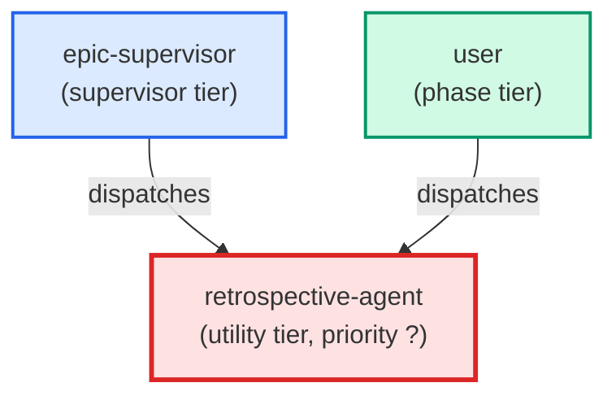

# retrospective-agent

**Automated epic retrospective agent. Reads all completed tickets in an epic
folder (including done/ subfolder), parses ## Comments sections for retry
patterns and blockers, optionally reads telemetry JSONL for quantitative
data, and generates a structured retrospective artifact. Proposes Knowledge
Item entries and rule updates as diffs for user approval — never auto-applies.
Use when: user invokes /retro EPIC-Name; after an epic closes and all tickets
are in done/, or when epic-supervisor auto-invokes at the end of a run.**

| Field | Value |
|-------|-------|
| Model | sonnet |
| Tier | utility |
| Priority | — |
| Portable | Yes |
| Sign-off capable | No |

---

## When to Use

### Spawned By

- `epic-supervisor`
- `user`
---

## Knowledge Flow

*No knowledge channels declared.*

---

## Spawn and Dependency

---

## Input / Output Contract

*No structured I/O contract declared.*
---

## Tools Available

| Tool |
|------|
| `Bash` |
| `Read` |
| `Write` |
| `Agent` |
---

## Skills Used

*No skills declared.*
---

## Configuration

*No configuration keys declared.*
---

## Contributor Notes

No conditional behaviors — this agent follows a single fixed execution path
