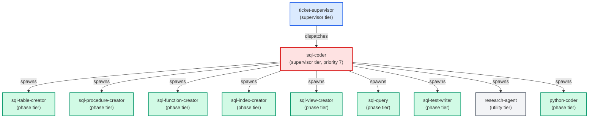

# sql-coder

**Standards-enforcing SQL implementation agent. Reads PROJECT_CONTEXT.md for
project-specific database conventions, runs the postgres skill, dispatches to
specialist sub-agents (sql-table-creator, sql-index-creator, sql-procedure-creator,
sql-function-creator, sql-view-creator) by artifact type, and gates "done" on
local-DB deploy + sql-test pass.
Use when: user types /sql-coder; asks to write a SQL procedure/function/view/
index/table; asks to refactor SQL or apply a SQL change to the local DB.**

| Field | Value |
|-------|-------|
| Model | sonnet |
| Tier | supervisor |
| Priority | 7 |
| Portable | No |
| Sign-off capable | No |

---

## When to Use

### Spawned By

- `ticket-supervisor`
---

## Knowledge Flow

*No knowledge channels declared.*

---

## Spawn and Dependency

---

## Input / Output Contract

*No structured I/O contract declared.*
---

## Tools Available

| Tool |
|------|
| `Bash` |
| `Read` |
| `Edit` |
| `Write` |
| `Agent` |
---

## Skills Used

| Skill | Mode | Condition |
|-------|------|-----------|
| `signoff` | — | — |
---

## Configuration

*No configuration keys declared.*
---

## Contributor Notes

No conditional behaviors — this agent follows a single fixed execution path
