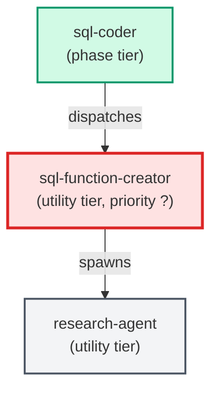

# sql-function-creator

**Specialist for creating new SQL functions. Produces the .sql file, a
matching unit test, and a design-decision record. Reads PROJECT_CONTEXT.md
for project-specific paths, how-tos, and conventions.
(internal — invoked by parent agents only)**

| Field | Value |
|-------|-------|
| Model | sonnet |
| Tier | utility |
| Priority | — |
| Portable | No |
| Sign-off capable | No |

---

## When to Use

### Spawned By

- `sql-coder`
---

## Knowledge Flow

*No knowledge channels declared.*

---

## Spawn and Dependency

---

## Input / Output Contract

*No structured I/O contract declared.*
---

## Tools Available

| Tool |
|------|
| `Bash` |
| `Read` |
| `Edit` |
| `Write` |
| `Agent` |
---

## Skills Used

*No skills declared.*
---

## Configuration

*No configuration keys declared.*
---

## Contributor Notes

No conditional behaviors — this agent follows a single fixed execution path
