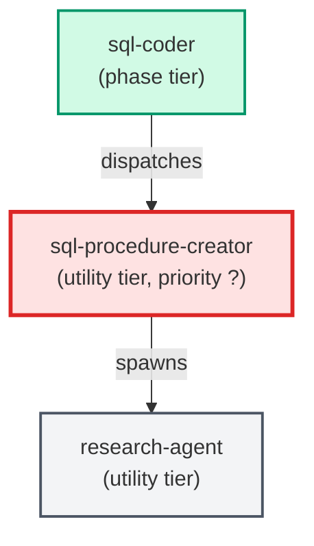

# sql-procedure-creator

**Specialist that authors new database stored procedures following the project's
procedure pattern. Produces the procedure SQL file and the matching
rollback-only test file in one pass. Reads PROJECT_CONTEXT.md for
project-specific paths and deploy commands.
(internal — invoked by parent agents only)**

| Field | Value |
|-------|-------|
| Model | sonnet |
| Tier | utility |
| Priority | — |
| Portable | No |
| Sign-off capable | No |

---

## When to Use

### Spawned By

- `sql-coder`
---

## Knowledge Flow

*No knowledge channels declared.*

---

## Spawn and Dependency

---

## Input / Output Contract

*No structured I/O contract declared.*
---

## Tools Available

| Tool |
|------|
| `Bash` |
| `Read` |
| `Edit` |
| `Write` |
| `Agent` |
---

## Skills Used

*No skills declared.*
---

## Configuration

*No configuration keys declared.*
---

## Contributor Notes

No conditional behaviors — this agent follows a single fixed execution path
