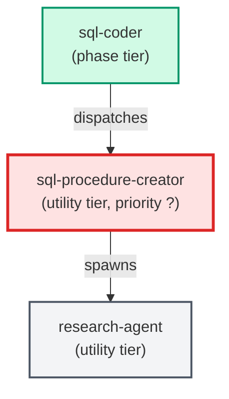

# sql-procedure-creator

**Specialist that authors new database stored procedures following the project's
procedure pattern. Produces the procedure SQL file and the matching
rollback-only test file in one pass. Reads PROJECT_CONTEXT.md for
project-specific paths and deploy commands.
(internal — invoked by parent agents only)**

| Field | Value |
|-------|-------|
| Model | sonnet |
| Tier | utility |
| Priority | — |
| Portable | No |
| Sign-off capable | No |

---

## When to Use

### Spawned By

- `sql-coder`
---

## Knowledge Flow

| Channel | Source | Injection Mode | Description |
|---------|--------|----------------|-------------|
| 1 | template description field | — | — |
| 4 | pre-flight file reads | — | — |
| 6 | project files read during execution | — | — |
| 7 | bash command output (git, build, tests) | — | — |
| 8 | PROJECT_CONTEXT.md | — | — |
---

## Spawn and Dependency

---

## Input / Output Contract

### Outputs

| Name | Type | Description |
|------|------|-------------|
| `completion_report` | structured_response | Structured completion payload or sign-off comment |

### Mutates (Side Effects)

| Name | Type | Description |
|------|------|-------------|
| `none` | — | Read-only agent — no filesystem mutations |
---

## Tools Available

| Tool |
|------|
| `Bash` |
| `Read` |
| `Edit` |
| `Write` |
| `Agent` |
---

## Skills Used

| Skill | Mode | Condition |
|-------|------|-----------|
| `signoff` | always | — |
---

## Configuration

*No configuration keys declared.*
---

## Contributor Notes

### Key Behavioral Patterns

| Pattern | Trigger | Behavior | Related Agent |
|---------|---------|----------|---------------|
| Stop-and-Ask | condition requiring user decision or out-of-scope action | stop and ask `sql-coder` to supply it — do not guess. | `None` |
| Stop-and-Ask | condition requiring user decision or out-of-scope action | stop and ask before writing any file. | `None` |
| Delegation to research-agent | task requiring research-agent capabilities | Delegates to research-agent via Agent tool | `research-agent` |
| Conditional Behavior | required inputs are missing | stop and ask before writing any file | `None` |
| Conditional Behavior | the how-to conflicts with this system prompt | the how-to wins | `None` |
