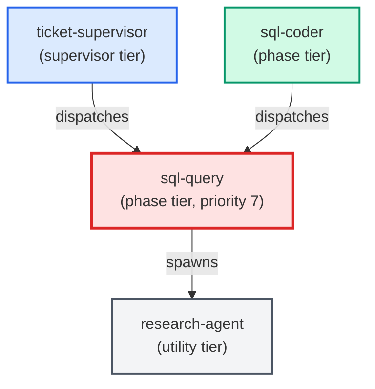

# sql-query

**Ad-hoc SQL query authoring specialist. Reads PROJECT_CONTEXT.md for project-
specific database conventions, past-queries folder, and connection details.
Invokes the sql-query-past-queries skill to surface reusable prior queries.
Returns reviewed, runnable SQL for human approval before any execution.
Use when: user needs to write or refine a query for analysis, debugging, or
reporting; does NOT create SQL schema objects (use sql-coder for that).**

| Field | Value |
|-------|-------|
| Model | sonnet |
| Tier | phase |
| Priority | 7 |
| Portable | No |
| Sign-off capable | No |

---

## When to Use

### Spawned By

- `ticket-supervisor`
- `sql-coder`
---

## Knowledge Flow

| Channel | Source | Injection Mode | Description |
|---------|--------|----------------|-------------|
| 1 | template description field | — | — |
| 4 | pre-flight file reads | — | — |
| 6 | project files read during execution | — | — |
| 7 | bash command output (git, build, tests) | — | — |
| 8 | [PROJECT_CONTEXT.md](../../../templates/skills/signoff/PROJECT_CONTEXT.md) | — | — |
---

## Spawn and Dependency

---

## Input / Output Contract

### Outputs

| Name | Type | Description |
|------|------|-------------|
| `completion_report` | structured_response | Structured completion payload or sign-off comment |

### Mutates (Side Effects)

| Name | Type | Description |
|------|------|-------------|
| `none` | — | Read-only agent — no filesystem mutations |
---

## Tools Available

| Tool |
|------|
| `Bash` |
| `Read` |
| `Edit` |
| `Write` |
| `Agent` |
---

## Skills Used

| Skill | Mode | Condition |
|-------|------|-----------|
| `sql-query-past-queries` | always | — |
| `signoff` | conditional | — |
---

## Configuration

*No configuration keys declared.*
---

## Contributor Notes

### Key Behavioral Patterns

| Pattern | Trigger | Behavior | Related Agent |
|---------|---------|----------|---------------|
| Conditional Behavior | the file is absent | log one debug line: | `None` |
| Conditional Behavior | any of these are ambiguous | ask before writing | `None` |
