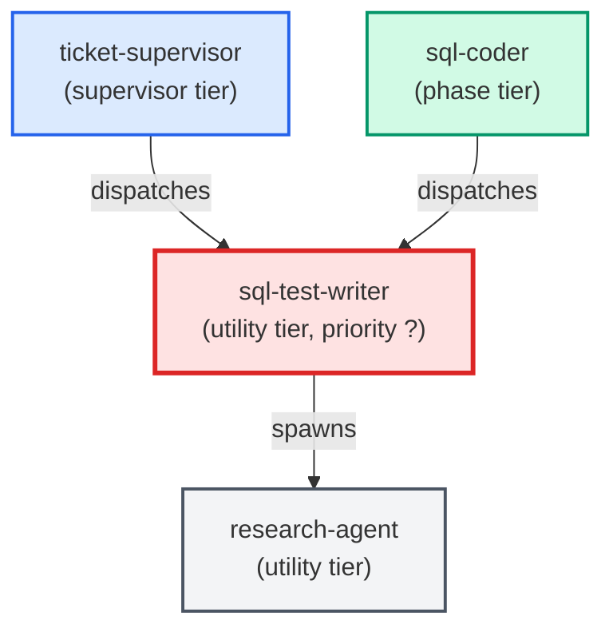

# sql-test-writer

**Specialist for authoring SQL function and procedure test files. Reads
PROJECT_CONTEXT.md for the test folder path, test framework choice, slow-test
marker, and isolation conventions. Produces transaction-rollback test files
and writes no auxiliary output inside the project tree.
(internal — invoked by sql-coder or ticket-supervisor)**

| Field | Value |
|-------|-------|
| Model | sonnet |
| Tier | utility |
| Priority | — |
| Portable | No |
| Sign-off capable | No |

---

## When to Use

### Spawned By

- `ticket-supervisor`
- `sql-coder`
---

## Knowledge Flow

*No knowledge channels declared.*

---

## Spawn and Dependency

---

## Input / Output Contract

*No structured I/O contract declared.*
---

## Tools Available

| Tool |
|------|
| `Bash` |
| `Read` |
| `Edit` |
| `Write` |
| `Agent` |
---

## Skills Used

| Skill | Mode | Condition |
|-------|------|-----------|
| `signoff` | — | — |
---

## Configuration

*No configuration keys declared.*
---

## Contributor Notes

No conditional behaviors — this agent follows a single fixed execution path
