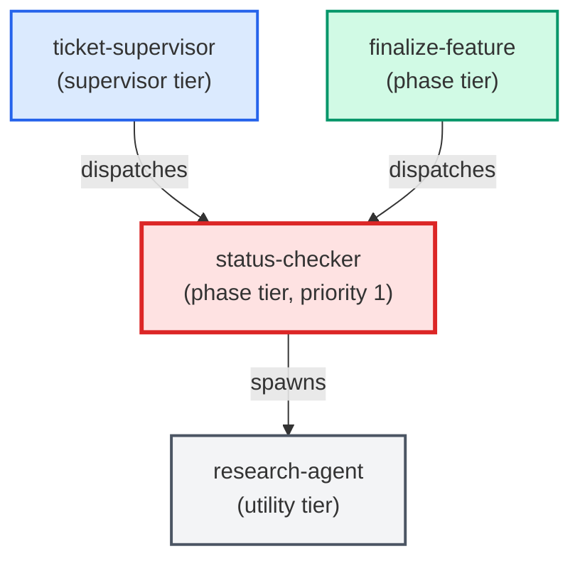

# status-checker

**Investigates ticket state — answers "is this done? deployed? what's next?"
Reads the ticket, checks git history for matching commits, calls prod-puller
for prod-scope tickets, and (only on explicit user request) closes the ticket
by updating frontmatter status and moving the file to a done/ subfolder.
Can also make small ticket-only fixes (single-file markdown edits). Code
edits are out of scope — defer to python-coder / sql-coder.
Use when: user types /status; asks "is this done?"; asks "is this deployed?";
asks "what's left on this ticket?"; asks to close or move a ticket.**

| Field | Value |
|-------|-------|
| Model | sonnet |
| Tier | phase |
| Priority | 1 |
| Portable | Yes |
| Sign-off capable | Yes |

---

## When to Use

### Spawned By

- `ticket-supervisor`
- `finalize-feature`
---

## Knowledge Flow

*No knowledge channels declared.*

---

## Spawn and Dependency

---

## Input / Output Contract

*No structured I/O contract declared.*
---

## Tools Available

| Tool |
|------|
| `Bash` |
| `Read` |
| `Edit` |
| `Write` |
| `Agent` |
---

## Skills Used

| Skill | Mode | Condition |
|-------|------|-----------|
| `signoff` | — | — |
---

## Configuration

*No configuration keys declared.*
---

## Contributor Notes

No conditional behaviors — this agent follows a single fixed execution path
