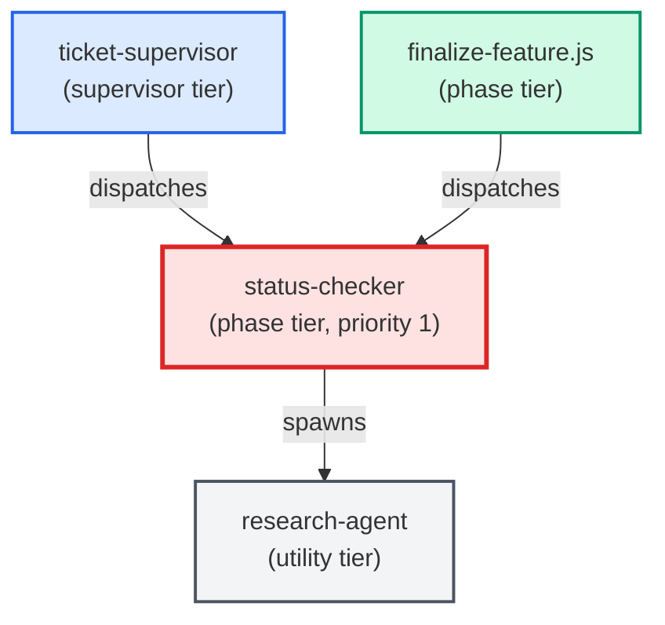

# status-checker

**Investigates ticket state — answers "is this done? deployed? what's next?"
Reads the ticket, checks git history for matching commits, calls prod-puller
for prod-scope tickets, and (only on explicit user request) closes the ticket
by updating frontmatter status and moving the file to a done/ subfolder.
Can also make small ticket-only fixes (single-file markdown edits). Code
edits are out of scope — defer to python-coder / sql-coder.
Use when: user types /status; asks "is this done?"; asks "is this deployed?";
asks "what's left on this ticket?"; asks to close or move a ticket.**

| Field | Value |
|-------|-------|
| Model | sonnet |
| Tier | phase |
| Priority | 1 |
| Portable | Yes |
| Sign-off capable | Yes |

---

## When to Use

### Spawned By

- `ticket-supervisor`
- `finalize-feature.js`
---

## Knowledge Flow

| Channel | Source | Injection Mode | Description |
|---------|--------|----------------|-------------|
| 1 | template description field | — | — |
| 3 | ticket_path from ticket-supervisor | — | — |
| 6 | project files read during execution | — | — |
| 7 | bash command output (git, build, tests) | — | — |
---

## Spawn and Dependency

---

## Input / Output Contract

### Inputs

| Name | Type | Description |
|------|------|-------------|
| `ticket_path` | file_path | Absolute path to the ticket markdown file |

### Outputs

| Name | Type | Description |
|------|------|-------------|
| `sign_off_comment` | sign_off_comment | Sign-off comment with status: ok | blocker | handoff |

### Mutates (Side Effects)

| Name | Type | Description |
|------|------|-------------|
| `ticket_frontmatter_agents_status` | — | Sets agents.status-checker to signed_off or failed |
| `sign_offs_checklist` | — | Checks the status-checker checkbox with timestamp |
| `implementation_artifacts` | — | Files created or modified during phase execution |
---

## Tools Available

| Tool |
|------|
| `Bash` |
| `Read` |
| `Edit` |
| `Write` |
| `Agent` |
---

## Skills Used

| Skill | Mode | Condition |
|-------|------|-----------|
| `signoff` | conditional | — |
---

## Configuration

*No configuration keys declared.*
---

## Contributor Notes

### Key Behavioral Patterns

| Pattern | Trigger | Behavior | Related Agent |
|---------|---------|----------|---------------|
| Delegation to research-agent | task requiring research-agent capabilities | Delegates to research-agent via Agent tool | `research-agent` |
| Conditional Behavior | the ticket touches prod-relevant code (workers | migrations, SQL deployed to prod): | `None` |
| Conditional Behavior | the auto-close fires | the ticket is closed immediately without | `None` |
