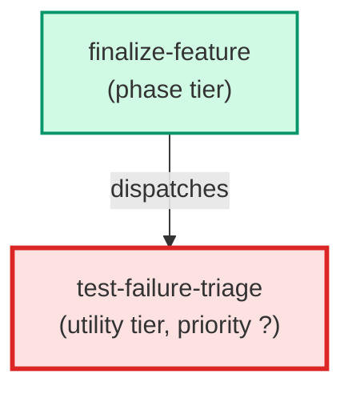

# test-failure-triage

**Classifies post-merge test failures into structured categories before any
remediation work begins. Receives a post-merge failure list, a baseline
failure list, and the set of files changed by the feature branch, then
emits a triage report so downstream finalize-feature.js steps can route
each failure to the correct handler without re-running LLM reasoning.
(internal — spawned by finalize-feature only)**

| Field | Value |
|-------|-------|
| Model | sonnet |
| Tier | utility |
| Priority | — |
| Portable | Yes |
| Sign-off capable | No |

---

## When to Use

### Spawned By

- `finalize-feature`
---

## Knowledge Flow

*No knowledge channels declared.*

---

## Spawn and Dependency

---

## Input / Output Contract

*No structured I/O contract declared.*
---

## Tools Available

| Tool |
|------|
| `Bash` |
| `Read` |
---

## Skills Used

*No skills declared.*
---

## Configuration

*No configuration keys declared.*
---

## Contributor Notes

No conditional behaviors — this agent follows a single fixed execution path
