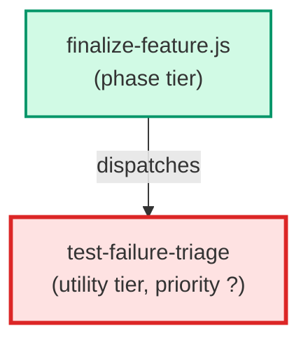

# test-failure-triage

**Classifies post-merge test failures into structured categories before any
remediation work begins. Receives a post-merge failure list, a baseline
failure list, and the set of files changed by the feature branch, then
emits a triage report so downstream finalize-feature.js steps can route
each failure to the correct handler without re-running LLM reasoning.
(internal — spawned by finalize-feature only)**

| Field | Value |
|-------|-------|
| Model | sonnet |
| Tier | utility |
| Priority | — |
| Portable | Yes |
| Sign-off capable | No |

---

## When to Use

### Spawned By

- `finalize-feature.js`
---

## Knowledge Flow

| Channel | Source | Injection Mode | Description |
|---------|--------|----------------|-------------|
| 1 | template description field | — | — |
| 6 | project files read during execution | — | — |
| 7 | bash command output (git, build, tests) | — | — |
---

## Spawn and Dependency

---

## Input / Output Contract

### Outputs

| Name | Type | Description |
|------|------|-------------|
| `triage_report` | structured_response | Output field: triage_report |
| `test_id` | structured_response | Output field: test_id |
| `test_file` | structured_response | Output field: test_file |

### Mutates (Side Effects)

| Name | Type | Description |
|------|------|-------------|
| `none` | — | Read-only agent — no filesystem mutations |
---

## Tools Available

| Tool |
|------|
| `Bash` |
| `Read` |
---

## Skills Used

*No skills declared.*
---

## Configuration

*No configuration keys declared.*
---

## Contributor Notes

### Key Behavioral Patterns

| Pattern | Trigger | Behavior | Related Agent |
|---------|---------|----------|---------------|
| Conditional Behavior | absent or `# covers: UNKNOWN` | set `covers_tag` to `null` | `None` |
| Conditional Behavior | the file does not exist | log a warning and | `None` |
---

## AC Assignments

### test-failure-triage

- FIN-100c-1: Failures present in baseline are classified as pre-existing
- FIN-100c-2: Failures absent from baseline are classified as regressions
- FIN-100c-7: Failures that also fail on main HEAD are pre_existing; only failures that pass on main are regressions
- FIN-100c-8: Only real regressions block finalization; pre_existing failures do not halt
