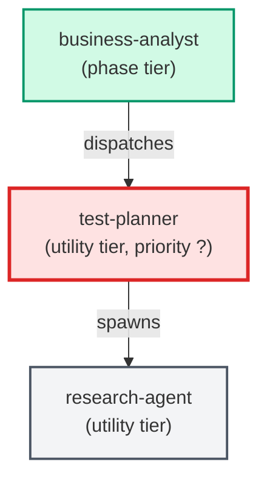

# test-planner

**Planning-phase test specialist. Spawned by business-analyst after deliverables
are scoped. Reads testing_context from skills_config.json, reads the test
README, and produces a structured test_requirements block specifying which
tests should be created, what they cover, and where they live.
Returns test_requirements JSON to the business-analyst for inclusion in the
BA payload. For docs-only or config-only tickets returns an empty tests array
with a rationale explaining why no tests are needed.
Internal — never invoked directly by users.**

| Field | Value |
|-------|-------|
| Model | sonnet |
| Tier | utility |
| Priority | — |
| Portable | Yes |
| Sign-off capable | No |

---

## When to Use

### Spawned By

- `business-analyst`
---

## Knowledge Flow

*No knowledge channels declared.*

---

## Spawn and Dependency

---

## Input / Output Contract

*No structured I/O contract declared.*
---

## Tools Available

| Tool |
|------|
| `Bash` |
| `Read` |
| `Agent` |
---

## Skills Used

*No skills declared.*
---

## Configuration

| Key | Required | Description |
|-----|----------|-------------|
| `testing_context` | No | Test infrastructure context: directories, frameworks, constraints |
---

## Contributor Notes

No conditional behaviors — this agent follows a single fixed execution path
