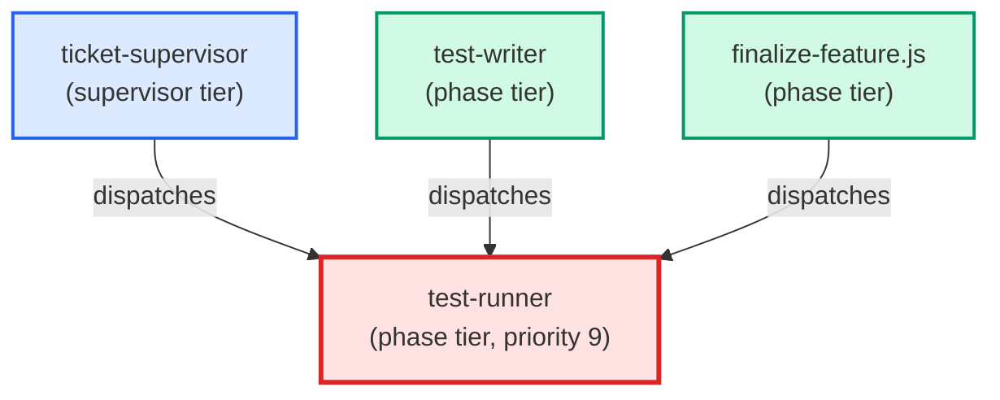

# test-runner

**Picks the right test suite based on what has changed, runs it, and returns a
structured failure report (file, test name, stacktrace excerpt, rerun command)
instead of a raw stdout dump.
Use when: user types /test; asks "run the tests"; asks "did I break anything?";
asks "run the SQL tests"; or any implementation agent (python-coder, sql-coder)
invokes this agent for its inner-loop test cycle.**

| Field | Value |
|-------|-------|
| Model | sonnet |
| Tier | phase |
| Priority | 9 |
| Portable | Yes |
| Sign-off capable | Yes |

---

## When to Use

### Spawned By

- `ticket-supervisor`
- `test-writer`
- `finalize-feature.js`
---

## Knowledge Flow

| Channel | Source | Injection Mode | Description |
|---------|--------|----------------|-------------|
| 1 | template description field | — | — |
| 3 | ticket_path from ticket-supervisor | — | — |
| 4 | pre-flight file reads | — | — |
| 5 | skills_config.json config_keys | — | — |
| 6 | project files read during execution | — | — |
| 7 | bash command output (git, build, tests) | — | — |
---

## Spawn and Dependency

---

## Input / Output Contract

### Inputs

| Name | Type | Description |
|------|------|-------------|
| `ticket_path` | file_path | Absolute path to the ticket markdown file |

### Outputs

| Name | Type | Description |
|------|------|-------------|
| `sign_off_comment` | sign_off_comment | Sign-off comment with status: ok | blocker | handoff |

### Mutates (Side Effects)

| Name | Type | Description |
|------|------|-------------|
| `ticket_frontmatter_agents_status` | — | Sets agents.test-runner to signed_off or failed |
| `sign_offs_checklist` | — | Checks the test-runner checkbox with timestamp |
---

## Tools Available

| Tool |
|------|
| `Bash` |
| `Read` |
---

## Skills Used

| Skill | Mode | Condition |
|-------|------|-----------|
| `signoff` | always | — |
---

## Configuration

| Key | Required | Description |
|-----|----------|-------------|
| `test_command_live_trader` | No | Command to run the fast unit test suite |
| `test_output_dir` | No | Temp directory for test output files |
---

## Contributor Notes

### Key Behavioral Patterns

| Pattern | Trigger | Behavior | Related Agent |
|---------|---------|----------|---------------|
| Conditional Behavior | invoked by `ticket-supervisor` | first check `git diff --name-only HEAD` | `None` |
| Conditional Behavior | the user does not specify an action | default to `auto` | `None` |
---

## AC Assignments

### test-runner

- BP-006a-2: test_no_orphaned_directories passes with no unregistered skill directories
- BP-006a-3: Edge case: new skill directory added without registry entry is detected
- BP-006c-2: test_build_workflow_phase validates .claude/workflows/ path
- BP-1200a-1-i: Suite is green across repeated runs with both fixed and varied test-ordering seeds
- TQ-100b-1-iii: The AC store is read once per session and the enforced set is stable across repeated runs
- TQ-100e-1-iii: Switching enforcement modes changes behavior with no edits to any test
