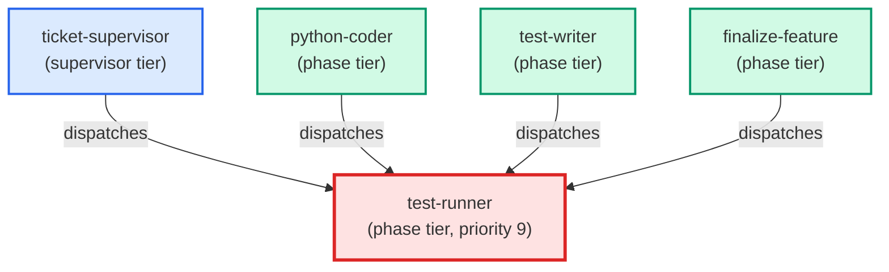

# test-runner

**Picks the right test suite based on what has changed, runs it, and returns a
structured failure report (file, test name, stacktrace excerpt, rerun command)
instead of a raw stdout dump.
Use when: user types /test; asks "run the tests"; asks "did I break anything?";
asks "run the SQL tests"; or any implementation agent (python-coder, sql-coder)
invokes this agent for its inner-loop test cycle.**

| Field | Value |
|-------|-------|
| Model | sonnet |
| Tier | phase |
| Priority | 9 |
| Portable | Yes |
| Sign-off capable | Yes |

---

## When to Use

### Spawned By

- `ticket-supervisor`
- `python-coder`
- `test-writer`
- `finalize-feature`
---

## Knowledge Flow

*No knowledge channels declared.*

---

## Spawn and Dependency

---

## Input / Output Contract

*No structured I/O contract declared.*
---

## Tools Available

| Tool |
|------|
| `Bash` |
| `Read` |
---

## Skills Used

| Skill | Mode | Condition |
|-------|------|-----------|
| `signoff` | — | — |
---

## Configuration

| Key | Required | Description |
|-----|----------|-------------|
| `test_command_live_trader` | No | Command to run the fast unit test suite |
| `test_output_dir` | No | Temp directory for test output files |
---

## Contributor Notes

No conditional behaviors — this agent follows a single fixed execution path
