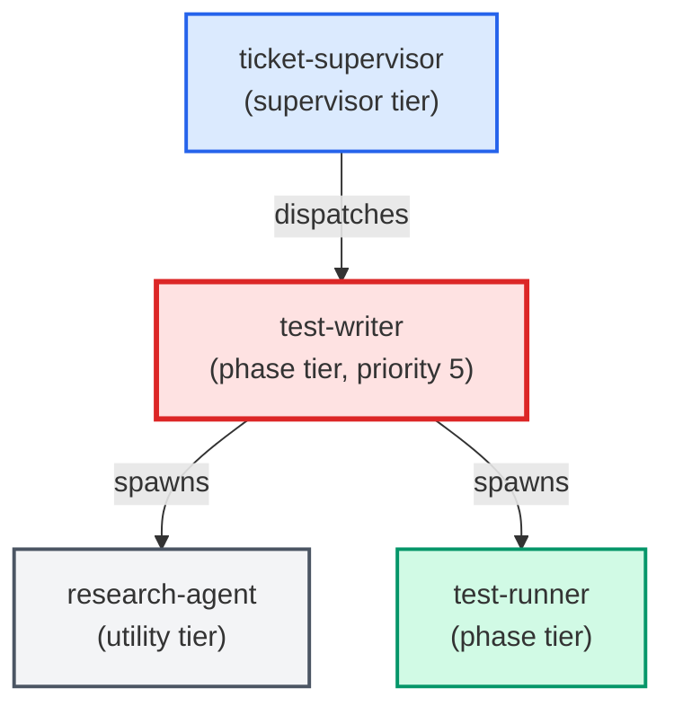

# test-writer

**TDD test-first authoring agent. Spawned by ticket-supervisor at priority 5,
BEFORE python-coder or sql-coder run. Reads the ## Test Requirements section
from the ticket body and writes the specified failing test stubs, runs the suite
to confirm all new tests are
RED (non-zero exit), captures a structured red_baseline block in its sign-off
comment, and hands off to coders whose job is to make the red-baseline green.
Classifies test failures before touching production code, enumerates consumers
via blast-radius query, and blocks contract-shrinking changes without explicit
authorization. Emits a completion report and signs off the ticket phase.
Use when: ticket has a non-empty test_requirements.tests array. Skip (sign off
immediately, zero file writes) when tests array is empty or block is absent.**

| Field | Value |
|-------|-------|
| Model | sonnet |
| Tier | phase |
| Priority | 5 |
| Portable | Yes |
| Sign-off capable | Yes |

---

## When to Use

### Spawned By

- `ticket-supervisor`
---

## Knowledge Flow

| Channel | Source | Injection Mode | Description |
|---------|--------|----------------|-------------|
| 1 | template description field | — | — |
| 3 | ticket_path from ticket-supervisor | — | — |
| 4 | pre-flight file reads | — | — |
| 5 | skills_config.json config_keys | — | — |
| 6 | project files read during execution | — | — |
| 7 | bash command output (git, build, tests) | — | — |
---

## Spawn and Dependency

---

## Input / Output Contract

### Inputs

| Name | Type | Description |
|------|------|-------------|
| `ticket_path` | file_path | Absolute path to the ticket markdown file |

### Outputs

| Name | Type | Description |
|------|------|-------------|
| `sign_off_comment` | sign_off_comment | Sign-off comment with status: ok | blocker | handoff |

### Mutates (Side Effects)

| Name | Type | Description |
|------|------|-------------|
| `ticket_frontmatter_agents_status` | — | Sets agents.test-writer to signed_off or failed |
| `sign_offs_checklist` | — | Checks the test-writer checkbox with timestamp |
| `implementation_artifacts` | — | Files created or modified during phase execution |
---

## Tools Available

| Tool |
|------|
| `Bash` |
| `Read` |
| `Edit` |
| `Write` |
| `Agent` |
---

## Skills Used

| Skill | Mode | Condition |
|-------|------|-----------|
| `signoff` | conditional | — |
---

## Configuration

| Key | Required | Description |
|-----|----------|-------------|
| `testing_context` | No | Test infrastructure context: directories, frameworks, constraints |
| `test_command_live_trader` | No | Command to run the fast unit test suite |
| `test_output_dir` | No | Temp directory for test output files |
---

## Contributor Notes

### Key Behavioral Patterns

| Pattern | Trigger | Behavior | Related Agent |
|---------|---------|----------|---------------|
| Stop-and-Ask | condition requiring user decision or out-of-scope action | Do not proceed without human review. | `None` |
| Delegation to research-agent | task requiring research-agent capabilities | Delegates to research-agent via Agent tool | `research-agent` |
| Conditional Behavior | an AC is untestable | write `(not testable: <reason>)` in the Test column | `None` |
| Conditional Behavior | `## Agent Contracts` is absent from the ticket body | skip all AC-aware | `None` |
---

## AC Assignments

### test-writer

- ACD-800a-2: Unrelated tickets produce no matches (false-positive prevention)
- BO-510-3: Validation test fails when any agent entry or template lacks the produces field
- BO-510-3-i: New agent template added without produces field is caught by validation
- BO-610-3-i: Empty change_target or risk_surface field is rejected
- BO-610-4-i: Ticket with change_target but missing risk_surface is rejected
- BO-620-1-i: Multi-value change_target unions all guardrails from each target's mapping
- BO-630-1-i: Task with no estimated_complexity field defaults to medium (faster model)
- BO-640-1-i: Challenge produces a structured rationale regardless of outcome
- BO-650-1-i: Architect notices missing architecture docs and flags the gap
- BO-650-5-i: Architect's model tier follows the same complexity routing as all other agents
- BO-660-2-i: Change_target with no explicit mapping falls back to the risk_surface default guardrails
- BP-100a-4: Test verifies warning is emitted when a hook script is missing
- BP-100a-5: Test verifies no warning is emitted when all hook scripts exist
- BP-100b-6: Parity test cross-validates all four infrastructure layers against each other
- BP-100b-6-i: Parity test failure message names the missing layer and category
- BP-100d-1-i: Test verifies commit_guardian paths are excluded from production file classification
- BP-100e-2-i: Pre-commit hook rejects failed sign-off lines with prose timestamp suffix
- BP-100e-3: Pre-commit hook accepts signed-off lines with valid YYYY-MM-DD HH:MM timestamps
- BP-100e-4: Pre-commit hook accepts failed sign-off lines with valid timestamps
- BP-100e-5-i: Pre-commit hook accepts comment headings with valid YYYY-MM-DD HH:MM timestamps
- BP-100f-3: finalize-feature happy path is unchanged inside a valid git worktree
- BP-100g-1-i: Error message for invalid YAML includes the file path in stderr output
- BP-100g-3-i: Validation accepts allowed-tools as comma-separated string or YAML list
- BP-100g-4: build.py deploys all skills successfully when all SKILL.md files have valid frontmatter
- BP-100g-5: build.py allows mcp__ prefixed tools in allowed-tools
- BP-1100b-2: Test-writer produces an executing behavioral-replay test for modified workflow JavaScript
- BP-300a-6-i: debug.js is syntactically valid JavaScript
- BP-700b-2-i: LLM trigger fires for tickets describing UI work without frontend file extensions in files_touched
- BP-700b-3: Agent produces no output or side effects when not dispatched
- GE-113c-3-iv: Direct unit tests for _is_suppressed cover both exploit paths
- GE-120c-1: A harness executes the deployed checks out of process from a real separate working copy
- GE-120c-1-i: The harness reports its own setup failure instead of passing vacuously
- GE-120c-2: The harness is shown to fail against the behaviour that was actually observed
- GE-120c-3: Every registered check is exercised by the harness, and a new check cannot opt out by omission
- GE-120c-4: The unverified count of files that only looked clean is replaced with a measured one
- GE-120d-4: A working copy created by set-up passes the parity sweep with no manual repair
- GE-120e-2-i: A check whose recorded change-set source disagrees with what it actually inspects is named by running it, not by believing it
- GE-120e-3: The same authored content reaches the same verdict whether it is committed ordinarily or brought in alongside a mainline merge
- GE-120e-3-i: Two arms that agree because the check said nothing at all is an inconclusive pair, not a pass
- GE-120e-3-ii: A merge whose own resolution introduces the fault is still blocked, and no check treats a merge as grounds to skip
- INF-100a-4: Wiring tests verify template Pre-Flight section and PROJECT_CONTEXT.md content
- INF-400g-2-i: emit_event.py handles optional arguments gracefully (null in payload)
- INF-400g-2-ii: emit_event.py appends (not overwrites) on subsequent calls
- INF-400g-9: aggregate.py returns non-empty output for subagent-quality after an epic drive
- INF-500a-3-i: SHA override mode sets git_commit_count to None (distinguishes from zero-commit)
- INF-500a-4: Existing path (pre-finalization) behavior is unchanged
- INF-500b-2-i: Priority scoring ranks high-severity categories above equal-count low-severity
- INF-500b-2-ii: JSON format output contains required keys
- INF-500b-3-i: Trend detection uses >20% threshold for rising/falling classification
- KM-KGS-100b-5-ii: Cache correctness is proven against a real store in a deployed layout
