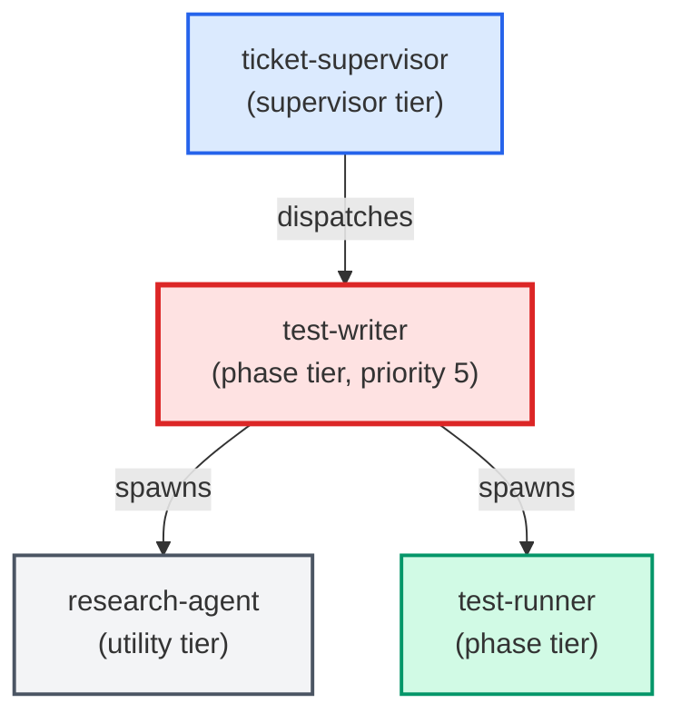

# test-writer

**TDD test-first authoring agent. Spawned by ticket-supervisor at priority 5,
BEFORE python-coder or sql-coder run. Reads the ## Test Requirements section
from the ticket body and writes the specified failing test stubs, runs the suite
to confirm all new tests are
RED (non-zero exit), captures a structured red_baseline block in its sign-off
comment, and hands off to coders whose job is to make the red-baseline green.
Classifies test failures before touching production code, enumerates consumers
via blast-radius query, and blocks contract-shrinking changes without explicit
authorization. Emits a completion report and signs off the ticket phase.
Use when: ticket has a non-empty test_requirements.tests array. Skip (sign off
immediately, zero file writes) when tests array is empty or block is absent.**

| Field | Value |
|-------|-------|
| Model | sonnet |
| Tier | phase |
| Priority | 5 |
| Portable | Yes |
| Sign-off capable | Yes |

---

## When to Use

### Spawned By

- `ticket-supervisor`
---

## Knowledge Flow

| Channel | Source | Injection Mode | Description |
|---------|--------|----------------|-------------|
| 1 | template description field | — | — |
| 3 | ticket_path from ticket-supervisor | — | — |
| 4 | pre-flight file reads | — | — |
| 5 | skills_config.json config_keys | — | — |
| 6 | project files read during execution | — | — |
| 7 | bash command output (git, build, tests) | — | — |
---

## Spawn and Dependency

---

## Input / Output Contract

### Inputs

| Name | Type | Description |
|------|------|-------------|
| `ticket_path` | file_path | Absolute path to the ticket markdown file |

### Outputs

| Name | Type | Description |
|------|------|-------------|
| `sign_off_comment` | sign_off_comment | Sign-off comment with status: ok | blocker | handoff |

### Mutates (Side Effects)

| Name | Type | Description |
|------|------|-------------|
| `ticket_frontmatter_agents_status` | — | Sets agents.test-writer to signed_off or failed |
| `sign_offs_checklist` | — | Checks the test-writer checkbox with timestamp |
| `implementation_artifacts` | — | Files created or modified during phase execution |
---

## Tools Available

| Tool |
|------|
| `Bash` |
| `Read` |
| `Edit` |
| `Write` |
| `Agent` |
---

## Skills Used

| Skill | Mode | Condition |
|-------|------|-----------|
| `signoff` | conditional | — |
---

## Configuration

| Key | Required | Description |
|-----|----------|-------------|
| `testing_context` | No | Test infrastructure context: directories, frameworks, constraints |
| `test_command_live_trader` | No | Command to run the fast unit test suite |
| `test_output_dir` | No | Temp directory for test output files |
---

## Contributor Notes

### Key Behavioral Patterns

| Pattern | Trigger | Behavior | Related Agent |
|---------|---------|----------|---------------|
| Stop-and-Ask | condition requiring user decision or out-of-scope action | Do not proceed without human review. | `None` |
| Delegation to research-agent | task requiring research-agent capabilities | Delegates to research-agent via Agent tool | `research-agent` |
| Conditional Behavior | an AC is untestable | write `(not testable: <reason>)` in the Test column | `None` |
| Conditional Behavior | `## Agent Contracts` is absent from the ticket body | skip all AC-aware | `None` |
