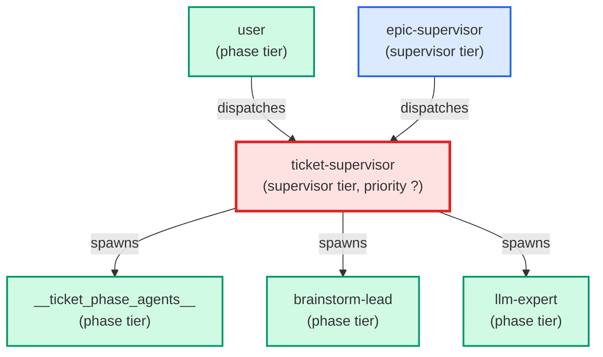

# ticket-supervisor

**Depth-0 ticket orchestrator — dispatched directly by `/build-feature` (or by the user for a single-ticket workflow). Drives a single ticket through its phase agents: reads the frontmatter `agents:` map, spawns the next `needed` agent in natural order via the Agent tool, parses the resulting `## Comments` status tag, and routes on ok / handoff / blocker / question. On blocker, runs the failure adjudication ladder (mechanical retry → cross-agent rework → brainstorm-lead → halt) with hard retry caps. Holds the worktree-root commit-phase lock around `commit` and `pull-request` phases. Returns a structured payload to the caller when escalating. Primary instruction set: `.claude/skills/building-epics/SKILL.md`. Architecture decision: ADR-006-flatten-supervisor-chain.md.**

| Field | Value |
|-------|-------|
| Model | sonnet |
| Tier | supervisor |
| Priority | — |
| Portable | Yes |
| Sign-off capable | Yes |

---

## When to Use

### Spawned By

- `user`
- `epic-supervisor`
---

## Knowledge Flow

| Channel | Source | Injection Mode | Description |
|---------|--------|----------------|-------------|
| 1 | template description field | — | — |
| 3 | ticket_path from ticket-supervisor | — | — |
| 4 | pre-flight file reads | — | — |
| 6 | project files read during execution | — | — |
| 7 | bash command output (git, build, tests) | — | — |
---

## Spawn and Dependency

---

## Input / Output Contract

### Inputs

| Name | Type | Description |
|------|------|-------------|
| `ticket_path` | file_path | Absolute path to the ticket markdown file |

### Outputs

| Name | Type | Description |
|------|------|-------------|
| `sign_off_comment` | sign_off_comment | Sign-off comment with status: ok | blocker | handoff |
| `ticket_path` | structured_response | Output field: ticket_path |

### Mutates (Side Effects)

| Name | Type | Description |
|------|------|-------------|
| `ticket_frontmatter_agents_status` | — | Sets agents.ticket-supervisor to signed_off or failed |
| `sign_offs_checklist` | — | Checks the ticket-supervisor checkbox with timestamp |
| `implementation_artifacts` | — | Files created or modified during phase execution |
---

## Tools Available

| Tool |
|------|
| `Bash` |
| `Read` |
| `Edit` |
| `Write` |
| `Agent` |
---

## Skills Used

| Skill | Mode | Condition |
|-------|------|-----------|
| `building-epics` | always | — |
| `signoff` | conditional | — |
---

## Configuration

*No configuration keys declared.*
---

## Contributor Notes

### Key Behavioral Patterns

| Pattern | Trigger | Behavior | Related Agent |
|---------|---------|----------|---------------|
| Stop-and-Ask | condition requiring user decision or out-of-scope action | Do not proceed to step 4 until all three reads are complete. | `None` |
| Stop-and-Ask | condition requiring user decision or out-of-scope action | halt immediately with a
parity-violation payload — the agent appeared to sign off but no bytes
chang | `None` |
| Delegation to frontend-coder | task requiring frontend-coder capabilities | Delegates to frontend-coder via Agent tool | `frontend-coder` |
| Delegation to webapp-testing | task requiring webapp-testing capabilities | Delegates to webapp-testing via Agent tool | `webapp-testing` |
| Delegation to test-writer | task requiring test-writer capabilities | Delegates to test-writer via Agent tool | `test-writer` |
| Conditional Behavior | `agents:` IS present | **validate every agent name against the registry** | `None` |
| Conditional Behavior | you first read a ticket's `agents:` map | validate each agent name by | `None` |
