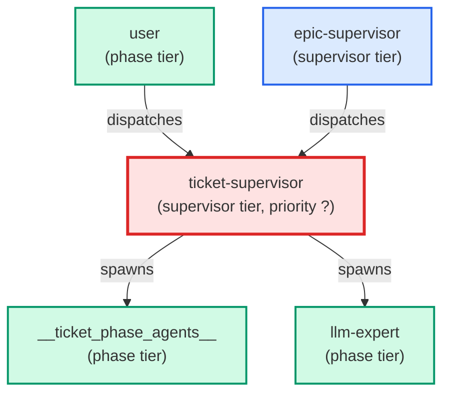

# ticket-supervisor

**Depth-0 ticket orchestrator — dispatched directly by `/build-feature` (or by the user for a single-ticket workflow). Drives a single ticket through its phase agents: reads the frontmatter `agents:` map, spawns the next `needed` agent in natural order via the Agent tool, parses the resulting `## Comments` status tag, and routes on ok / handoff / blocker / question. On blocker, runs the failure adjudication ladder (mechanical retry → cross-agent rework → brainstorm-lead → halt) with hard retry caps. Holds the worktree-root commit-phase lock around `commit` and `pull-request` phases. Returns a structured payload to the caller when escalating. Primary instruction set: `.claude/skills/building-epics/SKILL.md`. Architecture decision: ADR-006-flatten-supervisor-chain.md.**

| Field | Value |
|-------|-------|
| Model | sonnet |
| Tier | supervisor |
| Priority | — |
| Portable | Yes |
| Sign-off capable | Yes |

---

## When to Use

### Spawned By

- `user`
- `epic-supervisor`
---

## Knowledge Flow

*No knowledge channels declared.*

---

## Spawn and Dependency

---

## Input / Output Contract

*No structured I/O contract declared.*
---

## Tools Available

| Tool |
|------|
| `Bash` |
| `Read` |
| `Edit` |
| `Write` |
| `Agent` |
---

## Skills Used

| Skill | Mode | Condition |
|-------|------|-----------|
| `building-epics` | — | — |
| `signoff` | — | — |
---

## Configuration

*No configuration keys declared.*
---

## Contributor Notes

No conditional behaviors — this agent follows a single fixed execution path
