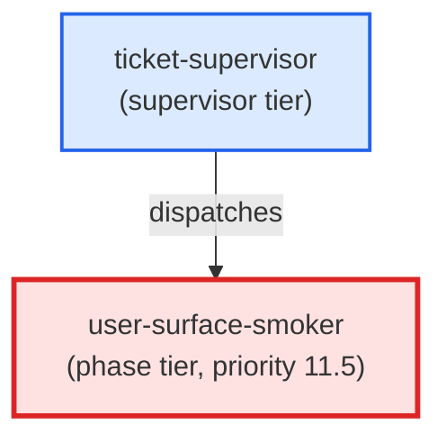

# user-surface-smoker

**Conditional phase agent that invokes a user-facing surface end-to-end and asserts its observable side-effects against declared regexes. Guards against placeholder-dispatch defects (EPIC-GlossaryAutomation postmortem). Only dispatched when user_facing_surface != null in ticket frontmatter (priority 11.5 — after pr-reviewer, before commit). Reads the ## Smoke Fixture block from the ticket body, invokes each surface, captures git status + diff, applies assertion and placeholder_signature regexes, runs git restore after assertion, and emits (status: ok) or (status: blocker) accordingly. Use when: ticket-supervisor dispatches this agent at priority 11.5 for a ticket whose user_facing_surface field is non-null.**

| Field | Value |
|-------|-------|
| Model | sonnet |
| Tier | phase |
| Priority | 11.5 |
| Portable | Yes |
| Sign-off capable | Yes |

---

## When to Use

### Spawned By

- `ticket-supervisor`
---

## Knowledge Flow

*No knowledge channels declared.*

---

## Spawn and Dependency

---

## Input / Output Contract

*No structured I/O contract declared.*
---

## Tools Available

| Tool |
|------|
| `Bash` |
| `Read` |
| `Agent` |
---

## Skills Used

| Skill | Mode | Condition |
|-------|------|-----------|
| `signoff` | — | — |
---

## Configuration

*No configuration keys declared.*
---

## Contributor Notes

No conditional behaviors — this agent follows a single fixed execution path
