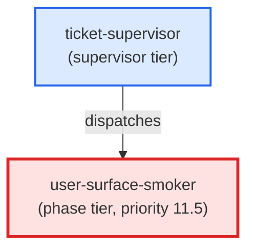

# user-surface-smoker

**Conditional phase agent that invokes a user-facing surface end-to-end and asserts its observable side-effects against declared regexes. Guards against placeholder-dispatch defects (EPIC-GlossaryAutomation postmortem). Only dispatched when user_facing_surface != null in ticket frontmatter (priority 11.5 — after pr-reviewer, before commit). Reads the ## Smoke Fixture block from the ticket body, invokes each surface, captures git status + diff, applies assertion and placeholder_signature regexes, runs git restore after assertion, and emits (status: ok) or (status: blocker) accordingly. Use when: ticket-supervisor dispatches this agent at priority 11.5 for a ticket whose user_facing_surface field is non-null.**

| Field | Value |
|-------|-------|
| Model | sonnet |
| Tier | phase |
| Priority | 11.5 |
| Portable | Yes |
| Sign-off capable | Yes |

---

## When to Use

### Spawned By

- `ticket-supervisor`
---

## Knowledge Flow

| Channel | Source | Injection Mode | Description |
|---------|--------|----------------|-------------|
| 1 | template description field | — | — |
| 3 | ticket_path from ticket-supervisor | — | — |
| 6 | project files read during execution | — | — |
| 7 | bash command output (git, build, tests) | — | — |
| 9 | agent memory store | — | — |
---

## Spawn and Dependency

---

## Input / Output Contract

### Inputs

| Name | Type | Description |
|------|------|-------------|
| `ticket_path` | file_path | Absolute path to the ticket markdown file |

### Outputs

| Name | Type | Description |
|------|------|-------------|
| `sign_off_comment` | sign_off_comment | Sign-off comment with status: ok | blocker | handoff |

### Mutates (Side Effects)

| Name | Type | Description |
|------|------|-------------|
| `ticket_frontmatter_agents_status` | — | Sets agents.user-surface-smoker to signed_off or failed |
| `sign_offs_checklist` | — | Checks the user-surface-smoker checkbox with timestamp |
---

## Tools Available

| Tool |
|------|
| `Bash` |
| `Read` |
| `Agent` |
---

## Skills Used

| Skill | Mode | Condition |
|-------|------|-----------|
| `signoff` | — | — |
---

## Configuration

*No configuration keys declared.*
---

## Contributor Notes

### Key Behavioral Patterns

| Pattern | Trigger | Behavior | Related Agent |
|---------|---------|----------|---------------|
| Stop-and-Ask | condition requiring user decision or out-of-scope action | Do not proceed. | `None` |
| Conditional Behavior | there are uncommitted staged changes | emit `(status: blocker)` with explanation: "Pre-smoke worktree has staged | `None` |
| Conditional Behavior | NO match → emit `(status: blocker)` | reason: "assertion regex did not | `None` |
