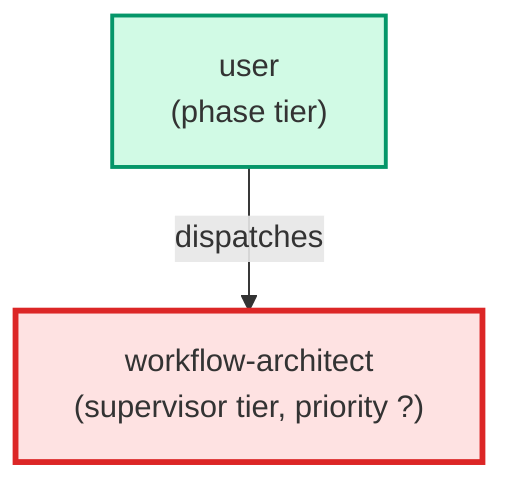

# workflow-architect

**Meta-agent that owns the leafcutter package surface area. Manages
the agent registry, hook registry, skill registry, and build pipeline. Invokes
four skills to extend the package: create-hook (new pre-commit hook), 
add-agent-to-package (promote a project-local agent), 
add-skill-to-package (promote a project-local skill), and 
package-audit (surface package gap analysis). Use when adding new tooling 
to the leafcutter package or auditing package boundary drift.**

| Field | Value |
|-------|-------|
| Model | sonnet |
| Tier | supervisor |
| Priority | — |
| Portable | Yes |
| Sign-off capable | No |

---

## When to Use

### Spawned By

- `user`
---

## Knowledge Flow

| Channel | Source | Injection Mode | Description |
|---------|--------|----------------|-------------|
| 1 | template description field | — | — |
| 6 | project files read during execution | — | — |
| 7 | bash command output (git, build, tests) | — | — |
| 8 | PROJECT_CONTEXT.md | — | — |
---

## Spawn and Dependency

---

## Input / Output Contract

### Outputs

| Name | Type | Description |
|------|------|-------------|
| `completion_report` | structured_response | Structured completion payload or sign-off comment |

### Mutates (Side Effects)

| Name | Type | Description |
|------|------|-------------|
| `none` | — | Read-only agent — no filesystem mutations |
---

## Tools Available

| Tool |
|------|
| `Bash` |
| `Read` |
| `Edit` |
| `Write` |
| `Agent` |
---

## Skills Used

| Skill | Mode | Condition |
|-------|------|-----------|
| `package-audit` | conditional | — |
---

## Configuration

*No configuration keys declared.*
---

## Contributor Notes

### Key Behavioral Patterns

| Pattern | Trigger | Behavior | Related Agent |
|---------|---------|----------|---------------|
| Delegation to create-hook | task requiring create-hook capabilities | Delegates to create-hook via Agent tool | `create-hook` |
| Delegation to add-agent-to-package | task requiring add-agent-to-package capabilities | Delegates to add-agent-to-package via Agent tool | `add-agent-to-package` |
| Delegation to add-skill-to-package | task requiring add-skill-to-package capabilities | Delegates to add-skill-to-package via Agent tool | `add-skill-to-package` |
| Conditional Behavior | a new project adopts a portable agent | it provides project-specific knowledge via a | `None` |
---

## AC Assignments

### workflow-architect

- ACS-500f-2: Pattern-first inventory recognizes a pattern AC by the same definition the hook uses
- BO-1900a-1: Preflight runs before spawn and holds back an unfit ticket with a reason
- BO-1900a-1-i: Preflight that errors internally fails closed and holds the ticket back
- BO-1900a-1-ii: Held-back reason is surfaced to the operator, not only buried in logs
- BO-1900a-2: A fit ticket passes preflight and dispatch proceeds unchanged
- BO-1900d-1: A dispatch names each allowlisted pointer as an explicit named token
- BO-1900d-1-i: A payload missing a required pointer is held back
- BO-1900d-2: A payload carrying a free-composed prose prompt is rejected before spawn
- BO-1900d-2-i: A premise injected inside an allowlisted pointer value is rejected
- BP-1100a-1: Refinement files_touched lens flags a behavior ticket missing its executable target
- BP-1100a-1-i: Behavior ticket with both documentation and an executable surface passes the lens
- BP-1100a-2: Ticket-supervisor pre-dispatch read halts a behavior ticket with only documentation in files_touched
- BP-1100b-1: A ticket touching workflow JavaScript is never classified docs-only
- BP-1100b-1-i: A non-workflow JavaScript path does not force test-writer dispatch
- BP-1100c-1: Finalization of a behavioral epic dispatches at least two independent angle-testing agents
- BP-1100c-1-i: A documentation-only epic finalizes without the angle-testing phase
- BP-1100c-2: Spot-check findings are recorded in the retrospective and defects open remediation tickets before close
- BP-1100d-2: pr-reviewer checks the agentType at every commit step in workflow JavaScript
- BP-600a-1: Quick-fix workflow operates in current worktree without branch switching
- BP-600a-2: Quick-fix workflow does not invoke worktree-agent or feature skill
- BP-600a-3: Quick-fix workflow rejects invocation when target file has uncommitted changes
- BP-600a-3-i: Quick-fix workflow permits uncommitted changes in unrelated files
- BP-600b-1: Quick-fix workflow creates an AC YAML file in the AC store
- BP-600b-1-i: Quick-fix workflow detects when an equivalent AC already exists
- BP-600b-2: Quick-fix AC uses the correct component prefix and sequential ID
- BP-600b-2-i: Quick-fix workflow infers component from diagnosed file path when not provided
- BP-600b-3: Quick-fix AC persists after the fix ticket lifecycle closes
- BP-600c-1: Quick-fix workflow dispatches test-writer to create a failing test before the fix
- BP-600c-2: Quick-fix workflow runs the new test and confirms it fails (red phase)
- BP-600c-2-i: Quick-fix workflow halts when red-phase test errors out rather than failing cleanly
- BP-600c-3: Quick-fix workflow runs the test after the fix and confirms it passes (green phase)
- BP-600c-3-i: Quick-fix workflow detects when the fix breaks existing related tests
- BP-600d-1: Quick-fix workflow accepts a structured diagnosis as input
- BP-600d-1-i: Quick-fix workflow rejects input that lacks a file path or root cause
- BP-600d-2: Quick-fix workflow dispatches python-coder to apply the fix after red-phase test
- BP-600d-3: Quick-fix workflow dispatches commit agent after green-phase verification
- BP-600d-4: Quick-fix workflow pushes to origin and closes the ticket lifecycle
- BP-600d-4-i: Quick-fix workflow handles the case when no PR exists for the current branch
- BP-600e-1: Quick-fix workflow warns when the fix modifies more than the target file
- BP-600e-1-i: Quick-fix workflow counts only intentional source changes, not auto-formatted files
- BP-600e-2: Quick-fix workflow warns when red-phase test reveals a deeper root cause
- BP-600e-3: Quick-fix workflow preserves progress when escalating to full build pipeline
- BP-600e-3-i: Quick-fix workflow does not leave partial commits when escalating
