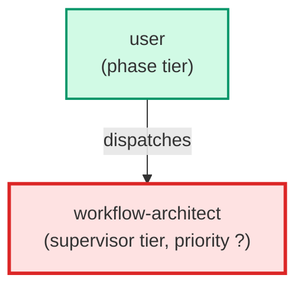

# workflow-architect

**Meta-agent that owns the leafcutter package surface area. Manages
the agent registry, hook registry, skill registry, and build pipeline. Invokes
four skills to extend the package: create-hook (new pre-commit hook), 
add-agent-to-package (promote a project-local agent), 
add-skill-to-package (promote a project-local skill), and 
package-audit (surface package gap analysis). Use when adding new tooling 
to the leafcutter package or auditing package boundary drift.**

| Field | Value |
|-------|-------|
| Model | sonnet |
| Tier | supervisor |
| Priority | — |
| Portable | Yes |
| Sign-off capable | No |

---

## When to Use

### Spawned By

- `user`
---

## Knowledge Flow

*No knowledge channels declared.*

---

## Spawn and Dependency

---

## Input / Output Contract

*No structured I/O contract declared.*
---

## Tools Available

| Tool |
|------|
| `Bash` |
| `Read` |
| `Edit` |
| `Write` |
| `Agent` |
---

## Skills Used

| Skill | Mode | Condition |
|-------|------|-----------|
| `create-hook` | — | — |
| `add-agent-to-package` | — | — |
| `add-skill-to-package` | — | — |
| `package-audit` | — | — |
---

## Configuration

*No configuration keys declared.*
---

## Contributor Notes

No conditional behaviors — this agent follows a single fixed execution path
