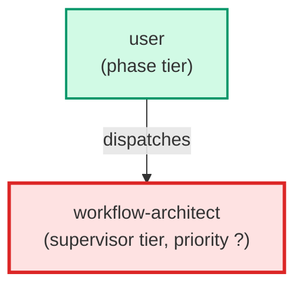

# workflow-architect

**Meta-agent that owns the leafcutter package surface area. Manages
the agent registry, hook registry, skill registry, and build pipeline. Invokes
four skills to extend the package: create-hook (new pre-commit hook), 
add-agent-to-package (promote a project-local agent), 
add-skill-to-package (promote a project-local skill), and 
package-audit (surface package gap analysis). Use when adding new tooling 
to the leafcutter package or auditing package boundary drift.**

| Field | Value |
|-------|-------|
| Model | sonnet |
| Tier | supervisor |
| Priority | — |
| Portable | Yes |
| Sign-off capable | No |

---

## When to Use

### Spawned By

- `user`
---

## Knowledge Flow

| Channel | Source | Injection Mode | Description |
|---------|--------|----------------|-------------|
| 1 | template description field | — | — |
| 6 | project files read during execution | — | — |
| 7 | bash command output (git, build, tests) | — | — |
| 8 | PROJECT_CONTEXT.md | — | — |
---

## Spawn and Dependency

---

## Input / Output Contract

### Outputs

| Name | Type | Description |
|------|------|-------------|
| `completion_report` | structured_response | Structured completion payload or sign-off comment |

### Mutates (Side Effects)

| Name | Type | Description |
|------|------|-------------|
| `none` | — | Read-only agent — no filesystem mutations |
---

## Tools Available

| Tool |
|------|
| `Bash` |
| `Read` |
| `Edit` |
| `Write` |
| `Agent` |
---

## Skills Used

| Skill | Mode | Condition |
|-------|------|-----------|
| `package-audit` | conditional | — |
---

## Configuration

*No configuration keys declared.*
---

## Contributor Notes

### Key Behavioral Patterns

| Pattern | Trigger | Behavior | Related Agent |
|---------|---------|----------|---------------|
| Delegation to create-hook | task requiring create-hook capabilities | Delegates to create-hook via Agent tool | `create-hook` |
| Delegation to add-agent-to-package | task requiring add-agent-to-package capabilities | Delegates to add-agent-to-package via Agent tool | `add-agent-to-package` |
| Delegation to add-skill-to-package | task requiring add-skill-to-package capabilities | Delegates to add-skill-to-package via Agent tool | `add-skill-to-package` |
| Conditional Behavior | a new project adopts a portable agent | it provides project-specific knowledge via a | `None` |
